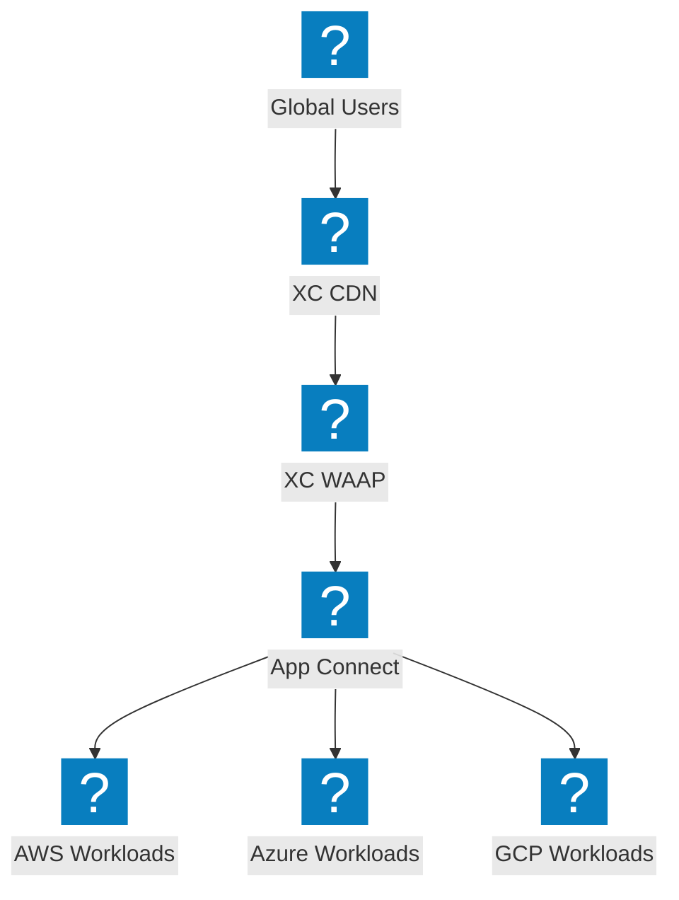

मल्टी-क्लाउड आर्किटेक्चर आरेख जो क्रॉस-प्रोवाइडर कनेक्टिविटी, ग्लोबल लोड बैलेंसिंग, और F5 Distributed Cloud नेटवर्क फेब्रिक को दर्शाते हैं।

## मल्टी-क्लाउड नेटवर्क टोपोलॉजी

ग्लोबल लोड बैलेंसर जो डेटाबेस रेप्लिकेशन के साथ AWS और Azure क्षेत्रों में ट्रैफ़िक वितरित करता है।

```mermaid
architecture-beta
  group aws(hashicorp-flight:aws-color)[AWS Region]
  group azure(hashicorp-flight:azure-color)[Azure Region]

  service lb(carbon:load-balancer-global)[Global LB]
  service web1(carbon:virtual-machine)[Web Tier] in aws
  service db1(carbon:data-base)[Primary DB] in aws
  service web2(carbon:virtual-machine)[Web Tier] in azure
  service db2(carbon:data-base)[Replica DB] in azure

  lb:R --> L:web1
  lb:B --> T:web2
  web1:R --> L:db1
  web2:R --> L:db2
  db1:B --> T:db2
```

## F5 XC मल्टी-क्लाउड कनेक्ट

F5 Distributed Cloud एकीकृत अवलोकनीयता के साथ AWS, Azure और GCP के बीच सुरक्षित कनेक्टिविटी प्रदान करता है।

```mermaid
architecture-beta
  group xc(lucide:cloud)[F5 Distributed Cloud]
  group aws(hashicorp-flight:aws-color)[AWS]
  group azure(hashicorp-flight:azure-color)[Azure]

  service mcn(f5xc:multi-cloud-network-connect)[Network Connect] in xc
  service mca(f5xc:multi-cloud-app-connect)[App Connect] in xc
  service obs(f5xc:observability)[Observability] in xc
  service eks(hashicorp-flight:kubernetes-color)[EKS] in aws
  service rds(carbon:data-base)[RDS] in aws
  service aks(hashicorp-flight:azure-aks-color)[AKS] in azure
  service sql(carbon:data-base)[Azure SQL] in azure

  mcn:R --> L:mca
  mca:R --> L:obs
  mcn:B --> T:eks
  eks:R --> L:rds
  mcn:B --> T:aks
  aks:R --> L:sql
```

## F5 XC के साथ मल्टी-क्लाउड ऐप डिलीवरी

एज पर सुरक्षा और ट्रैफ़िक प्रबंधन प्रदान करने वाले F5 XC के साथ कई क्लाउड में एंड-टू-एंड एप्लिकेशन डिलीवरी।

