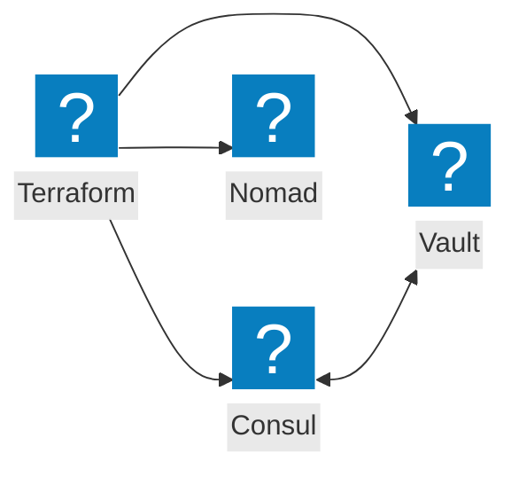
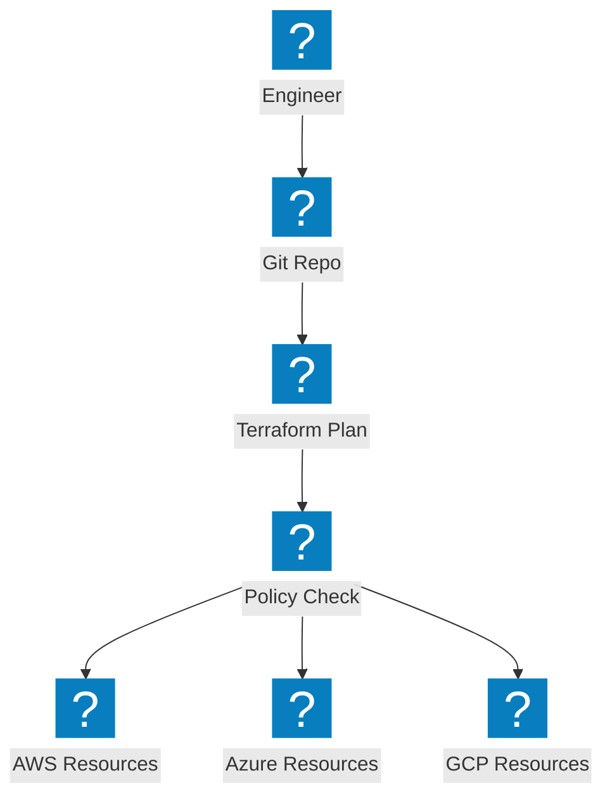

इन्फ्रास्ट्रक्चर एज़ कोड आरेख जिनमें Terraform स्वचालन, HashiCorp उपकरण इंटीग्रेशन और मल्टी-क्लाउड प्रोविज़निंग वर्कफ़्लो शामिल हैं।

## HashiCorp स्टैक इंटीग्रेशन

Terraform, सेवा खोज के लिए Consul, गोपनीय जानकारी के लिए Vault और वर्कलोड शेड्यूलिंग के लिए Nomad के साथ इन्फ्रास्ट्रक्चर प्रोविज़निंग का समन्वय करता है।

## मल्टी-क्लाउड IaC पाइपलाइन

Terraform, स्टेट मैनेजमेंट और पॉलिसी प्रवर्तन के साथ AWS, Azure और GCP में इन्फ्रास्ट्रक्चर प्रोविज़न करता है।

## F5 XC इन्फ्रास्ट्रक्चर स्वचालन

Terraform, लोड बैलेंसर, ऑरिजिन पूल और सुरक्षा नीतियों के साथ F5 Distributed Cloud कॉन्फ़िगरेशन को स्वचालित करता है।

```mermaid
architecture-beta
  group iac(hashicorp-flight:terraform-color)[Terraform Workspace]
  group xc(lucide:cloud)[F5 XC Tenant]

  service tfplan(hashicorp-flight:terraform-color)[Terraform] in iac
  service vault(hashicorp-flight:vault-color)[Vault Secrets] in iac
  service consul(hashicorp-flight:consul-color)[Consul Registry] in iac
  service waap(f5xc:web-app-and-api-protection)[WAAP Policy] in xc
  service lb(f5xc:multi-cloud-app-connect)[App Connect] in xc
  service dns(f5xc:dns-management)[DNS Config] in xc

  tfplan:R --> L:vault
  vault:R --> L:consul
  tfplan:B --> T:waap
  tfplan:B --> T:lb
  tfplan:B --> T:dns
```

