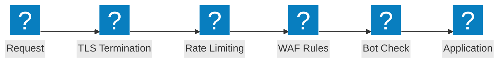

वेब एप्लिकेशन फ़ायरवॉल आर्किटेक्चर आरेख जो सुरक्षा निरीक्षण श्रृंखलाओं, OWASP सुरक्षा प्रवाहों, और F5 Distributed Cloud WAAP क्षमताओं को कवर करते हैं।

## सुरक्षा निरीक्षण पाइपलाइन

CDN एज से WAF, बॉट रक्षा, और लोड बैलेंसर के माध्यम से ऑरिजिन इन्फ्रास्ट्रक्चर तक बहु-स्तरीय सुरक्षा निरीक्षण श्रृंखला।

```mermaid
architecture-beta
  group edge(lucide:shield)[Security Edge]
  group origin(carbon:cloud-services)[Origin Infrastructure]

  service cdn(carbon:content-delivery-network)[CDN] in edge
  service waf(carbon:firewall)[WAF] in edge
  service bot(lucide:shield-check)[Bot Defense] in edge
  service lb(carbon:load-balancer-application)[Load Balancer] in origin
  service app(carbon:application)[App Server] in origin
  service db(carbon:data-base)[Database] in origin

  cdn:R --> L:waf
  waf:R --> L:bot
  bot:R --> L:lb
  lb:R --> L:app
  app:B --> T:db
```

## F5 XC WAAP सुरक्षा

F5 Distributed Cloud वेब एप्लिकेशन और API सुरक्षा, एकीकृत बॉट रक्षा और क्लाइंट-साइड डिफेंस के साथ।

```mermaid
architecture-beta
  group xcedge(lucide:cloud)[F5 XC Edge]
  group cloud(carbon:cloud-services)[Cloud Origin]

  service waap(f5xc:web-app-and-api-protection)[WAAP] in xcedge
  service botdef(f5xc:bot-defense)[Bot Defense] in xcedge
  service csd(f5xc:client-side-defense)[Client-Side Defense] in xcedge
  service lb(carbon:load-balancer-application)[Load Balancer] in cloud
  service app(carbon:application)[Application] in cloud
  service api(carbon:api)[API Service] in cloud

  waap:R --> L:botdef
  botdef:R --> L:csd
  csd:R --> L:lb
  lb:R --> L:app
  lb:B --> T:api
```

## OWASP सुरक्षा प्रवाह

WAF अनुरोध प्रसंस्करण पाइपलाइन जो OWASP Top 10 खतरा श्रेणियों के लिए निरीक्षण चरणों को दर्शाती है।

