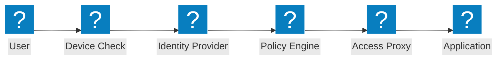
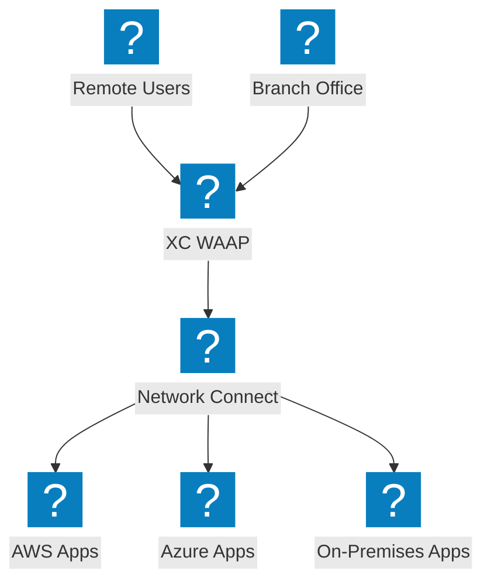

Zero trust आर्किटेक्चर डायग्राम जिसमें ZTNA एक्सेस फ्लो, पहचान सत्यापन, पॉलिसी-आधारित एक्सेस नियंत्रण और F5 XC इंटीग्रेशन के साथ माइक्रो-सेगमेंटेशन शामिल हैं।

## Zero Trust एक्सेस फ्लो

Zero trust एक्सेस फ्लो जिसमें डिवाइस पोस्चर चेक, पहचान सत्यापन, पॉलिसी मूल्यांकन और प्रॉक्सीड एप्लिकेशन एक्सेस शामिल हैं।

## F5 XC Zero Trust आर्किटेक्चर

F5 Distributed Cloud जो क्लाउड में WAAP, पहचान-जागरूक प्रॉक्सी और माइक्रो-सेगमेंटेशन के साथ zero trust एप्लिकेशन एक्सेस प्रदान करता है।

## माइक्रो-सेगमेंटेशन आर्किटेक्चर

नेटवर्क माइक्रो-सेगमेंटेशन जिसमें पहचान-आधारित पॉलिसियाँ एप्लिकेशन टियर के बीच ईस्ट-वेस्ट ट्रैफ़िक को नियंत्रित करती हैं।

```mermaid
architecture-beta
  group trust(lucide:shield)[Zero Trust Fabric]
  group apps(carbon:cloud-services)[Application Tiers]

  service idp(lucide:key)[Identity Provider] in trust
  service policy(carbon:gateway-security)[Policy Engine] in trust
  service seg(carbon:subnet-acl-rules)[Segmentation] in trust
  service web(carbon:application)[Web Tier] in apps
  service api(carbon:api)[API Tier] in apps
  service data(carbon:data-base)[Data Tier] in apps

  idp:R --> L:policy
  policy:R --> L:seg
  seg:R --> L:web
  web:R --> L:api
  api:R --> L:data
```

