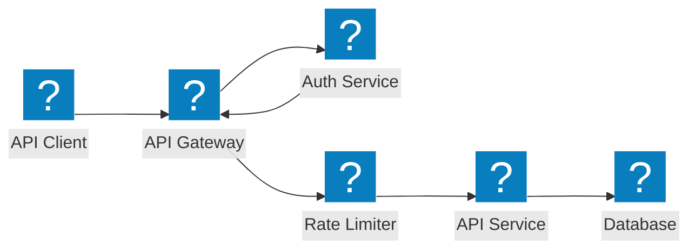
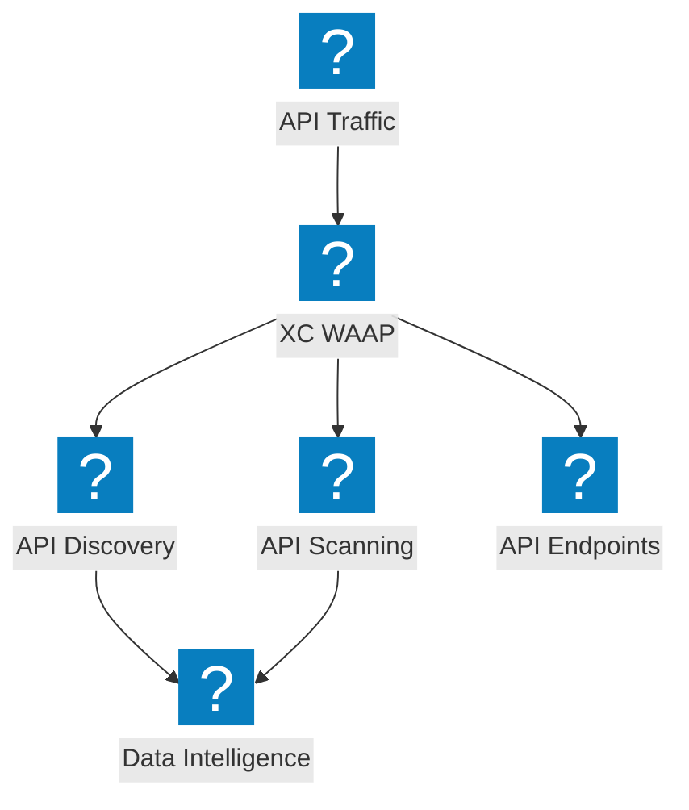

Diagrammi dell'architettura di protezione API che coprono la sicurezza del gateway API, il rilevamento delle API shadow, la limitazione della frequenza e la convalida dello schema con F5 Distributed Cloud.

## Sicurezza del gateway API

Gateway API con autenticazione, autorizzazione, limitazione della frequenza e convalida dello schema prima di raggiungere i servizi backend.

## Rilevamento e protezione API F5 XC

F5 Distributed Cloud fornisce il rilevamento delle API, il rilevamento delle API shadow e una sicurezza API completa con analisi del traffico.

## Pipeline di sicurezza API

Pipeline di convalida delle richieste API a più fasi con TLS, verifica JWT, limitazione della frequenza e ispezione del payload.

```mermaid
architecture-beta
  group security(lucide:shield)[API Security Layer]
  group backend(carbon:cloud-services)[Backend Services]

  service tls(lucide:lock)[TLS Termination] in security
  service jwt(lucide:key)[JWT Validation] in security
  service rate(carbon:load-balancer-vpc)[Rate Limiter] in security
  service schema(carbon:gateway-security)[Schema Validation] in security
  service api1(carbon:api)[Users API] in backend
  service api2(carbon:api)[Orders API] in backend

  tls:R --> L:jwt
  jwt:R --> L:rate
  rate:R --> L:schema
  schema:R --> L:api1
  schema:B --> T:api2
```

