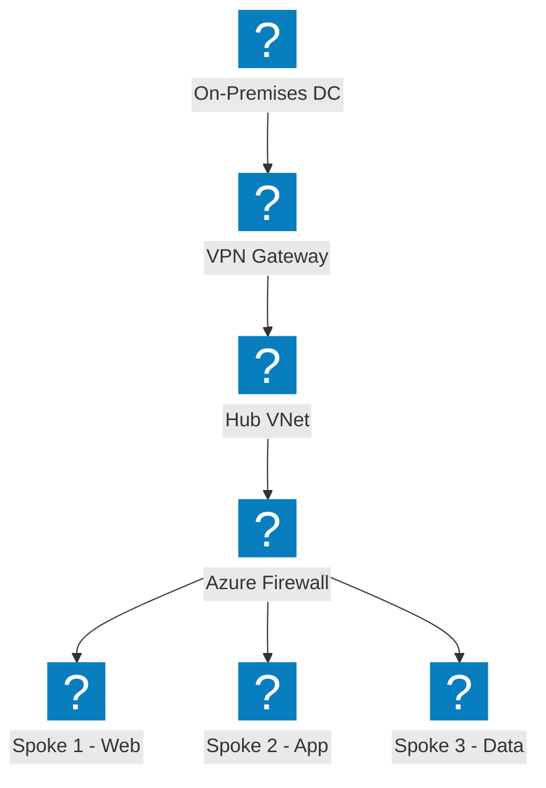
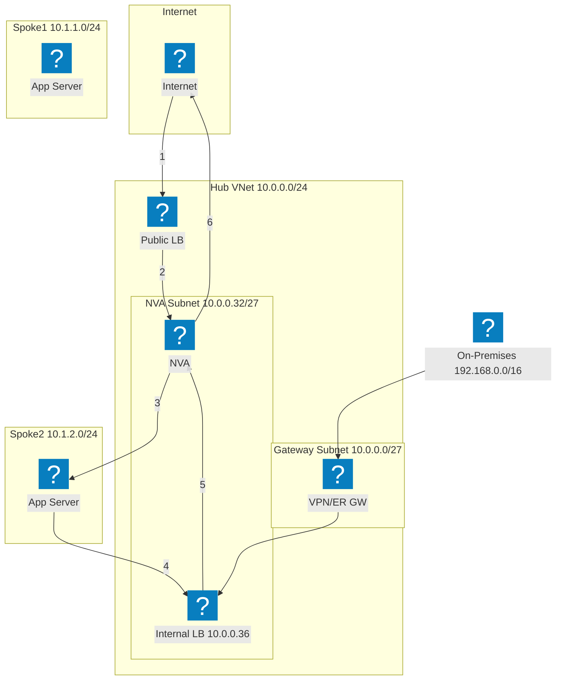
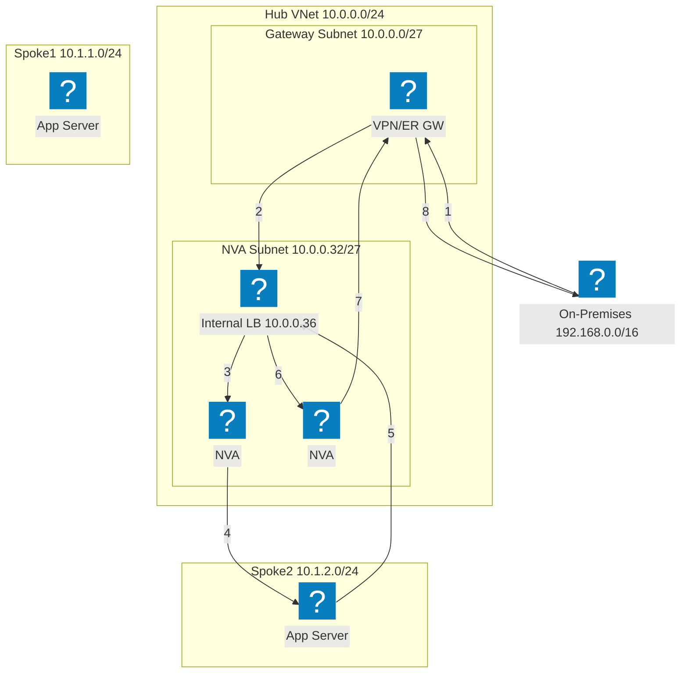
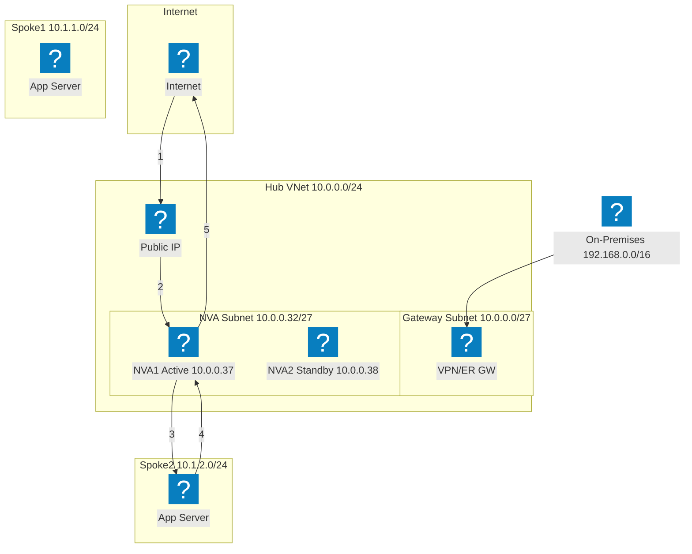
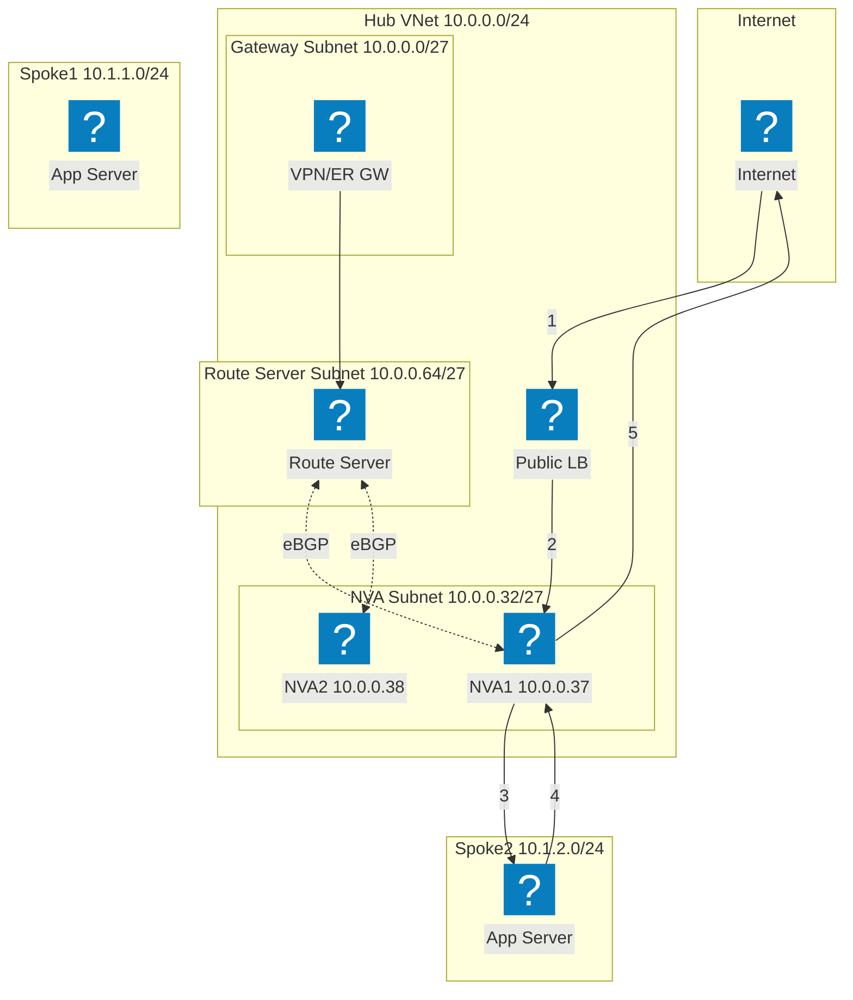
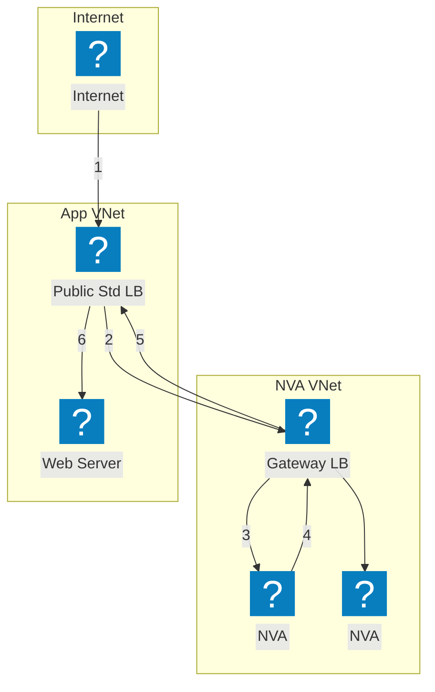

Diagrammi dell'infrastruttura Azure che utilizzano i pacchetti di icone HashiCorp Flight e Carbon per la rete VNet, il calcolo e i servizi gestiti.

## VNet con App Gateway

Azure VNet con gateway, applicazione e subnet dati. L'Application Gateway distribuisce il traffico ai VM Scale Sets.

```mermaid
architecture-beta
  group vnet(carbon:virtual-private-cloud)[Azure VNet]
  group gwsub(carbon:ibm-cloud-subnets)[Gateway Subnet] in vnet
  group appsub(carbon:ibm-cloud-subnets)[App Subnet] in vnet
  group datasub(carbon:ibm-cloud-subnets)[Data Subnet] in vnet

  service appgw(carbon:gateway-security)[App Gateway] in gwsub
  service vm1(hashicorp-flight:azure-vms-color)[VM Scale Set] in appsub
  service vm2(hashicorp-flight:azure-vms-color)[VM Scale Set] in appsub
  service sqldb(carbon:data-base)[Azure SQL] in datasub

  appgw:R --> L:vm1
  appgw:B --> T:vm2
  vm1:R --> L:sqldb
  vm2:R --> L:sqldb
```

## AKS con F5 XC Multi-Cloud Connect

Azure Kubernetes Service frontato da F5 Distributed Cloud per la connettività e la sicurezza delle applicazioni multi-cloud.

```mermaid
architecture-beta
  group xc(lucide:cloud)[F5 XC]
  group aks(hashicorp-flight:azure-aks-color)[AKS Cluster]

  service mcn(f5xc:multi-cloud-network-connect)[Network Connect] in xc
  service waap(f5xc:web-app-and-api-protection)[WAAP] in xc
  service ingress(carbon:gateway)[Ingress] in aks
  service app(hashicorp-flight:docker-color)[App Pods] in aks
  service cache(carbon:datastore)[Redis Cache] in aks
  service blob(hashicorp-flight:azure-blob-storage-color)[Blob Storage]

  mcn:R --> L:waap
  waap:R --> L:ingress
  ingress:R --> L:app
  app:B --> T:cache
  app:R --> L:blob
```

## Topologia di rete Hub-Spoke

Architettura Hub-Spoke di Azure con sicurezza centralizzata e servizi condivisi che collegano più VNet spoke.

## NVA HA con Load Balancer — Traffico Internet

Il traffico Internet in ingresso raggiunge un load balancer pubblico, che distribuisce agli istanze NVA nell'hub. L'NVA inoltra il traffico ispezionato ai carichi di lavoro spoke. Il traffico di ritorno dagli spoke viene instradato attraverso un load balancer interno verso l'NVA per l'uscita. I passaggi numerati mostrano il percorso in ingresso (1-3) e il percorso di ritorno (4-6).

## NVA HA con Load Balancer — Traffico On-Premises

Il traffico on-premises entra attraverso un gateway VPN o ExpressRoute e viene diretto verso un load balancer interno che fronteggia più istanze NVA. L'NVA ispeziona e inoltra il traffico ai carichi di lavoro spoke. Il traffico di ritorno attraversa lo stesso load balancer interno per garantire la simmetria dei flussi, prevenendo problemi di routing asimmetrico.

## NVA HA con PIP/UDR — Attivo/Standby

Coppia NVA attivo/standby in cui l'istanza attiva (NVA1) detiene l'indirizzo IP pubblico. In caso di guasto, l'NVA2 in standby chiama le API di Azure per riassegnare l'IP pubblico e aggiornare le route definite dall'utente affinché puntino a se stessa. Questo approccio evita i load balancer ma richiede un'orchestrazione del failover a livello di API.

## NVA HA con Azure Route Server

Alta disponibilità basata su BGP tramite Azure Route Server. Il Route Server stabilisce adiacenze eBGP con entrambe le istanze NVA e programma dinamicamente le route effettive degli spoke. ECMP bilancia il carico tra le NVA senza route definite dall'utente. Il Route Server inserisce voci next-hop per entrambi gli IP NVA in tutte le VNet in peering.

## NVA HA con Gateway Load Balancer

Inserimento trasparente di NVA tramite Azure Gateway Load Balancer. Il traffico destinato all'applicazione viene deviato in modo trasparente dal load balancer standard pubblico al Gateway LB in una VNet NVA separata. Le NVA ispezionano il traffico e lo restituiscono al Gateway LB, che lo reindirizza all'applicazione. Non sono richiesti peering VNet né UDR tra la VNet NVA e quella applicativa.

