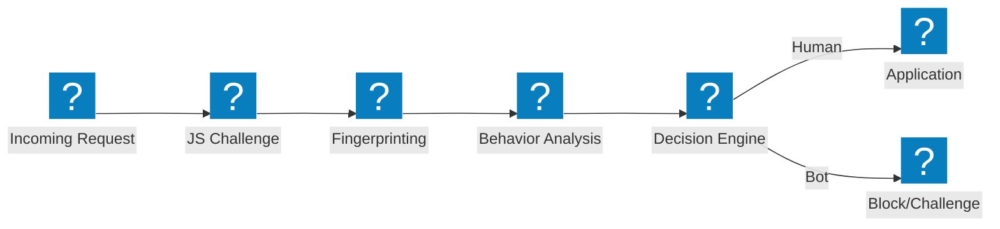
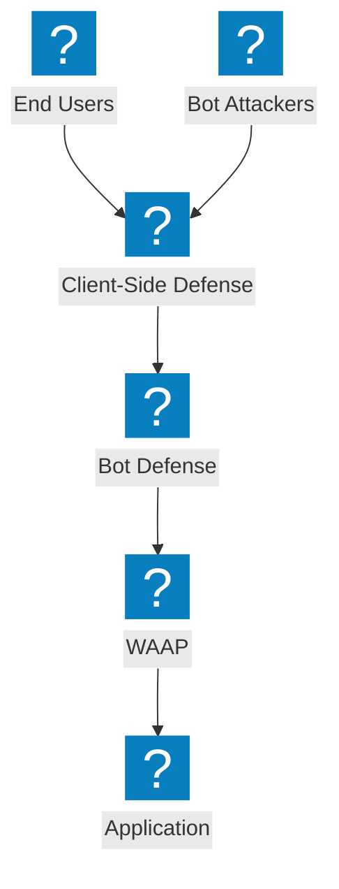

Diagrammi architetturali di difesa bot che coprono i pipeline di rilevamento, la mitigazione del credential stuffing, la difesa lato client e le capacità di gestione bot di F5 Distributed Cloud.

## Pipeline di rilevamento bot

Pipeline di rilevamento bot multi-stadio con challenge JavaScript, analisi comportamentale e fingerprinting prima di consentire l'accesso.

## F5 XC Bot Defense e Difesa lato client

F5 Distributed Cloud con difesa bot integrata e protezione lato client per la prevenzione del credential stuffing e della compromissione degli account.

## Architettura di difesa contro il credential stuffing

Difesa multi-livello contro gli attacchi di credential stuffing con fingerprinting del dispositivo, intelligence sulle credenziali e protezione degli account.

