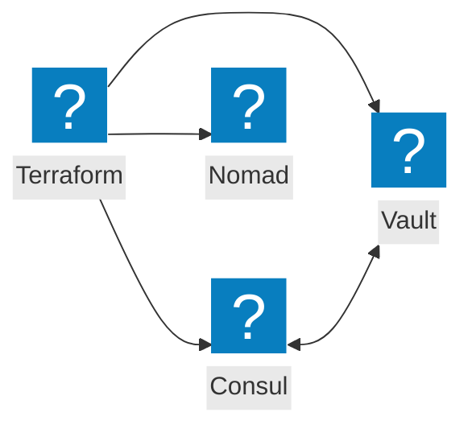
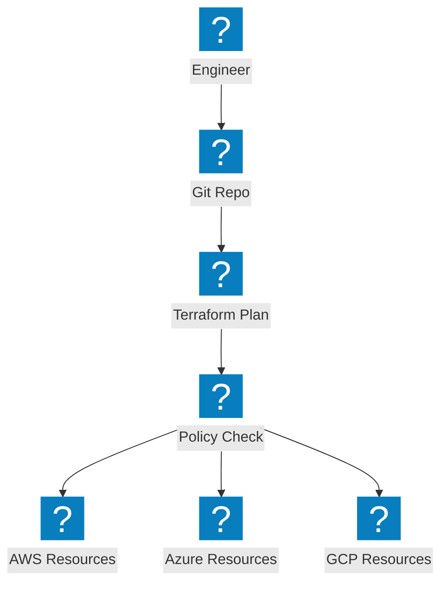

Diagrammi Infrastructure as Code che coprono l'Automazione Terraform, l'integrazione degli strumenti HashiCorp e i flussi di lavoro di provisioning multi-cloud.

## Integrazione dello Stack HashiCorp

Terraform orchestra il provisioning dell'infrastruttura con Consul per il service discovery, Vault per i segreti e Nomad per la pianificazione dei carichi di lavoro.

## Pipeline IaC Multi-Cloud

Terraform esegue il provisioning dell'infrastruttura su AWS, Azure e GCP con gestione dello stato e applicazione delle policy.

## Automazione dell'Infrastruttura F5 XC

Terraform automatizza la configurazione di F5 Distributed Cloud con load balancer, pool di origine e policy di sicurezza.

```mermaid
architecture-beta
  group iac(hashicorp-flight:terraform-color)[Terraform Workspace]
  group xc(lucide:cloud)[F5 XC Tenant]

  service tfplan(hashicorp-flight:terraform-color)[Terraform] in iac
  service vault(hashicorp-flight:vault-color)[Vault Secrets] in iac
  service consul(hashicorp-flight:consul-color)[Consul Registry] in iac
  service waap(f5xc:web-app-and-api-protection)[WAAP Policy] in xc
  service lb(f5xc:multi-cloud-app-connect)[App Connect] in xc
  service dns(f5xc:dns-management)[DNS Config] in xc

  tfplan:R --> L:vault
  vault:R --> L:consul
  tfplan:B --> T:waap
  tfplan:B --> T:lb
  tfplan:B --> T:dns
```

