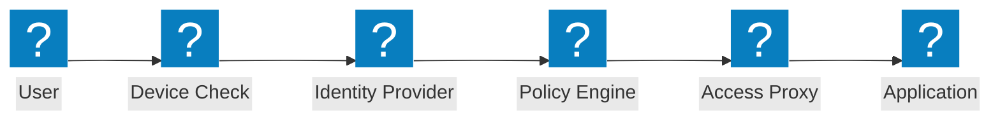
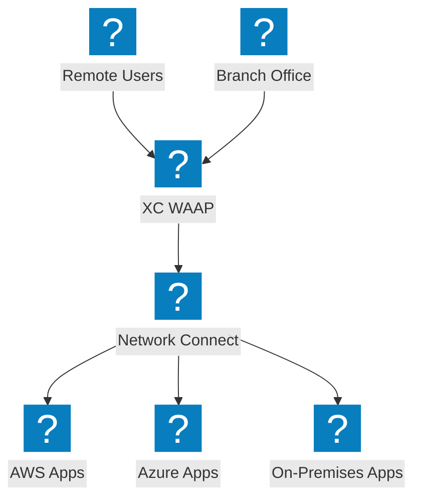

Diagrammi dell'architettura zero trust che coprono i flussi di accesso ZTNA, la verifica dell'identità, il controllo degli accessi basato su policy e la micro-segmentazione con integrazione F5 XC.

## Flusso di Accesso Zero Trust

Flusso di accesso zero trust con verifica della postura del dispositivo, verifica dell'identità, valutazione delle policy e accesso all'applicazione tramite proxy.

## Architettura Zero Trust F5 XC

F5 Distributed Cloud che fornisce accesso zero trust alle applicazioni con WAAP, proxy identity-aware e micro-segmentazione su più cloud.

## Architettura di Micro-Segmentazione

Micro-segmentazione della rete con policy basate sull'identità che controllano il traffico est-ovest tra i livelli applicativi.

```mermaid
architecture-beta
  group trust(lucide:shield)[Zero Trust Fabric]
  group apps(carbon:cloud-services)[Application Tiers]

  service idp(lucide:key)[Identity Provider] in trust
  service policy(carbon:gateway-security)[Policy Engine] in trust
  service seg(carbon:subnet-acl-rules)[Segmentation] in trust
  service web(carbon:application)[Web Tier] in apps
  service api(carbon:api)[API Tier] in apps
  service data(carbon:data-base)[Data Tier] in apps

  idp:R --> L:policy
  policy:R --> L:seg
  seg:R --> L:web
  web:R --> L:api
  api:R --> L:data
```

