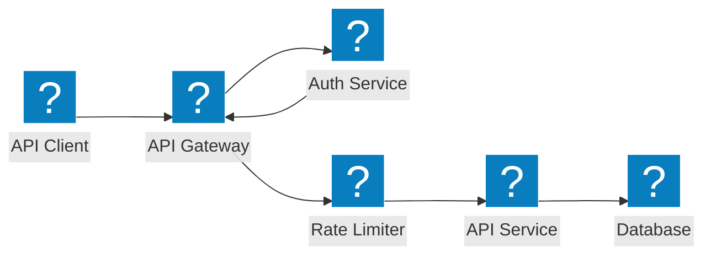
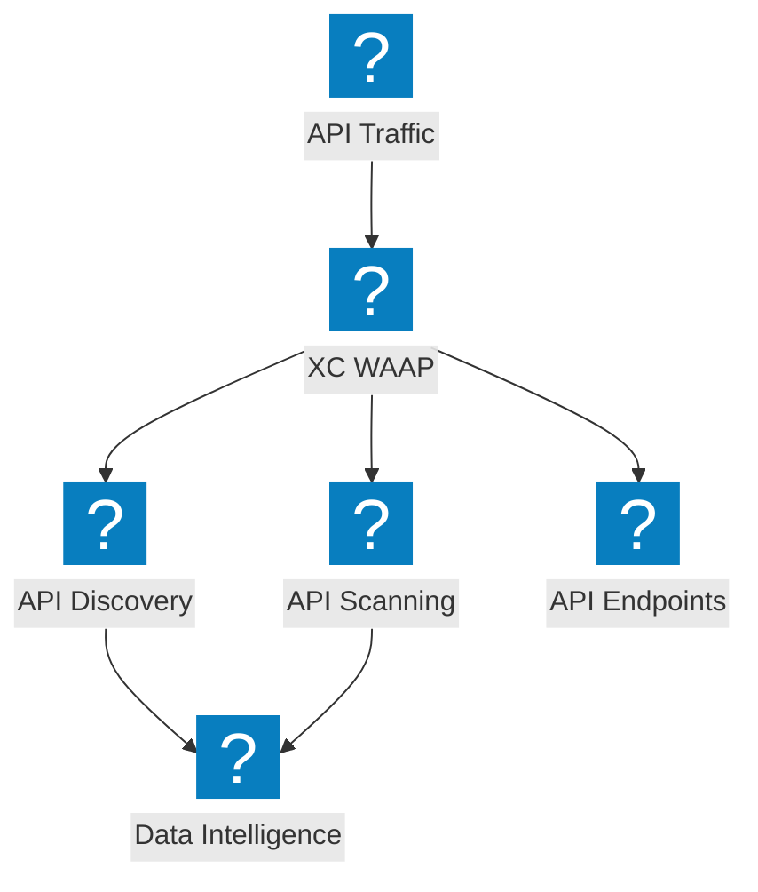

F5 Distributed Cloud を使用した API ゲートウェイセキュリティ、シャドウ API 検出、レート制限、およびスキーマ検証を網羅する API 保護アーキテクチャ図。

## API ゲートウェイセキュリティ

バックエンドサービスへの到達前に、認証、認可、レート制限、およびスキーマ検証を行う API ゲートウェイ。

## F5 XC API 検出と保護

F5 Distributed Cloud による API 検出、シャドウ API 検出、およびトラフィックインサイトを活用した包括的な API セキュリティ。

## API セキュリティパイプライン

TLS、JWT 検証、レート制限、およびペイロード検査を備えた多段階 API リクエスト検証パイプライン。

```mermaid
architecture-beta
  group security(lucide:shield)[API Security Layer]
  group backend(carbon:cloud-services)[Backend Services]

  service tls(lucide:lock)[TLS Termination] in security
  service jwt(lucide:key)[JWT Validation] in security
  service rate(carbon:load-balancer-vpc)[Rate Limiter] in security
  service schema(carbon:gateway-security)[Schema Validation] in security
  service api1(carbon:api)[Users API] in backend
  service api2(carbon:api)[Orders API] in backend

  tls:R --> L:jwt
  jwt:R --> L:rate
  rate:R --> L:schema
  schema:R --> L:api1
  schema:B --> T:api2
```

