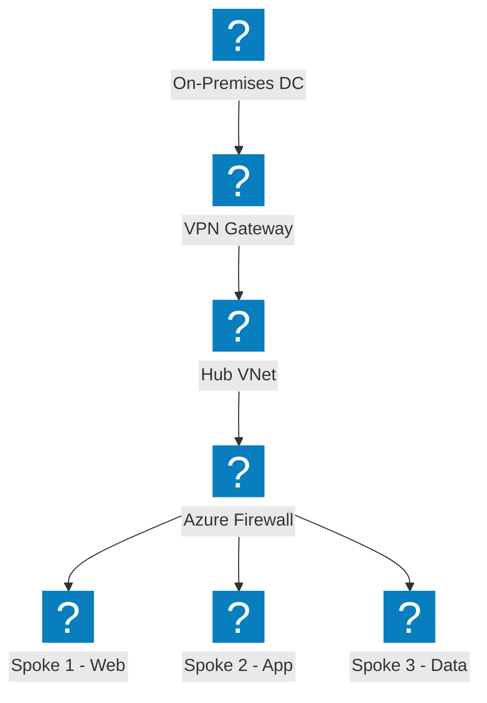
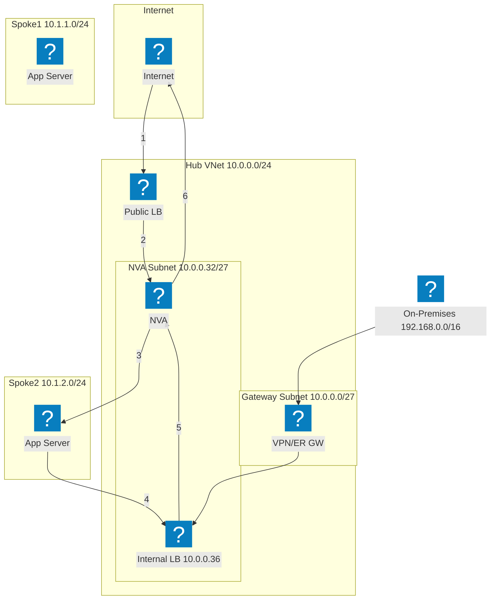
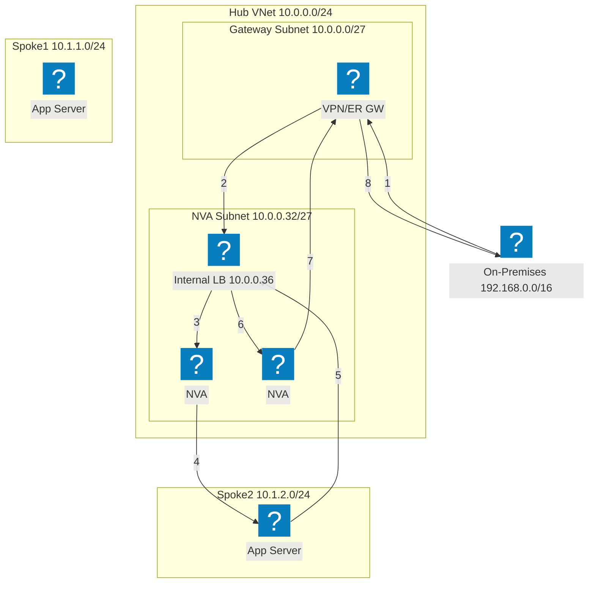
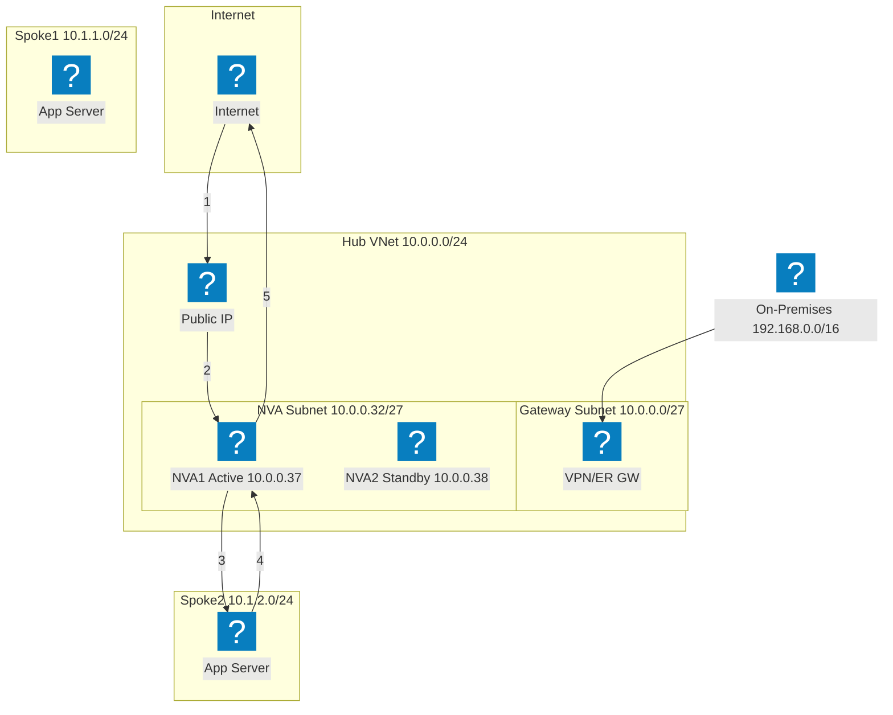
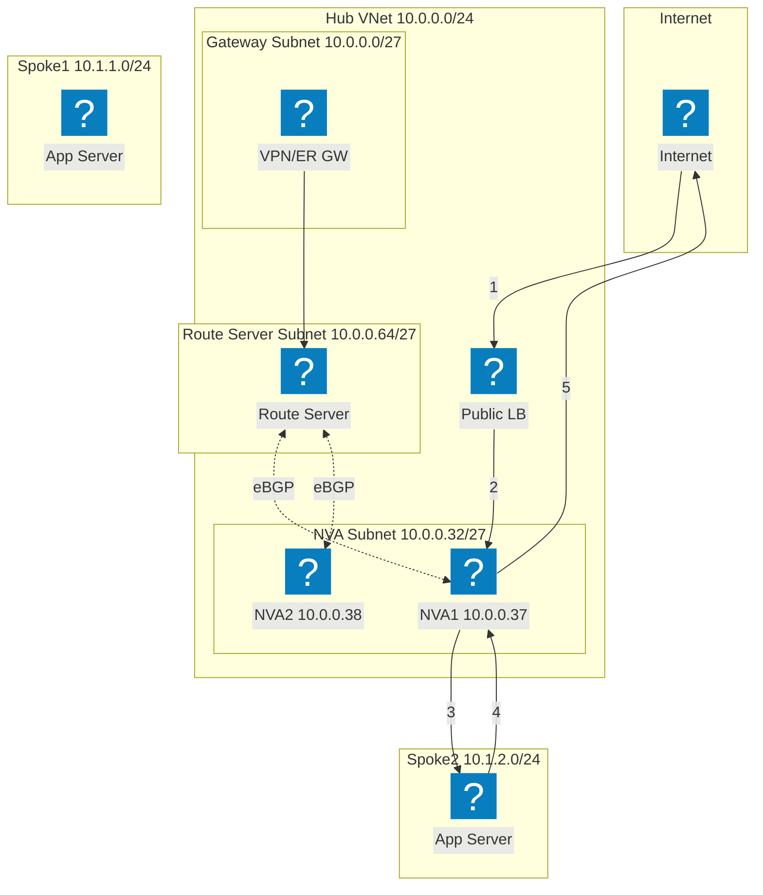
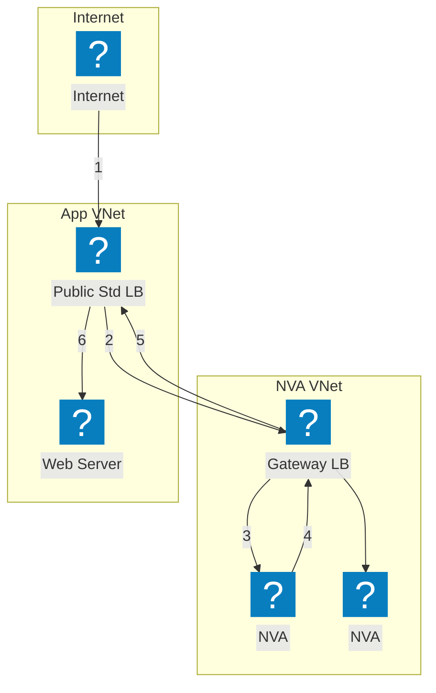

HashiCorp Flight および Carbon アイコンパックを使用した VNet ネットワーク、コンピュート、マネージドサービスの Azure インフラストラクチャ図。

## App Gateway を使用した VNet

ゲートウェイ、アプリケーション、データサブネットを持つ Azure VNet。Application Gateway が VM Scale Sets にトラフィックを分散します。

```mermaid
architecture-beta
  group vnet(carbon:virtual-private-cloud)[Azure VNet]
  group gwsub(carbon:ibm-cloud-subnets)[Gateway Subnet] in vnet
  group appsub(carbon:ibm-cloud-subnets)[App Subnet] in vnet
  group datasub(carbon:ibm-cloud-subnets)[Data Subnet] in vnet

  service appgw(carbon:gateway-security)[App Gateway] in gwsub
  service vm1(hashicorp-flight:azure-vms-color)[VM Scale Set] in appsub
  service vm2(hashicorp-flight:azure-vms-color)[VM Scale Set] in appsub
  service sqldb(carbon:data-base)[Azure SQL] in datasub

  appgw:R --> L:vm1
  appgw:B --> T:vm2
  vm1:R --> L:sqldb
  vm2:R --> L:sqldb
```

## F5 XC マルチクラウド接続を使用した AKS

マルチクラウドアプリケーション接続性とセキュリティのために F5 Distributed Cloud をフロントエンドとして配置した Azure Kubernetes Service。

```mermaid
architecture-beta
  group xc(lucide:cloud)[F5 XC]
  group aks(hashicorp-flight:azure-aks-color)[AKS Cluster]

  service mcn(f5xc:multi-cloud-network-connect)[Network Connect] in xc
  service waap(f5xc:web-app-and-api-protection)[WAAP] in xc
  service ingress(carbon:gateway)[Ingress] in aks
  service app(hashicorp-flight:docker-color)[App Pods] in aks
  service cache(carbon:datastore)[Redis Cache] in aks
  service blob(hashicorp-flight:azure-blob-storage-color)[Blob Storage]

  mcn:R --> L:waap
  waap:R --> L:ingress
  ingress:R --> L:app
  app:B --> T:cache
  app:R --> L:blob
```

## Hub-Spoke ネットワークトポロジー

集中型セキュリティと共有サービスにより複数のスポーク VNet を接続する Azure Hub-Spoke アーキテクチャ。

## ロードバランサーを使用した NVA HA — インターネットトラフィック

インバウンドのインターネットトラフィックはパブリックロードバランサーに到達し、ハブ内の NVA インスタンスへ分散されます。NVA は検査済みトラフィックをスポークのワークロードに転送します。スポークからの戻りトラフィックは、エグレスのために内部ロードバランサーを経由して NVA にルーティングされます。番号付きステップはインバウンドパス（1〜3）と戻りパス（4〜6）を示しています。

## ロードバランサーを使用した NVA HA — オンプレミストラフィック

オンプレミストラフィックは VPN または ExpressRoute ゲートウェイを経由して入り、複数の NVA インスタンスをフロントエンドとする内部ロードバランサーに転送されます。NVA はトラフィックを検査してスポークのワークロードに転送します。戻りトラフィックは、フロー対称性を確保しアシメトリックルーティング問題を防ぐために、同じ内部ロードバランサーを経由します。

## PIP/UDR を使用した NVA HA — アクティブ/スタンバイ

アクティブなインスタンス（NVA1）がパブリック IP アドレスを保持するアクティブ/スタンバイ NVA ペア。障害発生時、スタンバイの NVA2 が Azure API を呼び出してパブリック IP を再割り当てし、自身を指すようにユーザー定義ルートを更新します。このアプローチはロードバランサーを必要としませんが、API レベルのフェイルオーバーオーケストレーションが必要です。

## Azure Route Server を使用した NVA HA

Azure Route Server を使用した BGP ベースの高可用性。Route Server は両方の NVA インスタンスと eBGP アジャセンシーを確立し、スポークの有効ルートを動的にプログラムします。ECMP がユーザー定義ルートなしに NVA 間でロードバランシングを行います。Route Server はすべてのピアリング済み VNet に両 NVA IP のネクストホップエントリを注入します。

## Gateway ロードバランサーを使用した NVA HA

Azure Gateway ロードバランサーを使用した透過的な NVA 挿入。アプリケーション宛てのトラフィックは、パブリック標準ロードバランサーから別の NVA VNet 内の Gateway LB へ透過的に転送されます。NVA がトラフィックを検査して Gateway LB に返し、Gateway LB がアプリケーションに転送します。NVA と アプリケーション VNet 間の VNet ピアリングや UDR は不要です。

