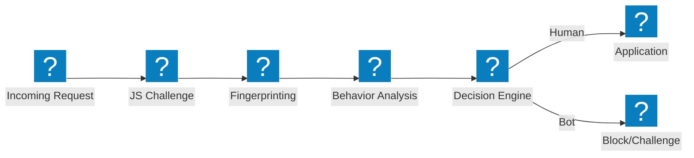
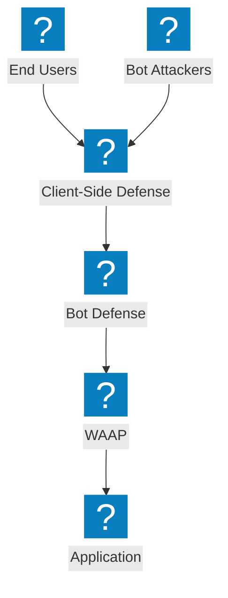

検出パイプライン、クレデンシャルスタッフィング対策、クライアントサイド防御、F5 Distributed Cloud の Bot 管理機能を網羅した Bot 防御アーキテクチャ図。

## Bot 検出パイプライン

JavaScript チャレンジ、行動分析、フィンガープリンティングを経てアクセスを許可するマルチステージの Bot 検出パイプライン。

## F5 XC Bot 防御とクライアントサイド防御

クレデンシャルスタッフィングおよびアカウント乗っ取り防止のためのクライアントサイド保護を統合した F5 Distributed Cloud の Bot 防御。

## クレデンシャルスタッフィング防御アーキテクチャ

デバイスフィンガープリンティング、クレデンシャルインテリジェンス、アカウント保護によるクレデンシャルスタッフィング攻撃に対する多層防御。

