`f5-brand` アイコンパックを使用したセキュリティ、ネットワーク、アプリケーション配信アーキテクチャを示す F5 Distributed Cloud のユースケース図です。

## Web アプリおよび API 保護

### WAAP セキュリティインスペクションパイプライン

ファイアウォール、アプリケーションコード保護、ボット防御を多層構成で経由してアプリケーションに到達する WAAP インスペクションパイプライン。

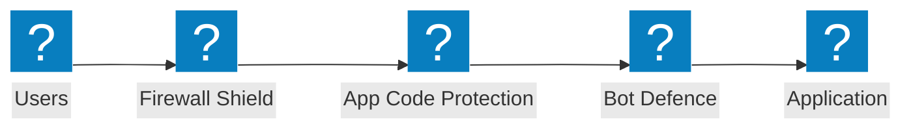

### エッジセキュリティアーキテクチャ

WAF、シールドチェックマーク検証、アプリケーション保護グループを組み合わせたクラウドオリジン向けエッジセキュリティアーキテクチャ。

```mermaid
architecture-beta
  group edge(f5-brand:security-firewall-shield)[Security Edge]
  group origins(carbon:cloud-services)[Cloud Origins]

  service waf(f5-brand:security-firewall)[WAF] in edge
  service shield(f5-brand:security-shield-checkmark)[Shield Verify] in edge
  service appshield(f5-brand:security-shield-app-code)[App Shield] in edge
  service aws(hashicorp-flight:aws-color)[AWS Origin] in origins
  service azure(hashicorp-flight:azure-color)[Azure Origin] in origins

  waf:R --> L:shield
  shield:R --> L:appshield
  appshield:R --> L:aws
  appshield:B --> T:azure
```

### レート制限付き API 保護

ファイアウォール、レート制限、スキーマ検証を経て API エンドポイントに到達する API リクエスト検証パイプライン。

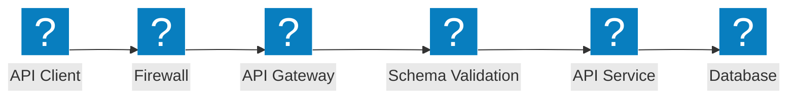

## ボット防御

### ボット検出パイプライン

JavaScript チャレンジ、デバイスフィンガープリント、行動分析、デシジョンエンジンによる多段階ボット検出。

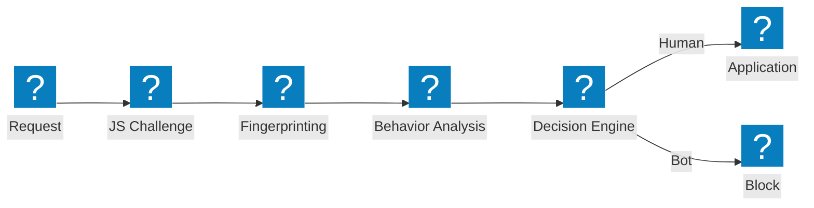

### ボット防御レイヤー

クレデンシャルインテリジェンス、ボット検出、デバイスポスチャ分析による多層ボット防御アーキテクチャ。

```mermaid
architecture-beta
  group defense(f5-brand:security-bot-defence)[Bot Defense Layers]
  group app(carbon:cloud-services)[Application]

  service botfw(f5-brand:security-firewall-bot)[Bot Firewall] in defense
  service botdef(f5-brand:security-bot-defence)[Bot Defence] in defense
  service intel(f5-brand:security-password-bot)[Credential Intel] in defense
  service login(carbon:application)[Login Service] in app
  service account(carbon:security)[Account Service] in app
  service db(carbon:data-base)[User Store] in app

  botfw:R --> L:botdef
  botdef:R --> L:intel
  intel:R --> L:login
  login:R --> L:account
  account:B --> T:db
```

### クライアントサイド防御

デバイスポスチャ検証、ラップトップボット検出、Magecart 対策によるクライアントサイド防御パイプライン。

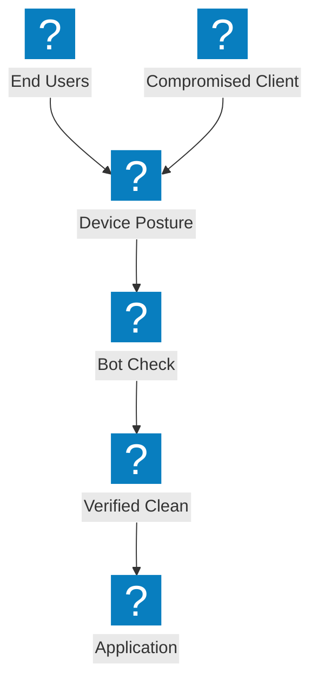

## マルチクラウドネットワーク

### マルチクラウドアプリ接続

集中型アプリデリバリーファブリックによる AWS、Azure、GCP 間のマルチクラウドアプリケーション接続。


### サイトメッシュを用いたネットワーク接続

サイトメッシュトポロジーとトランジットゲートウェイによるクラウドリージョン間のマルチクラウドネットワーク接続。

```mermaid
architecture-beta
  group net(f5-brand:cloud-network-connect)[Network Connect]
  group region1(hashicorp-flight:aws-color)[AWS Region]
  group region2(hashicorp-flight:azure-color)[Azure Region]

  service mesh(f5-brand:cloud-multi-network)[Site Mesh] in net
  service gw(f5-brand:network-gateway)[Transit Gateway] in net
  service web1(carbon:virtual-machine)[Web Tier] in region1
  service db1(carbon:data-base)[Database] in region1
  service web2(carbon:virtual-machine)[Web Tier] in region2
  service db2(carbon:data-base)[Database] in region2

  mesh:R --> L:gw
  gw:B --> T:web1
  web1:R --> L:db1
  gw:B --> T:web2
  web2:R --> L:db2
```

### マルチクラウドアプリデリバリー

グローバルロードバランシング、セキュリティ、分散ワークロードを備えたエンドツーエンドのマルチクラウドアプリデリバリー。

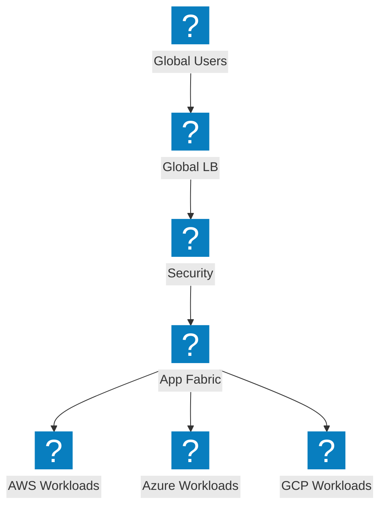

## DDoS 対策とエッジサービス

### DDoS スクラビングアーキテクチャ

ネットワーク層保護、サイトスクラビング、オリジンへのクリーントラフィック配信を行う DDoS スクラビングセンター。

```mermaid
architecture-beta
  group scrub(f5-brand:network-ddos-protection)[Scrubbing Center]
  group origin(carbon:cloud-services)[Origin DC]

  service ddos(f5-brand:network-ddos-protection)[DDoS Protection] in scrub
  service sitescrub(f5-brand:security-site-scrubbing)[Site Scrubbing] in scrub
  service clean(f5-brand:network-globe-load-balance)[Clean Pipe] in scrub
  service lb(carbon:load-balancer-application)[Load Balancer] in origin
  service app(carbon:application)[Application] in origin
  service db(carbon:data-base)[Database] in origin

  ddos:R --> L:sitescrub
  sitescrub:R --> L:clean
  clean:R --> L:lb
  lb:R --> L:app
  app:B --> T:db
```

### 大規模攻撃の緩和

オリジンに到達する前にエッジで容量型 DDoS 攻撃を吸収・緩和する攻撃トラフィックフロー。

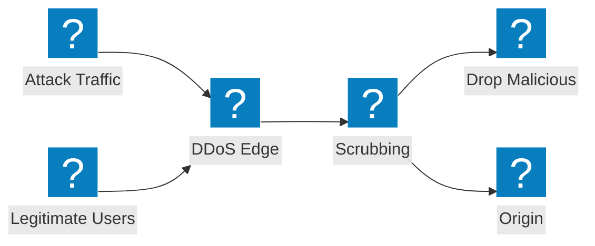

### CDN + DDoS + WAF の多層保護

CDN キャッシング、DDoS 緩和、WAF インスペクションを統合パイプラインで組み合わせた多層エッジ保護。

```mermaid
architecture-beta
  group edge(f5-brand:cloud-performance-arrow)[Edge Services]
  group security(f5-brand:security-firewall-shield)[Security Layer]
  group app(carbon:cloud-services)[Application]

  service cdn(f5-brand:cloud-performance-arrow)[CDN] in edge
  service ddos(f5-brand:network-ddos-protection)[DDoS Protection] in edge
  service waf(f5-brand:security-firewall-shield)[WAF] in security
  service shield(f5-brand:security-shield-checkmark)[Shield] in security
  service web(carbon:application)[Web App] in app
  service api(carbon:api)[API Service] in app

  cdn:R --> L:ddos
  ddos:R --> L:waf
  waf:R --> L:shield
  shield:R --> L:web
  shield:B --> T:api
```

## DNS とトラフィック管理

### ヘルスモニタリング付き DNS ベース GSLB

マルチクラウドエンドポイント全体のヘルスモニタリングを伴う DNS ベースのグローバルサーバーロードバランシング。

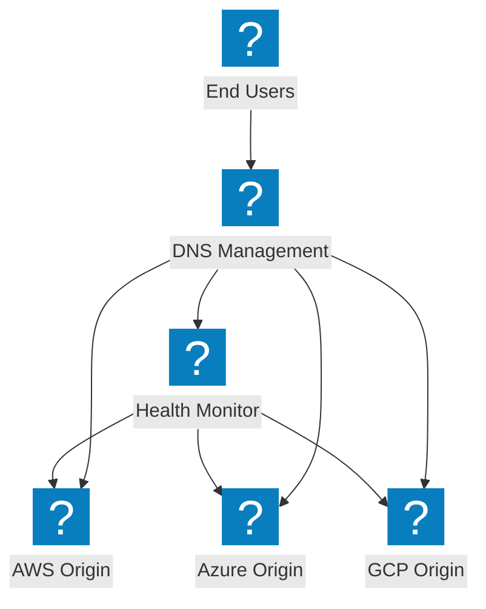

### DNS 管理アーキテクチャ

クラウドリージョン全体の DNS ロードバランシングとシールド DNS 保護を備えた DNS 管理インフラストラクチャ。

```mermaid
architecture-beta
  group dnsinfra(f5-brand:network-dns-1)[DNS Infrastructure]
  group region1(hashicorp-flight:aws-color)[US East]
  group region2(hashicorp-flight:azure-color)[EU West]

  service dns(f5-brand:network-dns-load-balance)[DNS Load Balance] in dnsinfra
  service shielddns(f5-brand:security-shield-dns)[Shield DNS] in dnsinfra
  service lb1(carbon:load-balancer-application)[Regional LB] in region1
  service app1(carbon:virtual-machine)[App Servers] in region1
  service lb2(carbon:load-balancer-application)[Regional LB] in region2
  service app2(carbon:virtual-machine)[App Servers] in region2

  dns:R --> L:shielddns
  dns:B --> T:lb1
  lb1:R --> L:app1
  dns:B --> T:lb2
  lb2:R --> L:app2
```

### フェイルオーバー付きインテリジェント DNS ロードバランシング

クラウド DNS 統合、パフォーマンスルーティング、自動フェイルオーバーを備えたインテリジェント DNS ロードバランシング。

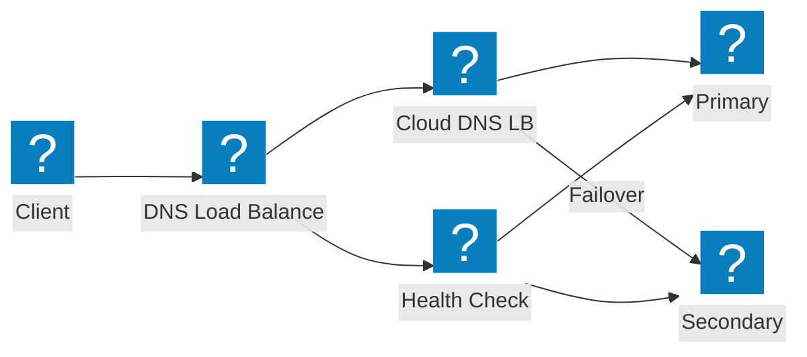

## API セキュリティと探索

### シャドー API 探索パイプライン

トラフィック分析とインベントリ管理を通じて未知の API を検出するシャドー API 探索パイプライン。

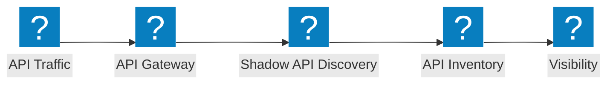

### API ゲートウェイアーキテクチャ

認証、レート制限、セキュリティ検証によりバックエンド API サービスを保護する API ゲートウェイ。

```mermaid
architecture-beta
  group gateway(f5-brand:network-api-gateway)[API Gateway]
  group backend(carbon:cloud-services)[Backend Services]

  service apigw(f5-brand:network-api-gateway)[API Gateway] in gateway
  service auth(f5-brand:security-key-lock)[Authentication] in gateway
  service rate(f5-brand:network-api)[Rate Limiter] in gateway
  service shield(f5-brand:security-shield-checkmark)[Schema Check] in gateway
  service api1(carbon:api)[Users API] in backend
  service api2(carbon:api)[Orders API] in backend

  apigw:R --> L:auth
  auth:R --> L:rate
  rate:R --> L:shield
  shield:R --> L:api1
  shield:B --> T:api2
```

### API ライフサイクル：探索から保護まで

シャドー API 探索からインベントリカタログ化、アクティブな保護までの API ライフサイクルパイプライン。

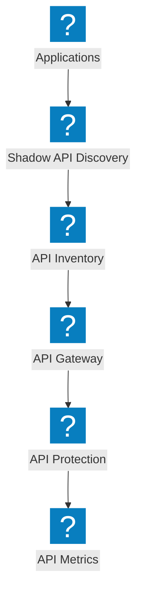

## プラットフォームとオブザーバビリティ

### NGINX One による分散アプリ

NGINX One 管理、Kubernetes ワークロード、集中管理を備えた分散アプリケーションプラットフォーム。

```mermaid
architecture-beta
  group platform(f5-brand:service-f5)[F5 Platform]
  group compute(carbon:cloud-services)[Compute]

  service nginx(f5-brand:service-nginx)[NGINX One] in platform
  service netng(f5-brand:network-nginx)[NGINX Network] in platform
  service f5svc(f5-brand:service-f5)[F5 Service] in platform
  service k8s(f5-brand:app-kubernetes)[Kubernetes] in compute
  service dist(f5-brand:cloud-distributed)[Distributed App] in compute
  service container(f5-brand:cloud-container-app)[Container App] in compute

  nginx:R --> L:netng
  netng:R --> L:f5svc
  nginx:B --> T:k8s
  netng:B --> T:dist
  f5svc:B --> T:container
```

### オブザーバビリティパイプライン

アプリケーションからメトリクスを収集し、インサイト、アラート、ダッシュボードを生成するオブザーバビリティパイプライン。

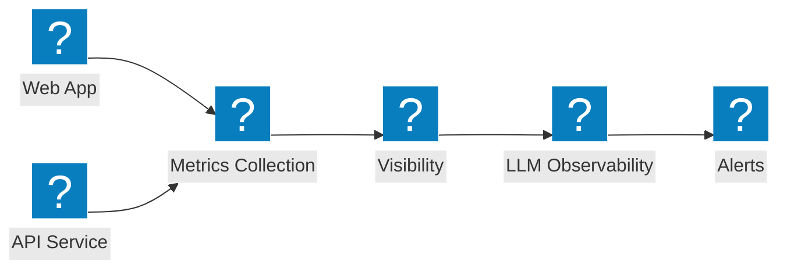

### フルプラットフォームビュー

セキュリティ、ネットワーク、アプリケーション配信を統合サービスとして接続する包括的な F5 プラットフォームビュー。

```mermaid
architecture-beta
  group f5(f5-brand:service-f5)[F5 Service Platform]
  group security(f5-brand:security-firewall-shield)[Security]
  group networking(f5-brand:cloud-network-connect)[Networking]

  service svcf5(f5-brand:service-f5)[F5 Service] in f5
  service bigip(f5-brand:service-big-ip-next)[BIG-IP Next] in f5
  service obs(f5-brand:other-site-metrics)[Observability] in f5
  service fw(f5-brand:security-firewall-shield)[WAF] in security
  service botd(f5-brand:security-bot-defence)[Bot Defence] in security
  service ddos(f5-brand:network-ddos-protection)[DDoS] in security
  service multi(f5-brand:cloud-multi-network)[Multi-Cloud Net] in networking
  service fabric(f5-brand:app-delivery-fabric)[App Fabric] in networking
  service nginx(f5-brand:service-nginx)[NGINX One] in networking

  svcf5:B --> T:fw
  svcf5:B --> T:multi
  bigip:B --> T:botd
  bigip:B --> T:fabric
  obs:B --> T:ddos
  obs:B --> T:nginx
```
