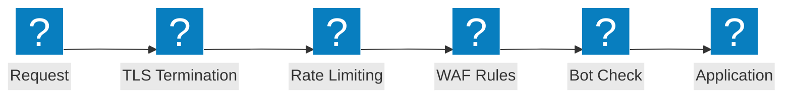

セキュリティインスペクションチェーン、OWASP 保護フロー、F5 Distributed Cloud WAAP 機能を網羅する Web アプリファイアウォール (WAF) アーキテクチャ図。

## セキュリティインスペクションパイプライン

CDN エッジから WAF、Bot 防御、ロードバランサーを経てオリジンインフラまでの多層セキュリティインスペクションチェーン。

```mermaid
architecture-beta
  group edge(lucide:shield)[Security Edge]
  group origin(carbon:cloud-services)[Origin Infrastructure]

  service cdn(carbon:content-delivery-network)[CDN] in edge
  service waf(carbon:firewall)[WAF] in edge
  service bot(lucide:shield-check)[Bot Defense] in edge
  service lb(carbon:load-balancer-application)[Load Balancer] in origin
  service app(carbon:application)[App Server] in origin
  service db(carbon:data-base)[Database] in origin

  cdn:R --> L:waf
  waf:R --> L:bot
  bot:R --> L:lb
  lb:R --> L:app
  app:B --> T:db
```

## F5 XC WAAP 保護

統合された Bot 防御およびクライアントサイド防御を備えた F5 Distributed Cloud Web アプリケーションおよび API 保護。

## OWASP 保護フロー

OWASP Top 10 の脅威カテゴリに対するインスペクションステージを示す WAF リクエスト処理パイプライン。

