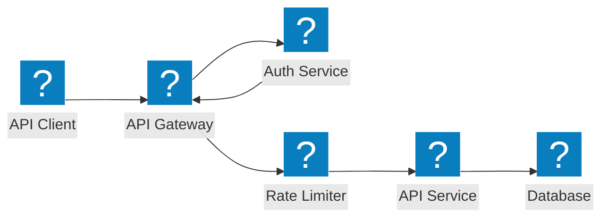
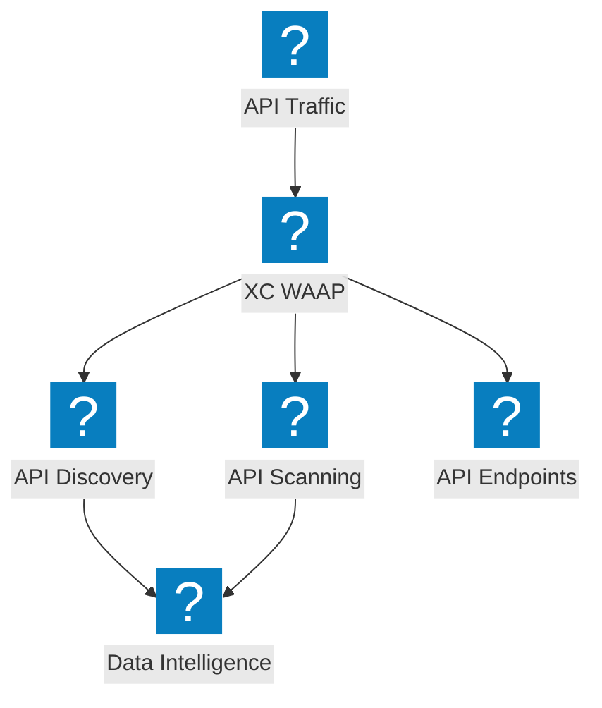

F5 Distributed Cloud를 활용한 API 게이트웨이 보안, 섀도우 API 탐지, 속도 제한 및 스키마 검증을 다루는 API 보호 아키텍처 다이어그램.

## API 게이트웨이 보안

백엔드 서비스에 도달하기 전에 인증, 권한 부여, 속도 제한 및 스키마 검증을 수행하는 API 게이트웨이.

## F5 XC API 탐지 및 보호

API 탐지, 섀도우 API 감지 및 트래픽 인사이트를 통한 포괄적인 API 보안을 제공하는 F5 Distributed Cloud.

## API 보안 파이프라인

TLS, JWT 검증, 속도 제한 및 페이로드 검사를 포함한 다단계 API 요청 검증 파이프라인.

```mermaid
architecture-beta
  group security(lucide:shield)[API Security Layer]
  group backend(carbon:cloud-services)[Backend Services]

  service tls(lucide:lock)[TLS Termination] in security
  service jwt(lucide:key)[JWT Validation] in security
  service rate(carbon:load-balancer-vpc)[Rate Limiter] in security
  service schema(carbon:gateway-security)[Schema Validation] in security
  service api1(carbon:api)[Users API] in backend
  service api2(carbon:api)[Orders API] in backend

  tls:R --> L:jwt
  jwt:R --> L:rate
  rate:R --> L:schema
  schema:R --> L:api1
  schema:B --> T:api2
```

