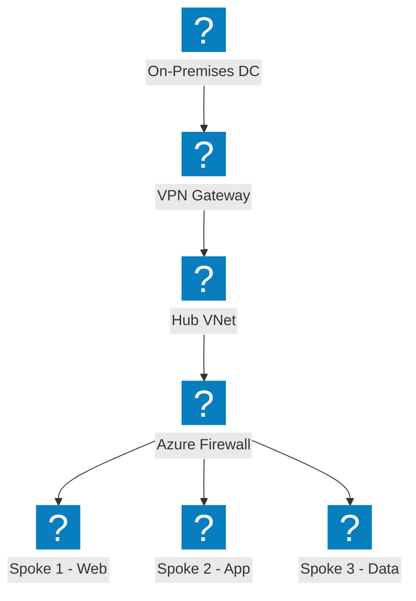
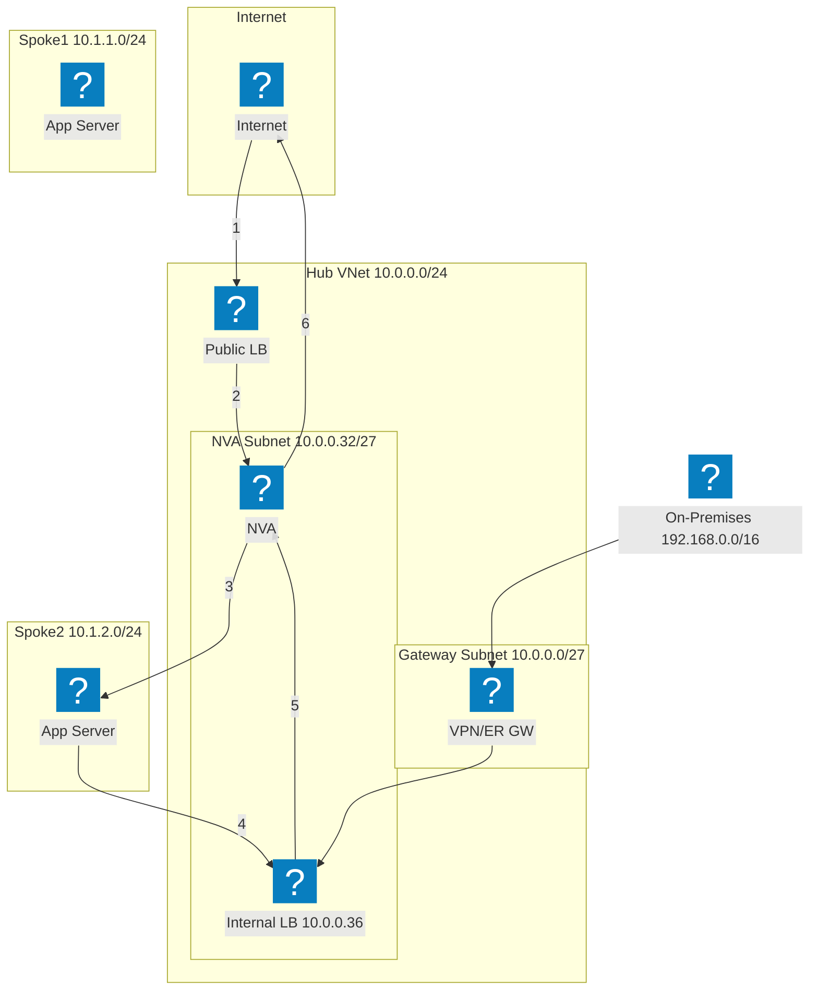
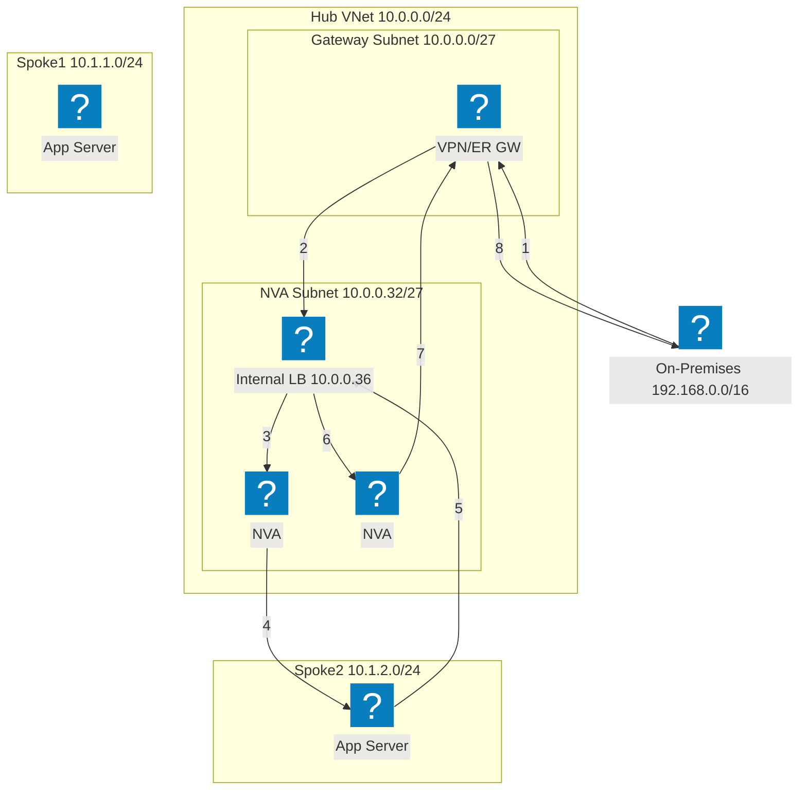
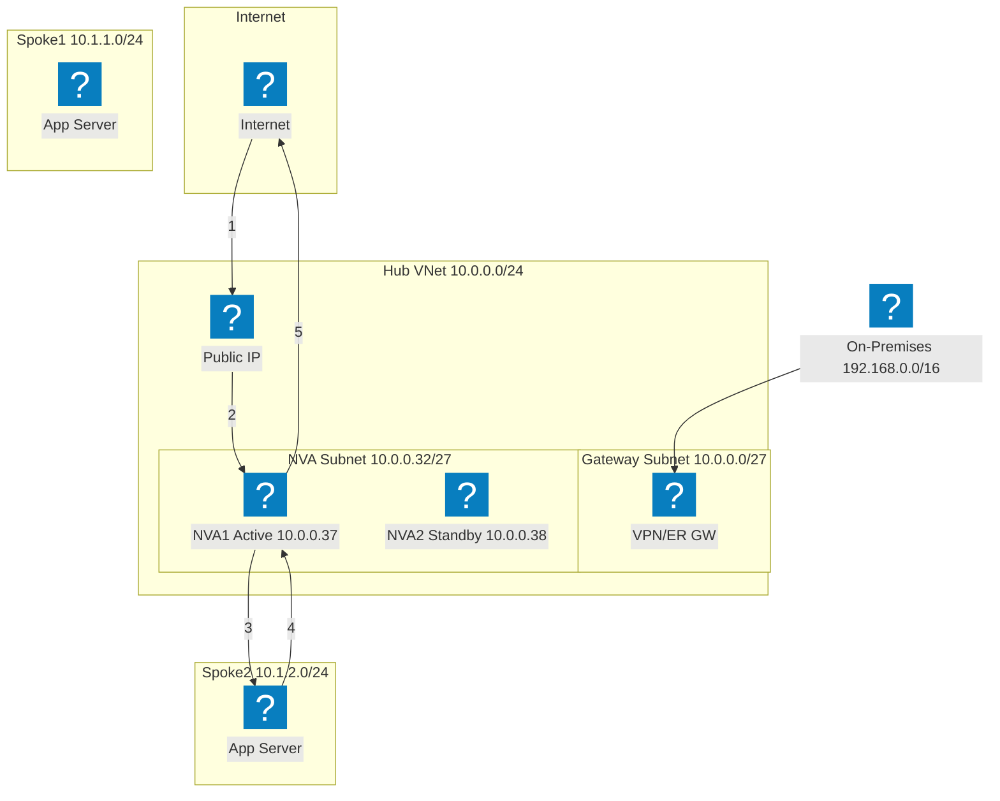
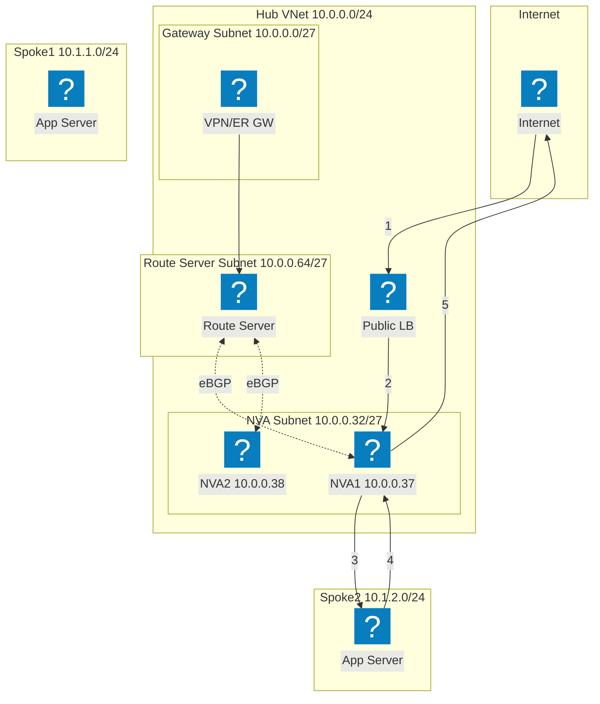
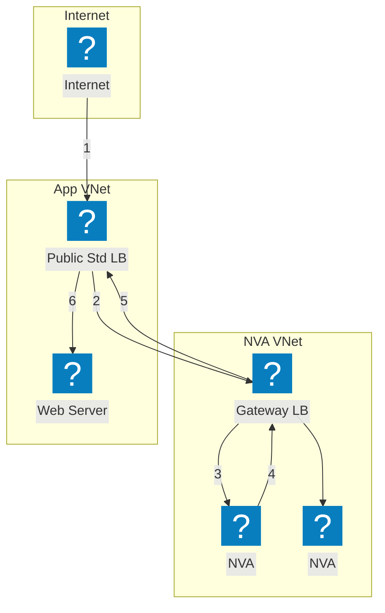

VNet 네트워킹, 컴퓨팅 및 관리형 서비스를 위해 HashiCorp Flight 및 Carbon 아이콘 팩을 사용한 Azure 인프라 다이어그램입니다.

## App Gateway를 포함한 VNet

게이트웨이, 애플리케이션 및 데이터 서브넷이 있는 Azure VNet입니다. Application Gateway가 VM Scale Sets에 트래픽을 분산합니다.

```mermaid
architecture-beta
  group vnet(carbon:virtual-private-cloud)[Azure VNet]
  group gwsub(carbon:ibm-cloud-subnets)[Gateway Subnet] in vnet
  group appsub(carbon:ibm-cloud-subnets)[App Subnet] in vnet
  group datasub(carbon:ibm-cloud-subnets)[Data Subnet] in vnet

  service appgw(carbon:gateway-security)[App Gateway] in gwsub
  service vm1(hashicorp-flight:azure-vms-color)[VM Scale Set] in appsub
  service vm2(hashicorp-flight:azure-vms-color)[VM Scale Set] in appsub
  service sqldb(carbon:data-base)[Azure SQL] in datasub

  appgw:R --> L:vm1
  appgw:B --> T:vm2
  vm1:R --> L:sqldb
  vm2:R --> L:sqldb
```

## F5 XC 멀티클라우드 연결을 포함한 AKS

멀티클라우드 애플리케이션 연결 및 보안을 위해 F5 Distributed Cloud를 앞단에 배치한 Azure Kubernetes Service입니다.

```mermaid
architecture-beta
  group xc(lucide:cloud)[F5 XC]
  group aks(hashicorp-flight:azure-aks-color)[AKS Cluster]

  service mcn(f5xc:multi-cloud-network-connect)[Network Connect] in xc
  service waap(f5xc:web-app-and-api-protection)[WAAP] in xc
  service ingress(carbon:gateway)[Ingress] in aks
  service app(hashicorp-flight:docker-color)[App Pods] in aks
  service cache(carbon:datastore)[Redis Cache] in aks
  service blob(hashicorp-flight:azure-blob-storage-color)[Blob Storage]

  mcn:R --> L:waap
  waap:R --> L:ingress
  ingress:R --> L:app
  app:B --> T:cache
  app:R --> L:blob
```

## Hub-Spoke 네트워크 토폴로지

여러 스포크 VNet을 연결하는 중앙화된 보안 및 공유 서비스를 갖춘 Azure Hub-Spoke 아키텍처입니다.

## 부하 분산 장치를 사용한 NVA HA — 인터넷 트래픽

인바운드 인터넷 트래픽은 공용 부하 분산 장치에 도달하고, 이를 통해 허브의 NVA 인스턴스에 분산됩니다. NVA는 검사된 트래픽을 스포크 워크로드로 전달합니다. 스포크에서의 반환 트래픽은 내부 부하 분산 장치를 통해 이그레스를 위해 NVA로 다시 라우팅됩니다. 번호가 매겨진 단계는 인바운드 경로(1-3)와 반환 경로(4-6)를 보여줍니다.

## 부하 분산 장치를 사용한 NVA HA — 온프레미스 트래픽

온프레미스 트래픽은 VPN 또는 ExpressRoute 게이트웨이를 통해 진입하고 여러 NVA 인스턴스 앞의 내부 부하 분산 장치로 전달됩니다. NVA는 트래픽을 검사하고 스포크 워크로드로 전달합니다. 반환 트래픽은 비대칭 라우팅 문제를 방지하기 위해 흐름 대칭성을 보장하는 동일한 내부 부하 분산 장치를 통해 이동합니다.

## PIP/UDR을 사용한 NVA HA — 액티브/스탠바이

액티브 인스턴스(NVA1)가 공용 IP 주소를 보유하는 액티브/스탠바이 NVA 쌍입니다. 장애 발생 시 스탠바이 NVA2는 Azure API를 호출하여 공용 IP를 재할당하고 자신을 가리키도록 사용자 정의 경로를 업데이트합니다. 이 방식은 부하 분산 장치를 사용하지 않지만 API 수준의 페일오버 오케스트레이션이 필요합니다.

## Azure Route Server를 사용한 NVA HA

Azure Route Server를 사용한 BGP 기반 고가용성입니다. Route Server는 두 NVA 인스턴스와 eBGP 인접성을 설정하고 스포크 유효 경로를 동적으로 프로그래밍합니다. ECMP는 사용자 정의 경로 없이 NVA 간에 부하를 분산합니다. Route Server는 모든 피어링된 VNet에 두 NVA IP의 넥스트홉 항목을 주입합니다.

## Gateway Load Balancer를 사용한 NVA HA

Azure Gateway Load Balancer를 사용한 투명한 NVA 삽입입니다. 애플리케이션을 대상으로 하는 트래픽은 공용 표준 부하 분산 장치에서 별도의 NVA VNet에 있는 Gateway LB로 투명하게 전환됩니다. NVA는 트래픽을 검사하고 Gateway LB로 반환하며, Gateway LB는 이를 다시 애플리케이션으로 전달합니다. NVA와 애플리케이션 VNet 간에 VNet 피어링이나 UDR이 필요하지 않습니다.

