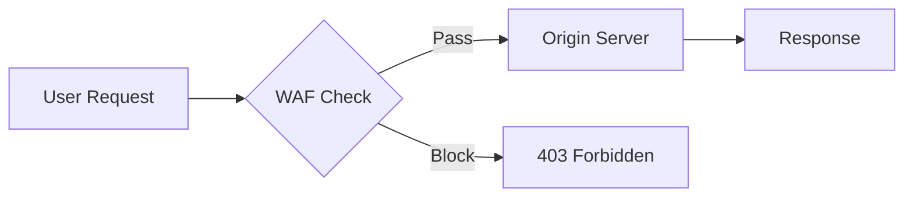
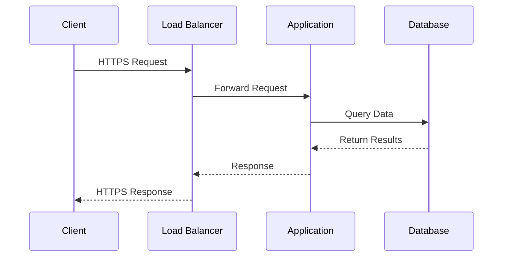
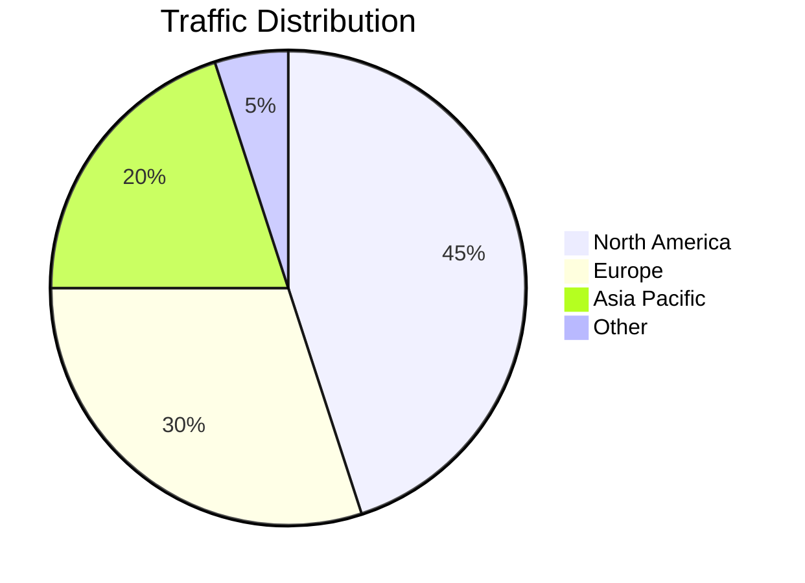
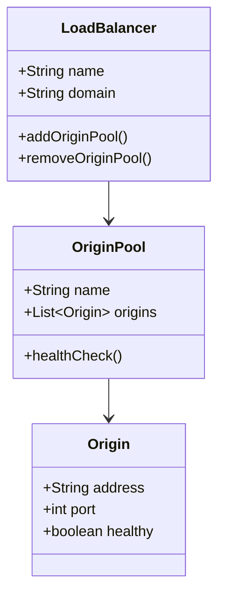
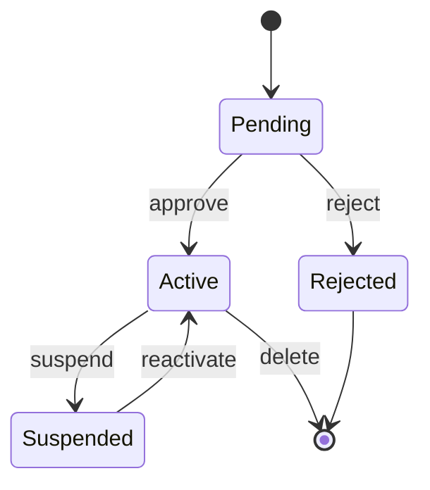
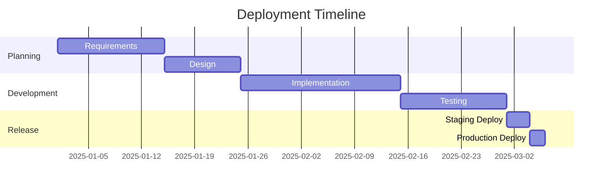

일반 목적의 문서화를 위한 핵심 Mermaid 다이어그램 유형입니다. 이 유형들은 커스텀 아이콘 팩 없이도 사용할 수 있습니다.

## 순서도

```mermaid
flowchart LR
  A[User Request] --> B{WAF Check}
  B -->|Pass| C[Origin Server]
  B -->|Block| D[403 Forbidden]
  C --> E[Response]
```

## 시퀀스 다이어그램

```mermaid
sequenceDiagram
  participant Client
  participant LB as Load Balancer
  participant App as Application
  participant DB as Database

  Client->>LB: HTTPS Request
  LB->>App: Forward Request
  App->>DB: Query Data
  DB-->>App: Return Results
  App-->>LB: Response
  LB-->>Client: HTTPS Response
```

## 파이 차트

```mermaid
pie title Traffic Distribution
  "North America" : 45
  "Europe" : 30
  "Asia Pacific" : 20
  "Other" : 5
```

## 클래스 다이어그램

```mermaid
classDiagram
  class LoadBalancer {
    +String name
    +String domain
    +addOriginPool()
    +removeOriginPool()
  }
  class OriginPool {
    +String name
    +List~Origin~ origins
    +healthCheck()
  }
  class Origin {
    +String address
    +int port
    +boolean healthy
  }
  LoadBalancer --> OriginPool
  OriginPool --> Origin
```

## 상태 다이어그램

```mermaid
stateDiagram-v2
  [*] --> Pending
  Pending --> Active : approve
  Pending --> Rejected : reject
  Active --> Suspended : suspend
  Suspended --> Active : reactivate
  Active --> [*] : delete
  Rejected --> [*]
```

## 간트 차트

```mermaid
gantt
  title Deployment Timeline
  dateFormat YYYY-MM-DD
  section Planning
    Requirements     :a1, 2025-01-01, 14d
    Design           :a2, after a1, 10d
  section Development
    Implementation   :b1, after a2, 21d
    Testing          :b2, after b1, 14d
  section Release
    Staging Deploy   :c1, after b2, 3d
    Production Deploy :c2, after c1, 2d
```
