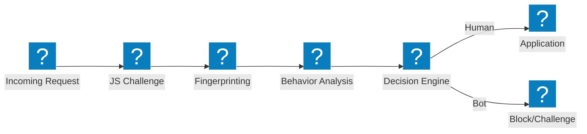
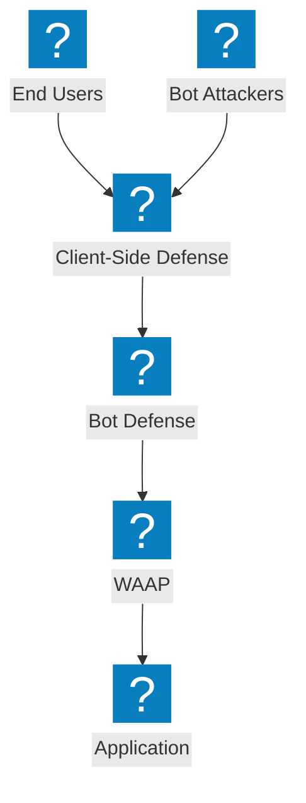

탐지 파이프라인, 자격 증명 스터핑 완화, 클라이언트 측 방어, F5 Distributed Cloud 봇 관리 기능을 다루는 봇 방어 아키텍처 다이어그램.

## 봇 탐지 파이프라인

JavaScript 챌린지, 행동 분석, 핑거프린팅을 통해 액세스를 허용하기 전에 처리하는 다단계 봇 탐지 파이프라인.

## F5 XC Bot Defense 및 클라이언트 측 방어

자격 증명 스터핑 및 계정 탈취 방지를 위한 클라이언트 측 보호 기능이 통합된 F5 Distributed Cloud 봇 방어.

## 자격 증명 스터핑 방어 아키텍처

장치 핑거프린팅, 자격 증명 인텔리전스, 계정 보호를 통한 자격 증명 스터핑 공격에 대한 다층 방어.

