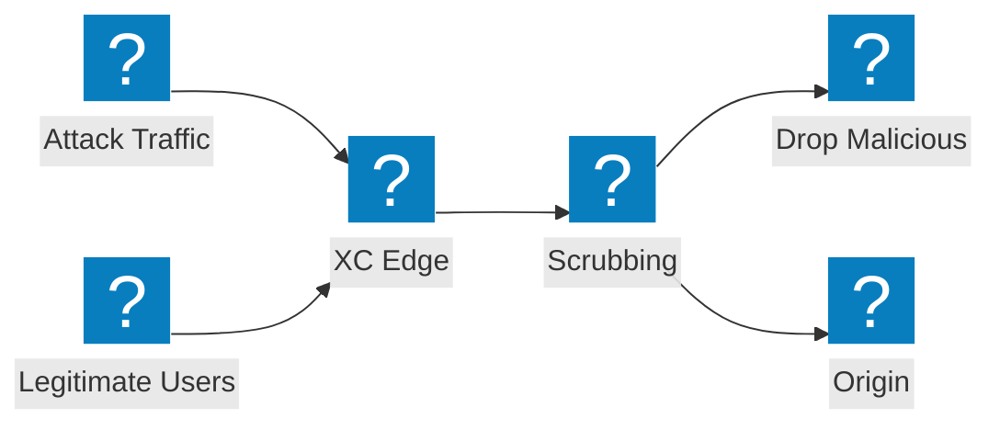

스크러빙 센터 설계, 트랜짓 서비스 통합, F5 Distributed Cloud 볼류메트릭 공격 방어를 다루는 DDoS 완화 아키텍처 다이어그램.

## DDoS 완화 아키텍처

네트워크 계층 스크러빙, 애플리케이션 계층 검사, 오리진으로의 클린 트래픽 전달을 포함한 다중 계층 DDoS 완화.

```mermaid
architecture-beta
  group scrub(lucide:shield)[Scrubbing Center]
  group origin(carbon:cloud-services)[Origin DC]

  service edge(carbon:edge-node)[Edge Router] in scrub
  service filter(carbon:firewall)[Traffic Filter] in scrub
  service clean(carbon:load-balancer-global)[Clean Pipe] in scrub
  service lb(carbon:load-balancer-application)[Load Balancer] in origin
  service app(carbon:application)[Application] in origin
  service db(carbon:data-base)[Database] in origin

  edge:R --> L:filter
  filter:R --> L:clean
  clean:R --> L:lb
  lb:R --> L:app
  app:B --> T:db
```

## F5 XC DDoS 및 트랜짓 서비스

통합 CDN 및 애플리케이션 보안을 갖춘 DDoS 보호와 트랜짓 서비스를 제공하는 F5 Distributed Cloud.

```mermaid
architecture-beta
  group xc(lucide:cloud)[F5 Distributed Cloud]
  group cloud(carbon:cloud-services)[Cloud Infrastructure]

  service ddos(f5xc:ddos-and-transit-services)[DDoS Protection] in xc
  service cdn(f5xc:content-delivery-network)[CDN] in xc
  service waap(f5xc:web-app-and-api-protection)[WAAP] in xc
  service lb(carbon:load-balancer-application)[Load Balancer] in cloud
  service app(carbon:application)[App Cluster] in cloud
  service db(carbon:data-base)[Database] in cloud

  ddos:R --> L:cdn
  cdn:R --> L:waap
  waap:R --> L:lb
  lb:R --> L:app
  app:B --> T:db
```

## 볼류메트릭 공격 흐름

볼류메트릭 DDoS 공격이 오리진 서버 인프라에 도달하기 전에 F5 XC 엣지에서 흡수 및 완화되는 방식을 보여주는 공격 트래픽 흐름.

