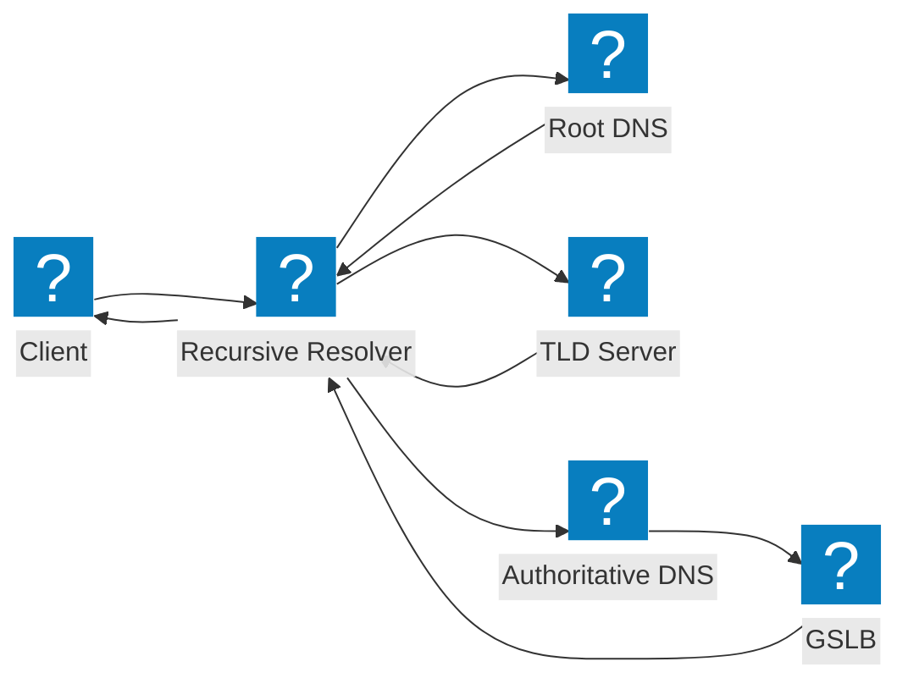
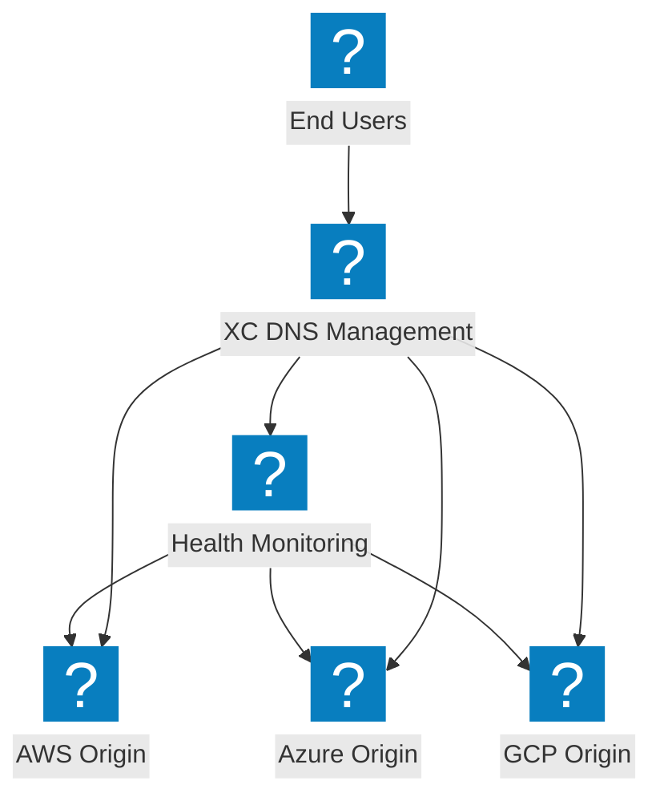

재귀적 해석 흐름, 글로벌 서버 부하 분산 및 F5 Distributed Cloud DNS 관리를 다루는 DNS 아키텍처 다이어그램.

## DNS 해석 흐름

클라이언트에서 재귀적 리졸버를 거쳐 GSLB 통합이 포함된 권한 있는 네임서버까지의 표준 DNS 쿼리 해석.

## F5 XC DNS 관리

멀티클라우드 오리진 전반에 걸쳐 지능형 DNS 부하 분산을 제공하는 F5 Distributed Cloud DNS 관리.

## DNS 부하 분산 아키텍처

지리적 라우팅, 상태 점검 및 클라우드 리전 간 장애 조치를 포함한 다중 계층 DNS 부하 분산.

```mermaid
architecture-beta
  group dns(carbon:dns-services)[DNS Infrastructure]
  group region1(hashicorp-flight:aws-color)[US East]
  group region2(hashicorp-flight:azure-color)[EU West]

  service gslb(carbon:load-balancer-global)[GSLB] in dns
  service health(carbon:application)[Health Check] in dns
  service lb1(carbon:load-balancer-application)[Regional LB] in region1
  service app1(carbon:virtual-machine)[App Servers] in region1
  service lb2(carbon:load-balancer-application)[Regional LB] in region2
  service app2(carbon:virtual-machine)[App Servers] in region2

  gslb:R --> L:health
  gslb:B --> T:lb1
  lb1:R --> L:app1
  gslb:B --> T:lb2
  lb2:R --> L:app2
```

