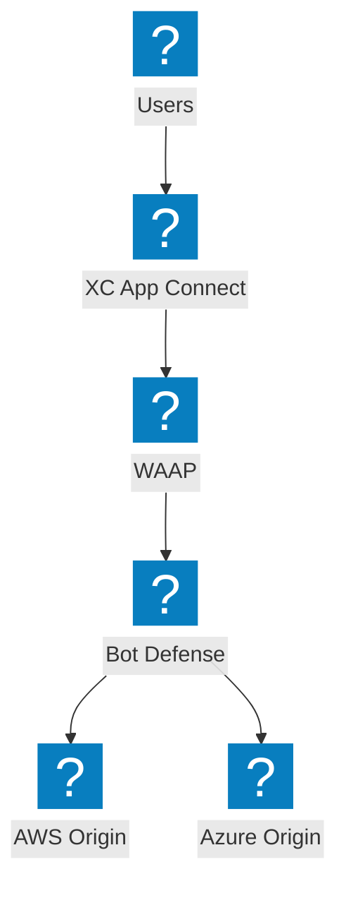
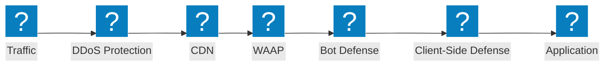

`f5xc` 및 `f5-brand` 아이콘 팩을 사용하여 F5 XC 서비스 포트폴리오, NGINX 제품군 및 BIG-IP 기능을 보여주는 F5 제품 아이콘 쇼케이스 다이어그램.

## F5 XC 서비스 포트폴리오

보안, 네트워킹 및 애플리케이션 전달을 아우르는 F5 Distributed Cloud 서비스 개요.

## F5 XC 보안 스택

WAAP, 봇 방어, 클라이언트 측 방어, DDoS 보호 및 API 검색을 포함한 완전한 F5 XC 보안 스택.

## F5 XC 네트워킹 서비스

멀티클라우드 연결, DNS 관리 및 분산 애플리케이션을 포함한 F5 Distributed Cloud 네트워킹 서비스.

```mermaid
architecture-beta
  group xc(lucide:cloud)[F5 Distributed Cloud]
  group infra(carbon:cloud-services)[Infrastructure]

  service mcn(f5xc:multi-cloud-network-connect)[Network Connect] in xc
  service mca(f5xc:multi-cloud-app-connect)[App Connect] in xc
  service dns(f5xc:dns-management)[DNS Management] in xc
  service dapp(f5xc:distributed-apps)[Distributed Apps] in xc
  service k8s(hashicorp-flight:kubernetes-color)[K8s Clusters] in infra
  service vm(carbon:virtual-machine)[VM Workloads] in infra

  mcn:R --> L:mca
  mca:R --> L:dns
  dns:R --> L:dapp
  mcn:B --> T:k8s
  mca:B --> T:vm
```

## F5 XC 관측 가능성 및 인텔리전스

포괄적인 애플리케이션 가시성을 위한 F5 Distributed Cloud 관측 가능성, 트래픽 인사이트 및 데이터 인텔리전스.

```mermaid
architecture-beta
  group apps(carbon:cloud-services)[Application Layer]
  group intel(lucide:cloud)[F5 XC Intelligence]

  service app1(carbon:application)[Web App] in apps
  service app2(carbon:api)[API Service] in apps
  service app3(f5xc:distributed-apps)[Distributed App] in apps
  service obs(f5xc:observability)[Observability] in intel
  service ati(f5xc:application-traffic-insight)[Traffic Insight] in intel
  service di(f5xc:data-intelligence)[Data Intelligence] in intel

  app1:B --> T:obs
  app2:B --> T:ati
  app3:B --> T:di
  obs:R --> L:ati
  ati:R --> L:di
```

