`f5-brand` 아이콘 팩을 사용하여 보안, 네트워킹 및 애플리케이션 전달 아키텍처를 보여주는 F5 Distributed Cloud 사용 사례 다이어그램입니다.

## 웹 앱 및 API 보호

### WAAP 보안 검사 파이프라인

방화벽, 애플리케이션 코드 보호 및 봇 방어를 통해 애플리케이션에 도달하기 전의 다중 레이어 WAAP 검사 파이프라인입니다.

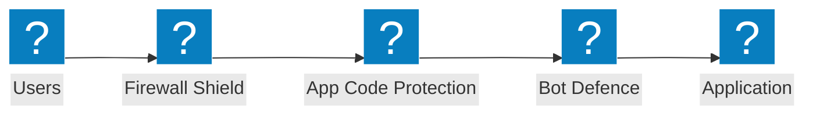

### 엣지 보안 아키텍처

WAF, 실드 체크마크 검증 및 클라우드 오리진 전반에 걸친 애플리케이션 보호 그룹을 포함한 엣지 보안 아키텍처입니다.

```mermaid
architecture-beta
  group edge(f5-brand:security-firewall-shield)[Security Edge]
  group origins(carbon:cloud-services)[Cloud Origins]

  service waf(f5-brand:security-firewall)[WAF] in edge
  service shield(f5-brand:security-shield-checkmark)[Shield Verify] in edge
  service appshield(f5-brand:security-shield-app-code)[App Shield] in edge
  service aws(hashicorp-flight:aws-color)[AWS Origin] in origins
  service azure(hashicorp-flight:azure-color)[Azure Origin] in origins

  waf:R --> L:shield
  shield:R --> L:appshield
  appshield:R --> L:aws
  appshield:B --> T:azure
```

### 속도 제한이 적용된 API 보호

API 엔드포인트에 도달하기 전에 방화벽, 속도 제한 및 스키마 유효성 검사를 포함하는 API 요청 검증 파이프라인입니다.

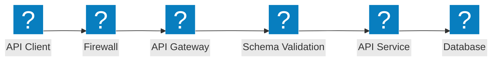

## 봇 방어

### 봇 탐지 파이프라인

JavaScript 챌린지, 디바이스 지문 인식, 행동 분석 및 의사 결정 엔진을 포함하는 다단계 봇 탐지입니다.

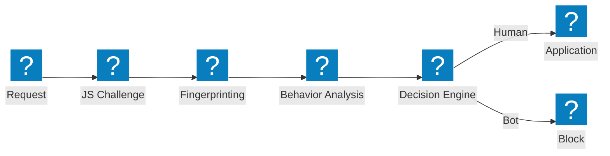

### 봇 방어 레이어

자격 증명 인텔리전스, 봇 탐지 및 디바이스 상태 분석을 포함하는 계층형 봇 방어 아키텍처입니다.

```mermaid
architecture-beta
  group defense(f5-brand:security-bot-defence)[Bot Defense Layers]
  group app(carbon:cloud-services)[Application]

  service botfw(f5-brand:security-firewall-bot)[Bot Firewall] in defense
  service botdef(f5-brand:security-bot-defence)[Bot Defence] in defense
  service intel(f5-brand:security-password-bot)[Credential Intel] in defense
  service login(carbon:application)[Login Service] in app
  service account(carbon:security)[Account Service] in app
  service db(carbon:data-base)[User Store] in app

  botfw:R --> L:botdef
  botdef:R --> L:intel
  intel:R --> L:login
  login:R --> L:account
  account:B --> T:db
```

### 클라이언트 측 방어

디바이스 상태 검증, 랩톱 봇 탐지 및 Magecart 보호를 포함하는 클라이언트 측 방어 파이프라인입니다.

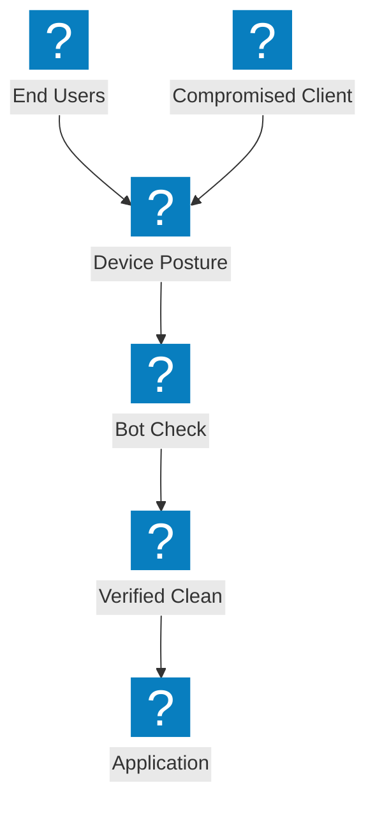

## 멀티클라우드 네트워킹

### 멀티클라우드 앱 연결

중앙 집중식 앱 전달 패브릭을 통해 AWS, Azure 및 GCP 전반에 걸친 멀티클라우드 애플리케이션 연결입니다.


### 사이트 메시를 활용한 네트워크 연결

사이트 메시 토폴로지와 클라우드 리전을 연결하는 트랜짓 게이트웨이를 포함하는 멀티클라우드 네트워크 연결입니다.

```mermaid
architecture-beta
  group net(f5-brand:cloud-network-connect)[Network Connect]
  group region1(hashicorp-flight:aws-color)[AWS Region]
  group region2(hashicorp-flight:azure-color)[Azure Region]

  service mesh(f5-brand:cloud-multi-network)[Site Mesh] in net
  service gw(f5-brand:network-gateway)[Transit Gateway] in net
  service web1(carbon:virtual-machine)[Web Tier] in region1
  service db1(carbon:data-base)[Database] in region1
  service web2(carbon:virtual-machine)[Web Tier] in region2
  service db2(carbon:data-base)[Database] in region2

  mesh:R --> L:gw
  gw:B --> T:web1
  web1:R --> L:db1
  gw:B --> T:web2
  web2:R --> L:db2
```

### 멀티클라우드 앱 전달

글로벌 부하 분산, 보안 및 분산 워크로드를 포함하는 엔드투엔드 멀티클라우드 앱 전달입니다.

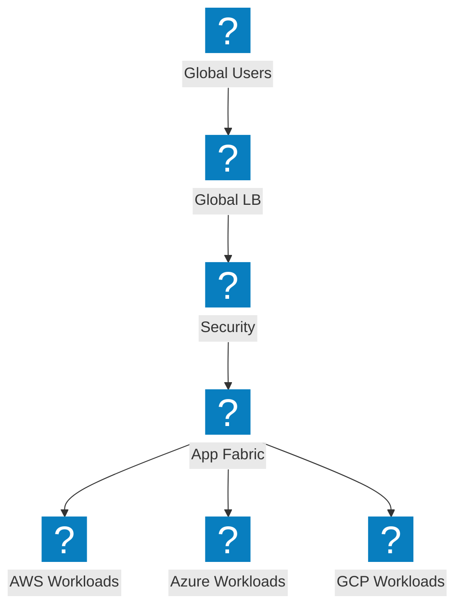

## DDoS 및 엣지 서비스

### DDoS 스크러빙 아키텍처

네트워크 계층 보호, 사이트 스크러빙 및 오리진 서버로의 클린 트래픽 전달을 포함하는 DDoS 스크러빙 센터입니다.

```mermaid
architecture-beta
  group scrub(f5-brand:network-ddos-protection)[Scrubbing Center]
  group origin(carbon:cloud-services)[Origin DC]

  service ddos(f5-brand:network-ddos-protection)[DDoS Protection] in scrub
  service sitescrub(f5-brand:security-site-scrubbing)[Site Scrubbing] in scrub
  service clean(f5-brand:network-globe-load-balance)[Clean Pipe] in scrub
  service lb(carbon:load-balancer-application)[Load Balancer] in origin
  service app(carbon:application)[Application] in origin
  service db(carbon:data-base)[Database] in origin

  ddos:R --> L:sitescrub
  sitescrub:R --> L:clean
  clean:R --> L:lb
  lb:R --> L:app
  app:B --> T:db
```

### 대용량 공격 완화

오리진 서버에 도달하기 전에 엣지에서 대용량 DDoS를 흡수하고 완화하는 공격 트래픽 흐름입니다.

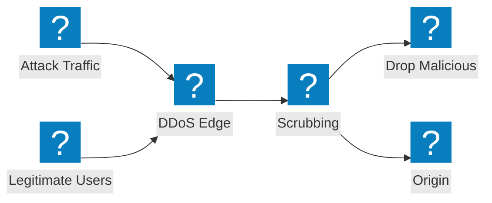

### CDN + DDoS + WAF 계층형 보호

통합 파이프라인에서 CDN 캐싱, DDoS 완화 및 WAF 검사를 결합하는 계층형 엣지 보호입니다.

```mermaid
architecture-beta
  group edge(f5-brand:cloud-performance-arrow)[Edge Services]
  group security(f5-brand:security-firewall-shield)[Security Layer]
  group app(carbon:cloud-services)[Application]

  service cdn(f5-brand:cloud-performance-arrow)[CDN] in edge
  service ddos(f5-brand:network-ddos-protection)[DDoS Protection] in edge
  service waf(f5-brand:security-firewall-shield)[WAF] in security
  service shield(f5-brand:security-shield-checkmark)[Shield] in security
  service web(carbon:application)[Web App] in app
  service api(carbon:api)[API Service] in app

  cdn:R --> L:ddos
  ddos:R --> L:waf
  waf:R --> L:shield
  shield:R --> L:web
  shield:B --> T:api
```

## DNS 및 트래픽 관리

### 상태 모니터링을 포함한 DNS 기반 GSLB

멀티클라우드 엔드포인트 전반에 걸쳐 상태 모니터링을 포함하는 DNS 기반 글로벌 서버 부하 분산입니다.

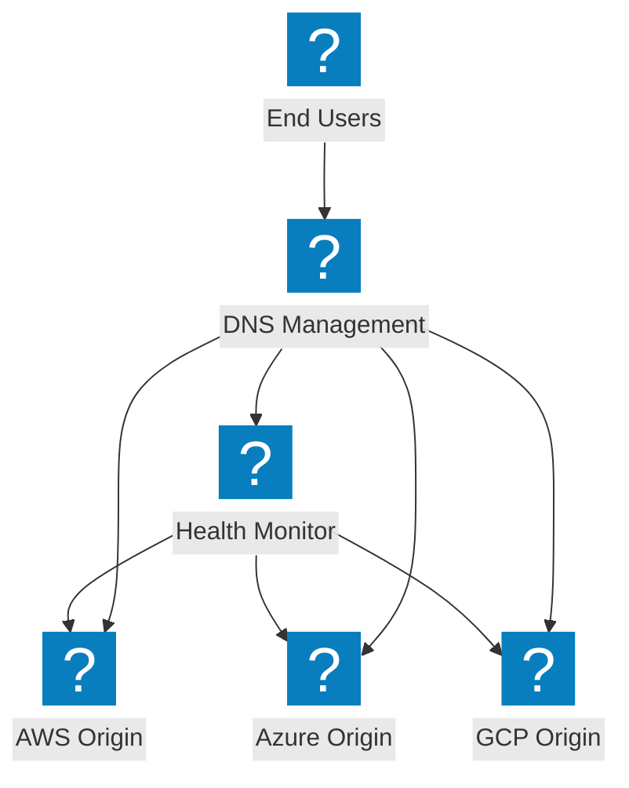

### DNS 관리 아키텍처

클라우드 리전 전반에 걸쳐 DNS 부하 분산 및 실드 DNS 보호를 포함하는 DNS 관리 인프라입니다.

```mermaid
architecture-beta
  group dnsinfra(f5-brand:network-dns-1)[DNS Infrastructure]
  group region1(hashicorp-flight:aws-color)[US East]
  group region2(hashicorp-flight:azure-color)[EU West]

  service dns(f5-brand:network-dns-load-balance)[DNS Load Balance] in dnsinfra
  service shielddns(f5-brand:security-shield-dns)[Shield DNS] in dnsinfra
  service lb1(carbon:load-balancer-application)[Regional LB] in region1
  service app1(carbon:virtual-machine)[App Servers] in region1
  service lb2(carbon:load-balancer-application)[Regional LB] in region2
  service app2(carbon:virtual-machine)[App Servers] in region2

  dns:R --> L:shielddns
  dns:B --> T:lb1
  lb1:R --> L:app1
  dns:B --> T:lb2
  lb2:R --> L:app2
```

### 자동 장애 조치를 포함한 지능형 DNS 부하 분산

클라우드 DNS 통합, 성능 기반 라우팅 및 자동 장애 조치를 포함하는 지능형 DNS 부하 분산입니다.

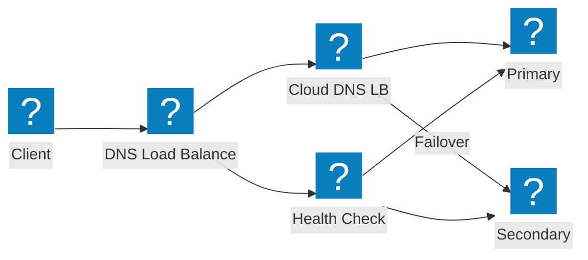

## API 보안 및 탐색

### 섀도우 API 탐색 파이프라인

트래픽 분석 및 인벤토리 관리를 통해 알 수 없는 API를 탐지하는 섀도우 API 탐색 파이프라인입니다.

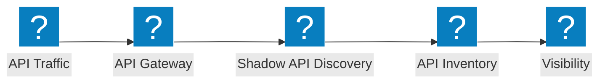

### API 게이트웨이 아키텍처

인증, 속도 제한 및 보안 유효성 검사를 통해 백엔드 API 서비스를 보호하는 API 게이트웨이입니다.

```mermaid
architecture-beta
  group gateway(f5-brand:network-api-gateway)[API Gateway]
  group backend(carbon:cloud-services)[Backend Services]

  service apigw(f5-brand:network-api-gateway)[API Gateway] in gateway
  service auth(f5-brand:security-key-lock)[Authentication] in gateway
  service rate(f5-brand:network-api)[Rate Limiter] in gateway
  service shield(f5-brand:security-shield-checkmark)[Schema Check] in gateway
  service api1(carbon:api)[Users API] in backend
  service api2(carbon:api)[Orders API] in backend

  apigw:R --> L:auth
  auth:R --> L:rate
  rate:R --> L:shield
  shield:R --> L:api1
  shield:B --> T:api2
```

### API 수명 주기: 탐색에서 보호까지

섀도우 API 탐색부터 인벤토리 카탈로그화 및 능동적 보호까지의 API 수명 주기 파이프라인입니다.

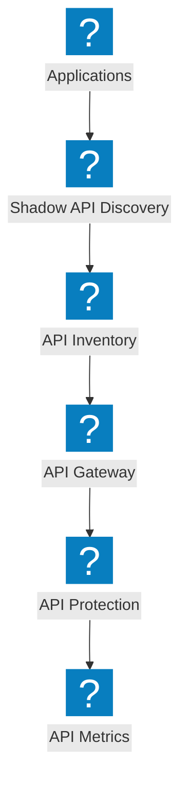

## 플랫폼 및 관측 가능성

### NGINX One을 활용한 분산 앱

NGINX One 관리, Kubernetes 워크로드 및 중앙 집중식 제어를 포함하는 분산 애플리케이션 플랫폼입니다.

```mermaid
architecture-beta
  group platform(f5-brand:service-f5)[F5 Platform]
  group compute(carbon:cloud-services)[Compute]

  service nginx(f5-brand:service-nginx)[NGINX One] in platform
  service netng(f5-brand:network-nginx)[NGINX Network] in platform
  service f5svc(f5-brand:service-f5)[F5 Service] in platform
  service k8s(f5-brand:app-kubernetes)[Kubernetes] in compute
  service dist(f5-brand:cloud-distributed)[Distributed App] in compute
  service container(f5-brand:cloud-container-app)[Container App] in compute

  nginx:R --> L:netng
  netng:R --> L:f5svc
  nginx:B --> T:k8s
  netng:B --> T:dist
  f5svc:B --> T:container
```

### 관측 가능성 파이프라인

애플리케이션으로부터 메트릭을 수집하고 인사이트, 알림 및 대시보드를 생성하는 관측 가능성 파이프라인입니다.

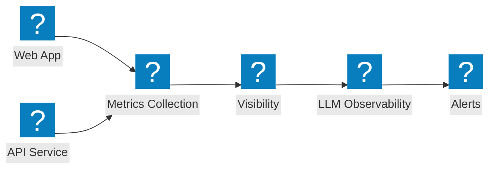

### 전체 플랫폼 뷰

통합 서비스 하에서 보안, 네트워킹 및 애플리케이션 전달을 연결하는 포괄적인 F5 플랫폼 뷰입니다.

```mermaid
architecture-beta
  group f5(f5-brand:service-f5)[F5 Service Platform]
  group security(f5-brand:security-firewall-shield)[Security]
  group networking(f5-brand:cloud-network-connect)[Networking]

  service svcf5(f5-brand:service-f5)[F5 Service] in f5
  service bigip(f5-brand:service-big-ip-next)[BIG-IP Next] in f5
  service obs(f5-brand:other-site-metrics)[Observability] in f5
  service fw(f5-brand:security-firewall-shield)[WAF] in security
  service botd(f5-brand:security-bot-defence)[Bot Defence] in security
  service ddos(f5-brand:network-ddos-protection)[DDoS] in security
  service multi(f5-brand:cloud-multi-network)[Multi-Cloud Net] in networking
  service fabric(f5-brand:app-delivery-fabric)[App Fabric] in networking
  service nginx(f5-brand:service-nginx)[NGINX One] in networking

  svcf5:B --> T:fw
  svcf5:B --> T:multi
  bigip:B --> T:botd
  bigip:B --> T:fabric
  obs:B --> T:ddos
  obs:B --> T:nginx
```
