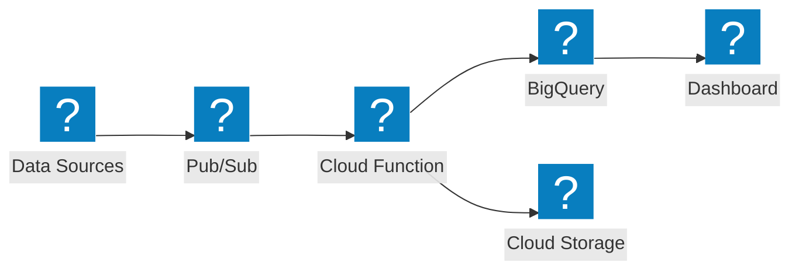

VPC 네트워킹, GKE 및 관리형 서비스를 위한 HashiCorp Flight 및 Carbon 아이콘 팩을 사용한 Google Cloud 인프라 다이어그램.

## GCP VPC와 GKE

글로벌 로드 밸런서가 GKE 클러스터와 Cloud Functions에 트래픽을 분산하는 Google Cloud 프로젝트.

```mermaid
architecture-beta
  group gcp(hashicorp-flight:gcp-color)[GCP Project]
  group frontend(carbon:ibm-cloud-subnets)[Frontend Tier] in gcp
  group backend(carbon:ibm-cloud-subnets)[Backend Tier] in gcp

  service glb(carbon:load-balancer-global)[Global LB]
  service gke(hashicorp-flight:kubernetes-color)[GKE Cluster] in frontend
  service func(carbon:application)[Cloud Functions] in frontend
  service sql(carbon:data-base)[Cloud SQL] in backend
  service store(carbon:data-base)[Firestore] in backend

  glb:R --> L:gke
  glb:B --> T:func
  gke:R --> L:sql
  func:R --> L:store
  sql:B --> T:store
```

## F5 XC 앱 연결을 활용한 GKE

F5 Distributed Cloud가 클라우드 환경 전반에 걸쳐 애플리케이션 연결 및 관측 가능성을 제공하는 GKE 클러스터.

```mermaid
architecture-beta
  group xc(lucide:cloud)[F5 XC]
  group gke(hashicorp-flight:kubernetes-color)[GKE Cluster]

  service appconn(f5xc:multi-cloud-app-connect)[App Connect] in xc
  service obs(f5xc:observability)[Observability] in xc
  service ingress(carbon:gateway)[Ingress] in gke
  service web(hashicorp-flight:docker-color)[Web Pods] in gke
  service api(carbon:api)[API Pods] in gke
  service sql(carbon:data-base)[Cloud SQL]

  appconn:R --> L:obs
  obs:R --> L:ingress
  ingress:R --> L:web
  ingress:B --> T:api
  api:R --> L:sql
```

## 서버리스 데이터 파이프라인

Pub/Sub, Cloud Functions 및 BigQuery를 활용한 GCP 서버리스 데이터 처리 파이프라인.

