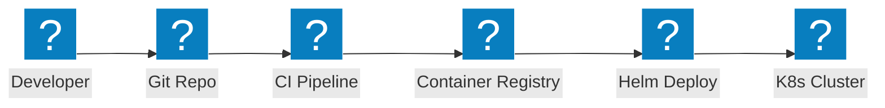

NGINX 및 F5 XC 통합을 통한 인그레스 컨트롤러, 서비스 메시 패턴, 파드 네트워킹 및 컨테이너 보안을 다루는 Kubernetes 아키텍처 다이어그램.

## NGINX를 활용한 Kubernetes 인그레스

NGINX 인그레스 컨트롤러가 프론트엔드 및 백엔드 파드로 트래픽을 분산하는 컨테이너 기반 애플리케이션.

```mermaid
architecture-beta
  group cluster(hashicorp-flight:kubernetes-color)[Kubernetes Cluster]
  group frontend(carbon:container-services)[Frontend Pods] in cluster
  group backend(carbon:container-services)[Backend Pods] in cluster

  service ingress(carbon:gateway)[Ingress Controller] in cluster
  service web(hashicorp-flight:docker-color)[Web App] in frontend
  service api(carbon:api)[API Service] in backend
  service db(carbon:data-base)[StatefulSet DB] in backend

  ingress:R --> L:web
  ingress:B --> T:api
  api:R --> L:db
```

## F5 XC를 활용한 서비스 메시

외부 부하 분산, 관측 가능성 및 멀티클러스터 연결을 제공하는 F5 XC 기반 Kubernetes 서비스 메시.

```mermaid
architecture-beta
  group xc(lucide:cloud)[F5 XC]
  group mesh(hashicorp-flight:kubernetes-color)[Service Mesh]

  service nginx(f5xc:nginx-one)[NGINX One] in xc
  service obs(f5xc:observability)[Observability] in xc
  service proxy1(carbon:server-proxy)[Sidecar Proxy] in mesh
  service svc1(hashicorp-flight:docker-color)[Service A] in mesh
  service proxy2(carbon:server-proxy)[Sidecar Proxy] in mesh
  service svc2(hashicorp-flight:docker-color)[Service B] in mesh

  nginx:R --> L:obs
  obs:R --> L:proxy1
  proxy1:R --> L:svc1
  svc1:B --> T:proxy2
  proxy2:R --> L:svc2
```

## 컨테이너 배포 파이프라인

Helm 차트, 컨테이너 레지스트리 및 자동화된 롤아웃을 사용하는 Kubernetes 배포용 CI/CD 파이프라인.

