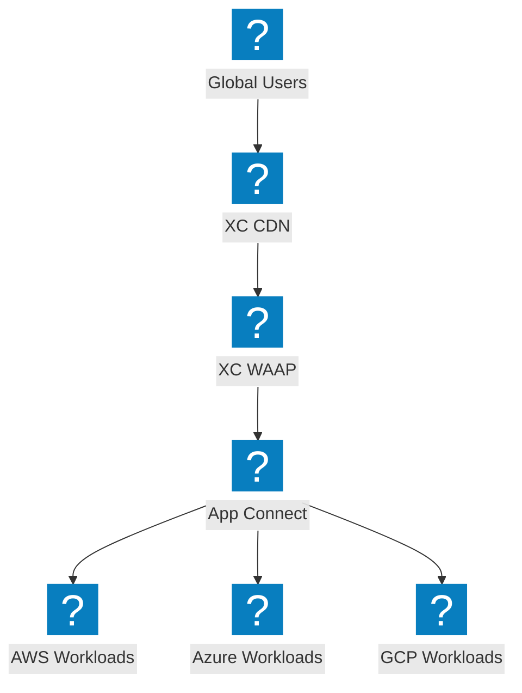

크로스 프로바이더 연결, 글로벌 부하 분산, F5 Distributed Cloud 네트워크 패브릭을 보여주는 멀티클라우드 아키텍처 다이어그램.

## 멀티클라우드 네트워크 토폴로지

데이터베이스 복제를 통해 AWS 및 Azure 리전 전반에 트래픽을 분산하는 글로벌 로드 밸런서.

```mermaid
architecture-beta
  group aws(hashicorp-flight:aws-color)[AWS Region]
  group azure(hashicorp-flight:azure-color)[Azure Region]

  service lb(carbon:load-balancer-global)[Global LB]
  service web1(carbon:virtual-machine)[Web Tier] in aws
  service db1(carbon:data-base)[Primary DB] in aws
  service web2(carbon:virtual-machine)[Web Tier] in azure
  service db2(carbon:data-base)[Replica DB] in azure

  lb:R --> L:web1
  lb:B --> T:web2
  web1:R --> L:db1
  web2:R --> L:db2
  db1:B --> T:db2
```

## F5 XC 멀티클라우드 연결

통합 관측 가능성을 갖춘 AWS, Azure, GCP 간 보안 연결을 제공하는 F5 Distributed Cloud.

```mermaid
architecture-beta
  group xc(lucide:cloud)[F5 Distributed Cloud]
  group aws(hashicorp-flight:aws-color)[AWS]
  group azure(hashicorp-flight:azure-color)[Azure]

  service mcn(f5xc:multi-cloud-network-connect)[Network Connect] in xc
  service mca(f5xc:multi-cloud-app-connect)[App Connect] in xc
  service obs(f5xc:observability)[Observability] in xc
  service eks(hashicorp-flight:kubernetes-color)[EKS] in aws
  service rds(carbon:data-base)[RDS] in aws
  service aks(hashicorp-flight:azure-aks-color)[AKS] in azure
  service sql(carbon:data-base)[Azure SQL] in azure

  mcn:R --> L:mca
  mca:R --> L:obs
  mcn:B --> T:eks
  eks:R --> L:rds
  mcn:B --> T:aks
  aks:R --> L:sql
```

## F5 XC를 활용한 멀티클라우드 앱 전달

엣지에서 보안 및 트래픽 관리를 제공하는 F5 XC를 통한 다중 클라우드 전반의 엔드투엔드 애플리케이션 전달.

