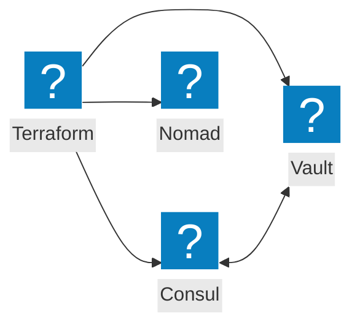
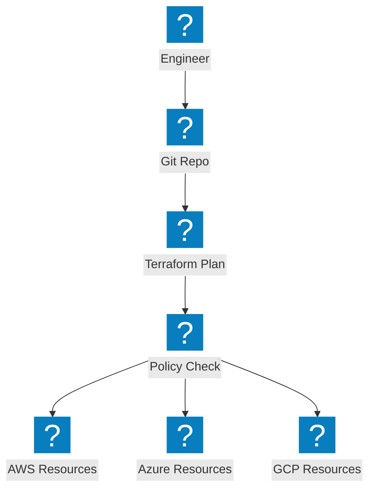

Terraform 자동화, HashiCorp 도구 통합 및 멀티클라우드 프로비저닝 워크플로를 다루는 코드형 인프라 다이어그램.

## HashiCorp 스택 통합

Terraform이 Consul(서비스 검색), Vault(시크릿), Nomad(워크로드 스케줄링)를 활용하여 인프라 프로비저닝을 오케스트레이션합니다.

## 멀티클라우드 IaC 파이프라인

Terraform이 상태 관리 및 정책 적용을 통해 AWS, Azure, GCP 전반에 걸쳐 인프라를 프로비저닝합니다.

## F5 XC 인프라 자동화

Terraform이 로드 밸런서, 오리진 풀 및 보안 정책을 포함한 F5 Distributed Cloud 구성을 자동화합니다.

```mermaid
architecture-beta
  group iac(hashicorp-flight:terraform-color)[Terraform Workspace]
  group xc(lucide:cloud)[F5 XC Tenant]

  service tfplan(hashicorp-flight:terraform-color)[Terraform] in iac
  service vault(hashicorp-flight:vault-color)[Vault Secrets] in iac
  service consul(hashicorp-flight:consul-color)[Consul Registry] in iac
  service waap(f5xc:web-app-and-api-protection)[WAAP Policy] in xc
  service lb(f5xc:multi-cloud-app-connect)[App Connect] in xc
  service dns(f5xc:dns-management)[DNS Config] in xc

  tfplan:R --> L:vault
  vault:R --> L:consul
  tfplan:B --> T:waap
  tfplan:B --> T:lb
  tfplan:B --> T:dns
```

