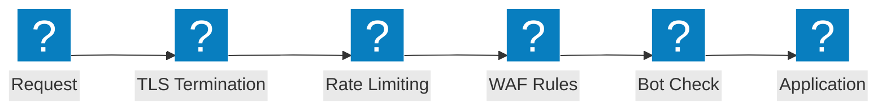

보안 검사 체인, OWASP 보호 흐름, F5 Distributed Cloud WAAP 기능을 포함하는 웹 애플리케이션 방화벽 아키텍처 다이어그램입니다.

## 보안 검사 파이프라인

CDN 엣지에서 웹 앱 방화벽 (WAF), Bot 표준 방어, 부하 분산 장치를 거쳐 오리진 인프라까지 이어지는 다중 계층 보안 검사 체인입니다.

```mermaid
architecture-beta
  group edge(lucide:shield)[Security Edge]
  group origin(carbon:cloud-services)[Origin Infrastructure]

  service cdn(carbon:content-delivery-network)[CDN] in edge
  service waf(carbon:firewall)[WAF] in edge
  service bot(lucide:shield-check)[Bot Defense] in edge
  service lb(carbon:load-balancer-application)[Load Balancer] in origin
  service app(carbon:application)[App Server] in origin
  service db(carbon:data-base)[Database] in origin

  cdn:R --> L:waf
  waf:R --> L:bot
  bot:R --> L:lb
  lb:R --> L:app
  app:B --> T:db
```

## F5 XC WAAP 보호

통합 Bot 표준 방어 및 클라이언트 측 방어가 포함된 F5 Distributed Cloud 웹 애플리케이션 및 API 보호입니다.

```mermaid
architecture-beta
  group xcedge(lucide:cloud)[F5 XC Edge]
  group cloud(carbon:cloud-services)[Cloud Origin]

  service waap(f5xc:web-app-and-api-protection)[WAAP] in xcedge
  service botdef(f5xc:bot-defense)[Bot Defense] in xcedge
  service csd(f5xc:client-side-defense)[Client-Side Defense] in xcedge
  service lb(carbon:load-balancer-application)[Load Balancer] in cloud
  service app(carbon:application)[Application] in cloud
  service api(carbon:api)[API Service] in cloud

  waap:R --> L:botdef
  botdef:R --> L:csd
  csd:R --> L:lb
  lb:R --> L:app
  lb:B --> T:api
```

## OWASP 보호 흐름

OWASP Top 10 위협 카테고리에 대한 검사 단계를 보여주는 웹 앱 방화벽 (WAF) 요청 처리 파이프라인입니다.

