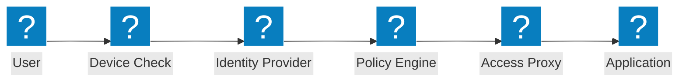
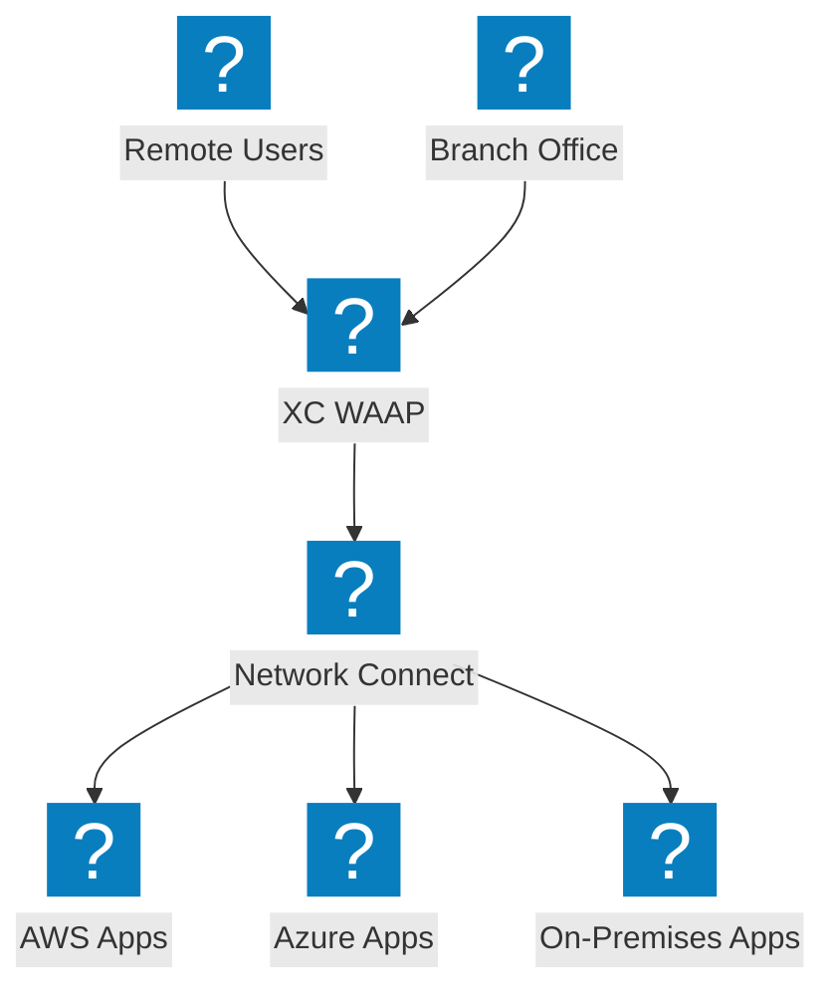

ZTNA 액세스 흐름, 신원 확인, 정책 기반 액세스 제어 및 F5 XC 통합을 통한 마이크로 세그멘테이션을 포함한 제로 트러스트 아키텍처 다이어그램.

## 제로 트러스트 액세스 흐름

장치 상태 확인, 신원 확인, 정책 평가 및 프록시 애플리케이션 액세스를 포함한 제로 트러스트 액세스 흐름.

## F5 XC 제로 트러스트 아키텍처

F5 Distributed Cloud가 클라우드 전반에 걸쳐 WAAP, ID 인식 프록시 및 마이크로 세그멘테이션을 통해 제로 트러스트 애플리케이션 액세스를 제공합니다.

## 마이크로 세그멘테이션 아키텍처

애플리케이션 계층 간 동서 트래픽을 제어하는 ID 기반 정책을 사용한 네트워크 마이크로 세그멘테이션.

```mermaid
architecture-beta
  group trust(lucide:shield)[Zero Trust Fabric]
  group apps(carbon:cloud-services)[Application Tiers]

  service idp(lucide:key)[Identity Provider] in trust
  service policy(carbon:gateway-security)[Policy Engine] in trust
  service seg(carbon:subnet-acl-rules)[Segmentation] in trust
  service web(carbon:application)[Web Tier] in apps
  service api(carbon:api)[API Tier] in apps
  service data(carbon:data-base)[Data Tier] in apps

  idp:R --> L:policy
  policy:R --> L:seg
  seg:R --> L:web
  web:R --> L:api
  api:R --> L:data
```

