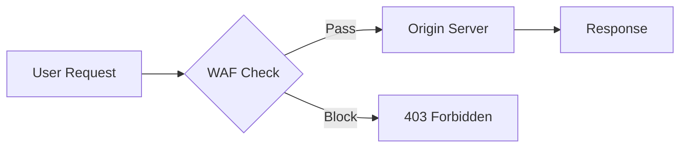
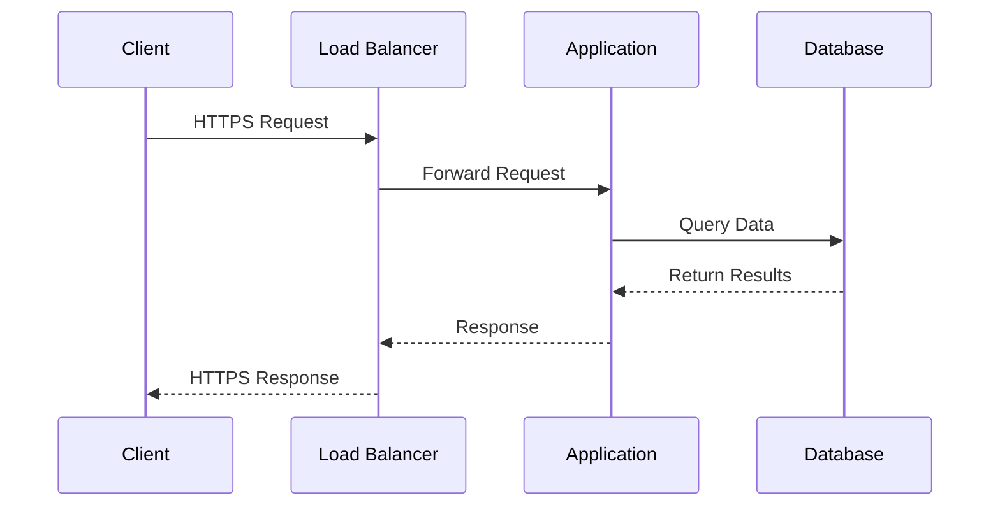
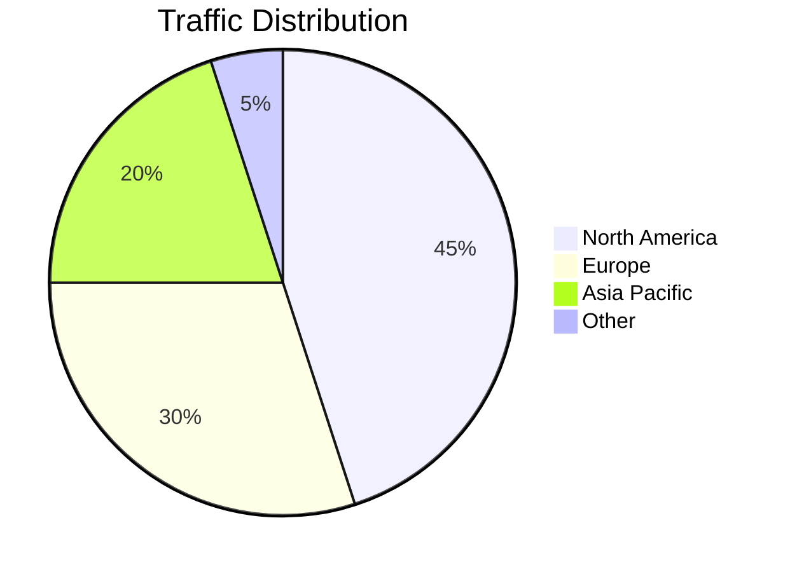
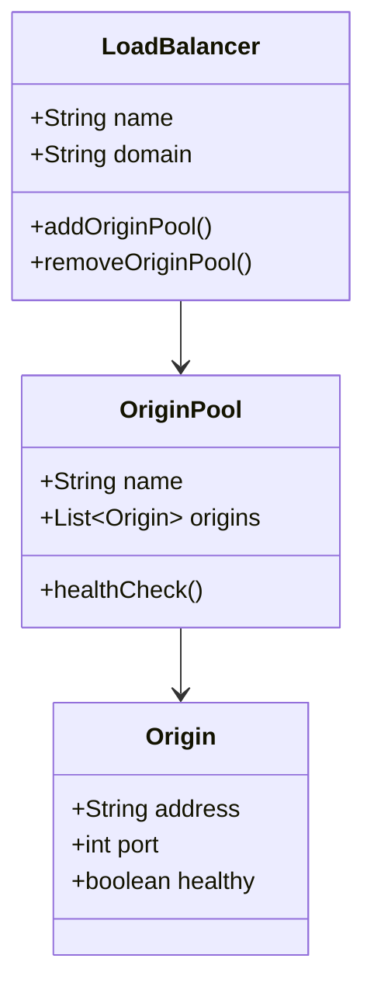
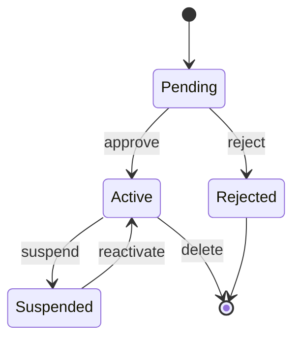
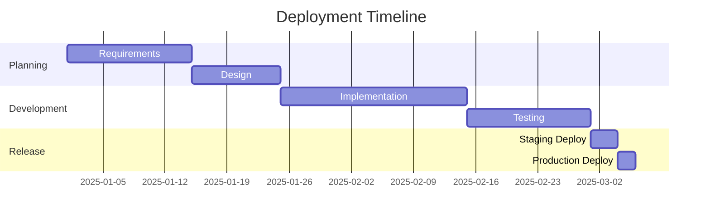
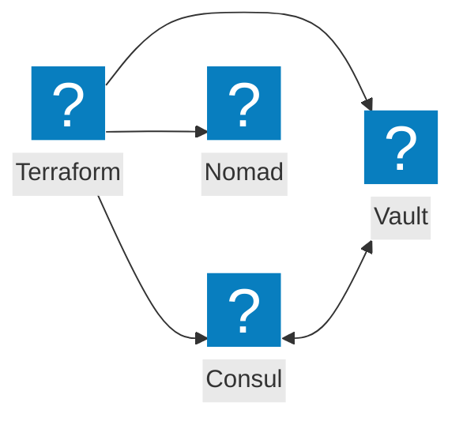

The theme includes a custom `remark-mermaid` plugin (`plugins/remark-mermaid.mjs`) that converts fenced ` ```mermaid ` code blocks into `<div class="mermaid-container">` wrappers. The Mermaid CDN script renders SVG diagrams on page load.

## Flowchart



## Sequence Diagram



## Pie Chart



## Class Diagram



## State Diagram



## Gantt Chart



## Flowchart with Icons

Use the `@{ icon: 'pack:name' }` syntax to add icons from any registered icon pack to flowchart nodes.



## Architecture Diagram

The `architecture-beta` diagram type supports service and group definitions with icon-decorated nodes.

```mermaid
architecture-beta
  group cloud(carbon:cloud-services)[Cloud Infrastructure]

  service gateway(carbon:gateway--api)[API Gateway] in cloud
  service app(carbon:application)[App Server] in cloud
  service db(carbon:data--base)[Database] in cloud
  service cache(carbon:data--cache)[Cache] in cloud

  gateway:R --> L:app
  app:R --> L:db
  app:B --> T:cache
```



## Network Topology

Multi-cloud network diagrams using architecture groups and cloud provider icons.

```mermaid
architecture-beta
  group aws(carbon:logo--aws)[AWS Region]
  group azure(carbon:logo--azure)[Azure Region]

  service lb(carbon:load--balancer--global)[Global LB]
  service web1(carbon:virtual--machine)[Web Tier] in aws
  service db1(carbon:data--base)[Primary DB] in aws
  service web2(carbon:virtual--machine)[Web Tier] in azure
  service db2(carbon:data--base)[Replica DB] in azure

  lb:R --> L:web1
  lb:B --> T:web2
  web1:R --> L:db1
  web2:R --> L:db2
  db1:B --> T:db2
```



## Icon Reference

The following icon packs are registered and available in Mermaid diagrams. Icons are loaded lazily from CDN only when referenced.

| Pack Name | npm Package | Example Icons |
|-----------|-------------|---------------|
| `hashicorp-flight` | `@robinmordasiewicz/icons-hashicorp-flight` | `terraform`, `consul`, `vault`, `nomad`, `waypoint`, `packer` |
| `f5-brand` | `@robinmordasiewicz/icons-f5-brand` | F5 product and brand icons |
| `f5xc` | `@robinmordasiewicz/icons-f5xc` | F5 Distributed Cloud service icons |
| `carbon` | `@robinmordasiewicz/icons-carbon` | `cloud-services`, `data--base`, `application`, `gateway--api`, `security` |
| `lucide` | `@robinmordasiewicz/icons-lucide` | `server`, `database`, `shield`, `globe`, `lock`, `cloud` |
| `mdi` | `@robinmordasiewicz/icons-mdi` | `server`, `database`, `shield`, `cloud`, `lock`, `network` |
| `phosphor` | `@robinmordasiewicz/icons-phosphor` | `cloud`, `database`, `shield`, `globe`, `lock` |
| `tabler` | `@robinmordasiewicz/icons-tabler` | `server`, `database`, `shield`, `cloud`, `lock`, `network` |

### Usage Syntax

In **flowcharts**, use the `@{}` node syntax:

```
nodeName@{ icon: 'pack:icon-name', label: 'Display Label' }
```

In **architecture diagrams**, use the icon in service/group definitions:

```
service myService(pack:icon-name)[Label]
group myGroup(pack:icon-name)[Label]
```

## CSS Reference

### Container Styling

Mermaid diagrams are wrapped in a styled container with rounded corners and a layered box shadow:

```css
.mermaid-container {
  border: 1px solid var(--sl-color-gray-5);
  border-radius: 0.75rem;
  padding: 1.5rem;
  box-shadow: 0 2px 4px rgba(0,0,0,0.04), 0 8px 16px rgba(0,0,0,0.08), 0 24px 48px rgba(0,0,0,0.12);
  margin-block: 1.5rem;
  background: #fff;
}
```

### Pre Element Reset

Starlight's default `<pre>` styling is stripped from the mermaid wrapper so only the outer container border is visible:

```css
.mermaid-container pre.mermaid {
  border: none;
  padding: 0;
  margin: 0;
  background: transparent;
}
```

### SVG Background Forcing

The SVG inside is forced to a white background for dark mode compatibility:

```css
.mermaid-container svg {
  background: white !important;
  border-radius: 0.5rem;
}
```

## Theme Checks

- `.mermaid-container` has white SVG background in dark mode
- Container border uses `--sl-color-gray-5`
- Container has 0.75rem border radius and layered box shadow
- Diagrams are readable in both light and dark themes
- Mermaid CDN script loads and renders SVGs on page load
