The theme includes a custom `remark-mermaid` plugin (`plugins/remark-mermaid.mjs`) that converts fenced ` ```mermaid ` code blocks into `<div class="mermaid-container">` wrappers. The Mermaid CDN script renders SVG diagrams on page load.

## Flowchart

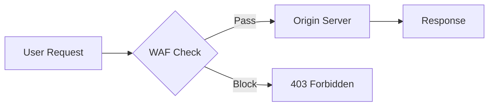

## Sequence Diagram

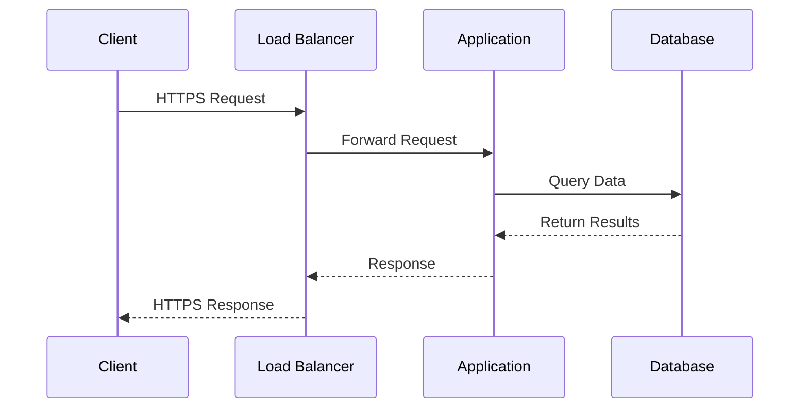

## Pie Chart

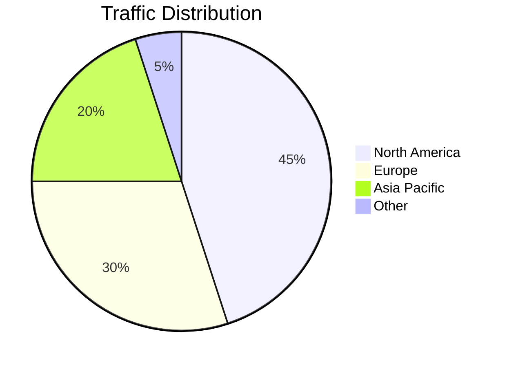

## Class Diagram

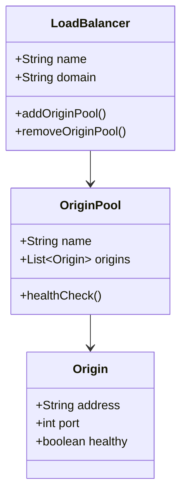

## State Diagram

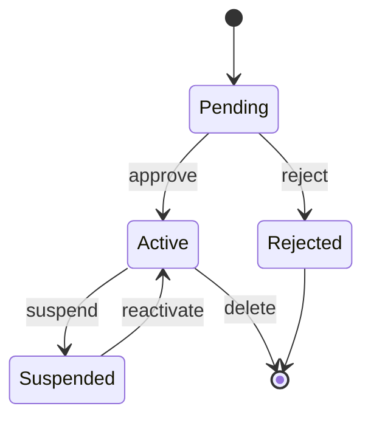

## Gantt Chart

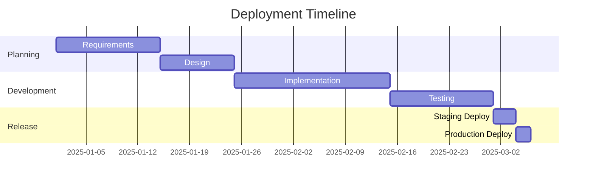

## Flowchart with Icons

Use the `@{ icon: 'pack:name' }` syntax to add icons from any registered icon pack to flowchart nodes.

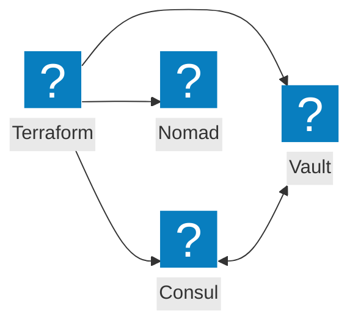

## Architecture Diagram

The `architecture-beta` diagram type supports service and group definitions with icon-decorated nodes.

```mermaid
architecture-beta
  group cloud(carbon:cloud-services)[Cloud Infrastructure]

  service gateway(carbon:gateway--api)[API Gateway] in cloud
  service app(carbon:application)[App Server] in cloud
  service db(carbon:data--base)[Database] in cloud
  service cache(carbon:data--cache)[Cache] in cloud

  gateway:R --> L:app
  app:R --> L:db
  app:B --> T:cache
```

## Multi-Cloud Network

Multi-cloud network topology with cloud provider icons and global load balancing.

```mermaid
architecture-beta
  group aws(carbon:logo--aws)[AWS Region]
  group azure(carbon:logo--azure)[Azure Region]

  service lb(carbon:load--balancer--global)[Global LB]
  service web1(carbon:virtual--machine)[Web Tier] in aws
  service db1(carbon:data--base)[Primary DB] in aws
  service web2(carbon:virtual--machine)[Web Tier] in azure
  service db2(carbon:data--base)[Replica DB] in azure

  lb:R --> L:web1
  lb:B --> T:web2
  web1:R --> L:db1
  web2:R --> L:db2
  db1:B --> T:db2
```

## AWS VPC Architecture

AWS VPC with public and private subnets, load balancer, EC2 instances, and RDS.

```mermaid
architecture-beta
  group vpc(carbon:virtual-private-cloud)[AWS VPC]
  group pubsub(carbon:ibm-cloud-subnets)[Public Subnet] in vpc
  group privsub(carbon:ibm-cloud-subnets)[Private Subnet] in vpc

  service igw(carbon:gateway)[Internet GW] in vpc
  service alb(carbon:load-balancer-application)[ALB] in pubsub
  service ec2a(hashicorp-flight:aws-ec2-color)[EC2] in privsub
  service ec2b(hashicorp-flight:aws-ec2-color)[EC2] in privsub
  service rds(carbon:data-base)[RDS] in privsub

  igw:R --> L:alb
  alb:R --> L:ec2a
  alb:B --> T:ec2b
  ec2a:R --> L:rds
  ec2b:R --> L:rds
```

## Azure VNet Architecture

Azure VNet with subnets, Application Gateway, VMs, and managed database.

```mermaid
architecture-beta
  group vnet(carbon:virtual-private-cloud)[Azure VNet]
  group gwsub(carbon:ibm-cloud-subnets)[Gateway Subnet] in vnet
  group appsub(carbon:ibm-cloud-subnets)[App Subnet] in vnet
  group datasub(carbon:ibm-cloud-subnets)[Data Subnet] in vnet

  service appgw(carbon:gateway-security)[App Gateway] in gwsub
  service vm1(hashicorp-flight:azure-vms-color)[VM Scale Set] in appsub
  service vm2(hashicorp-flight:azure-vms-color)[VM Scale Set] in appsub
  service sqldb(carbon:data-base)[Azure SQL] in datasub

  appgw:R --> L:vm1
  appgw:B --> T:vm2
  vm1:R --> L:sqldb
  vm2:R --> L:sqldb
```

## GCP Network Architecture

Google Cloud network with regional load balancing and managed services.

```mermaid
architecture-beta
  group gcp(hashicorp-flight:gcp-color)[GCP Project]
  group frontend(carbon:ibm-cloud-subnets)[Frontend Tier] in gcp
  group backend(carbon:ibm-cloud-subnets)[Backend Tier] in gcp

  service glb(carbon:load-balancer-global)[Global LB]
  service gke(hashicorp-flight:kubernetes-color)[GKE Cluster] in frontend
  service func(hashicorp-flight:serverless)[Cloud Functions] in frontend
  service sql(carbon:data-base)[Cloud SQL] in backend
  service store(hashicorp-flight:database)[Firestore] in backend

  glb:R --> L:gke
  glb:B --> T:func
  gke:R --> L:sql
  func:R --> L:store
  sql:B --> T:store
```

## DNS Resolution Flow

DNS query resolution with GSLB, authoritative DNS, and caching layers.

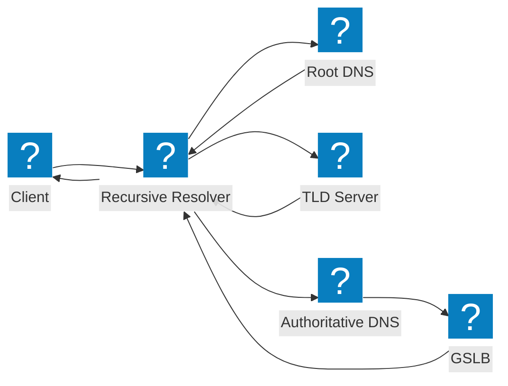

## WAF and App Security

Web application firewall and security inspection pipeline.

```mermaid
architecture-beta
  group edge(lucide:shield)[Security Edge]
  group origin(carbon:cloud-services)[Origin Infrastructure]

  service cdn(carbon:content-delivery-network)[CDN] in edge
  service waf(carbon:firewall)[WAF] in edge
  service bot(lucide:shield-check)[Bot Defense] in edge
  service lb(carbon:load-balancer-application)[Load Balancer] in origin
  service app(carbon:application)[App Server] in origin
  service db(carbon:data-base)[Database] in origin

  cdn:R --> L:waf
  waf:R --> L:bot
  bot:R --> L:lb
  lb:R --> L:app
  app:B --> T:db
```

## App Delivery with F5 XC

F5 Distributed Cloud application delivery with WAAP, bot defense, and multi-cloud connect.

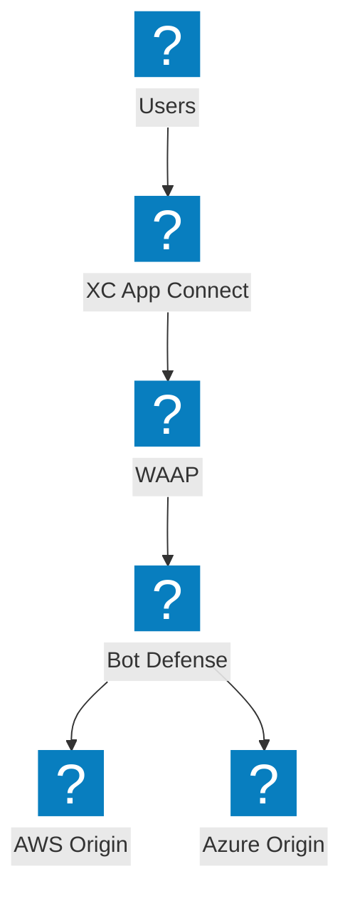

## Kubernetes Ingress

Container-based application with ingress controller, services, and persistent storage.

```mermaid
architecture-beta
  group cluster(hashicorp-flight:kubernetes-color)[Kubernetes Cluster]
  group frontend(carbon:container-services)[Frontend Pods] in cluster
  group backend(carbon:container-services)[Backend Pods] in cluster

  service ingress(carbon:gateway)[Ingress Controller] in cluster
  service web(hashicorp-flight:docker-color)[Web App] in frontend
  service api(carbon:api)[API Service] in backend
  service db(carbon:data-base)[StatefulSet DB] in backend

  ingress:R --> L:web
  ingress:B --> T:api
  api:R --> L:db
```

## Zero Trust Network Access

Zero trust architecture with identity verification, policy engine, and micro-segmentation.

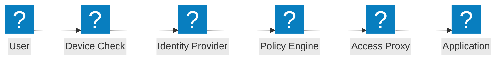

## Icon Reference

The following icon packs are registered and available in Mermaid diagrams. Icons are loaded lazily from CDN only when referenced.

| Pack Name | npm Package | Key Icons |
|-----------|-------------|-----------|
| `hashicorp-flight` | `@robinmordasiewicz/icons-hashicorp-flight` | `terraform-color`, `consul-color`, `vault-color`, `aws-color`, `azure-color`, `gcp-color`, `kubernetes-color`, `docker-color` |
| `f5-brand` | `@robinmordasiewicz/icons-f5-brand` | `network-gateway`, `security-firewall`, `security-shield-network`, `cloud-multi`, `hw-server` |
| `f5xc` | `@robinmordasiewicz/icons-f5xc` | `web-app-and-api-protection`, `bot-defense`, `multi-cloud-app-connect`, `dns-management`, `content-delivery-network` |
| `carbon` | `@robinmordasiewicz/icons-carbon` | `cloud-services`, `data-base`, `gateway-api`, `virtual-machine`, `load-balancer-global`, `firewall`, `dns-services`, `virtual-private-cloud` |
| `lucide` | `@robinmordasiewicz/icons-lucide` | `server`, `database`, `shield`, `shield-check`, `globe`, `lock`, `cloud`, `network`, `user` |
| `mdi` | `@robinmordasiewicz/icons-mdi` | `server`, `database`, `shield`, `cloud`, `lock`, `network`, `dns`, `vpn`, `router` |
| `phosphor` | `@robinmordasiewicz/icons-phosphor` | `cloud`, `database`, `shield`, `globe`, `lock`, `network` |
| `tabler` | `@robinmordasiewicz/icons-tabler` | `server`, `database`, `shield`, `cloud`, `lock`, `network`, `route`, `router` |

### Usage Syntax

In **flowcharts**, use the `@{}` node syntax:

```
nodeName@{ icon: 'pack:icon-name', label: 'Display Label' }
```

In **architecture diagrams**, use the icon in service/group definitions:

```
service myService(pack:icon-name)[Label]
group myGroup(pack:icon-name)[Label]
```

## CSS Reference

### Container Styling

Mermaid diagrams are wrapped in a styled container with rounded corners and a layered box shadow:

```css
.mermaid-container {
  border: 1px solid var(--sl-color-gray-5);
  border-radius: 0.75rem;
  padding: 1.5rem;
  box-shadow: 0 2px 4px rgba(0,0,0,0.04), 0 8px 16px rgba(0,0,0,0.08), 0 24px 48px rgba(0,0,0,0.12);
  margin-block: 1.5rem;
  background: #fff;
}
```

### Pre Element Reset

Starlight's default `<pre>` styling is stripped from the mermaid wrapper so only the outer container border is visible:

```css
.mermaid-container pre.mermaid {
  border: none;
  padding: 0;
  margin: 0;
  background: transparent;
}
```

### SVG Background Forcing

The SVG inside is forced to a white background for dark mode compatibility:

```css
.mermaid-container svg {
  background: white !important;
  border-radius: 0.5rem;
}
```

## Theme Checks

- `.mermaid-container` has white SVG background in dark mode
- Container border uses `--sl-color-gray-5`
- Container has 0.75rem border radius and layered box shadow
- Diagrams are readable in both light and dark themes
- Mermaid CDN script loads and renders SVGs on page load
