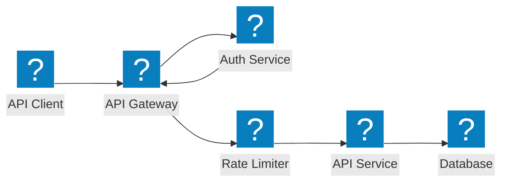
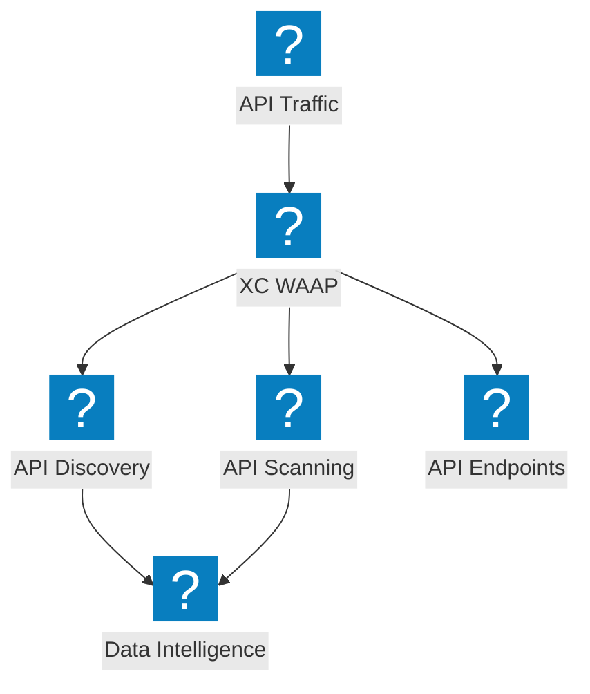

Diagramas de arquitetura de proteção de API cobrindo segurança de gateway de API, descoberta de shadow API, limitação de taxa e validação de esquema com F5 Distributed Cloud.

## Segurança de Gateway de API

Gateway de API com autenticação, autorização, limitação de taxa e validação de esquema antes de alcançar os serviços de backend.

## Descoberta e Proteção de API com F5 XC

F5 Distributed Cloud fornecendo descoberta de API, detecção de shadow API e segurança de API abrangente com análise de tráfego.

## Pipeline de Segurança de API

Pipeline de validação de requisições de API em múltiplos estágios com TLS, verificação de JWT, limitação de taxa e inspeção de payload.

```mermaid
architecture-beta
  group security(lucide:shield)[API Security Layer]
  group backend(carbon:cloud-services)[Backend Services]

  service tls(lucide:lock)[TLS Termination] in security
  service jwt(lucide:key)[JWT Validation] in security
  service rate(carbon:load-balancer-vpc)[Rate Limiter] in security
  service schema(carbon:gateway-security)[Schema Validation] in security
  service api1(carbon:api)[Users API] in backend
  service api2(carbon:api)[Orders API] in backend

  tls:R --> L:jwt
  jwt:R --> L:rate
  rate:R --> L:schema
  schema:R --> L:api1
  schema:B --> T:api2
```

