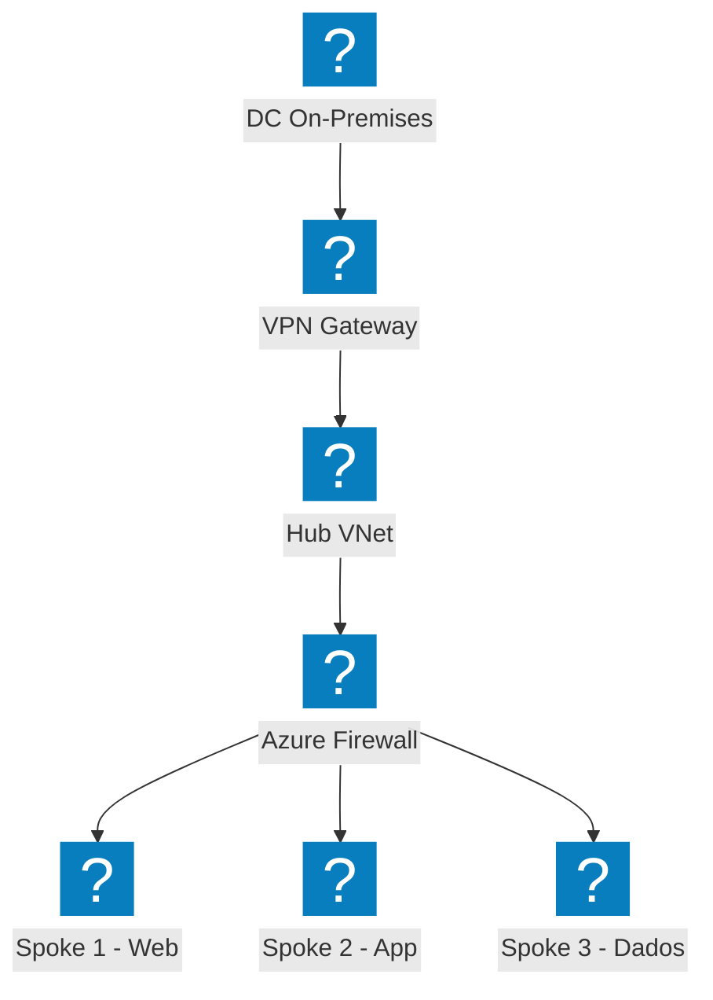
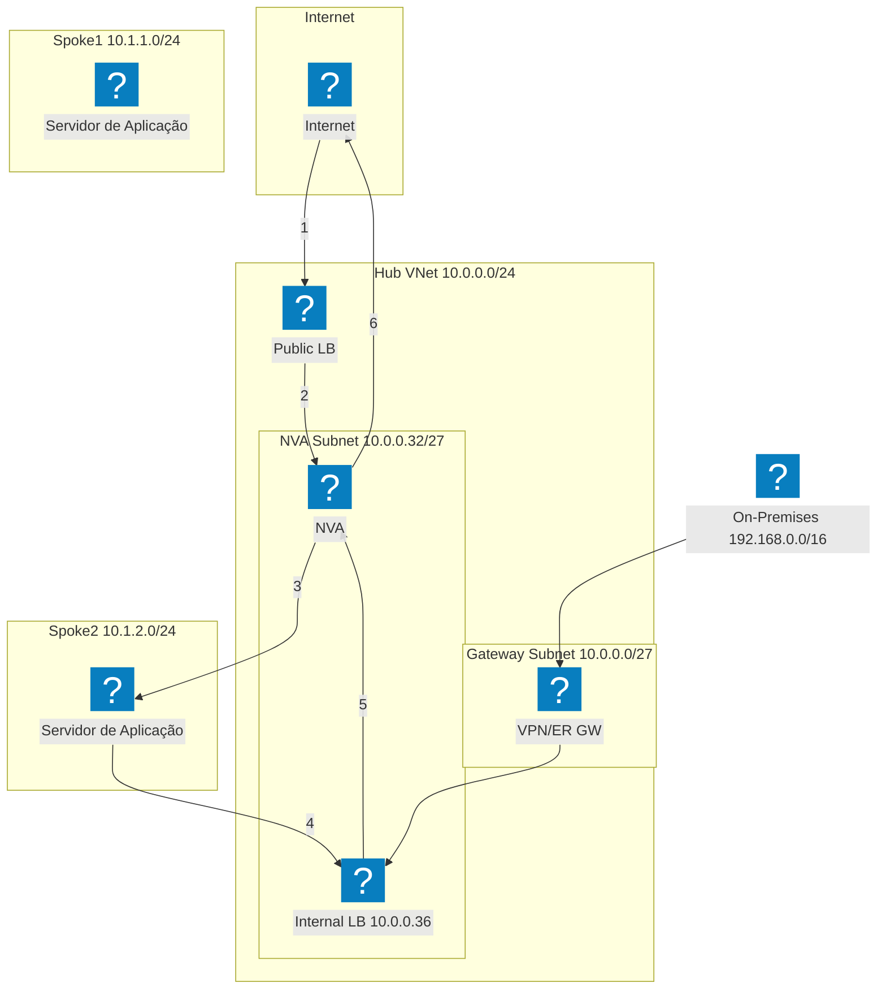
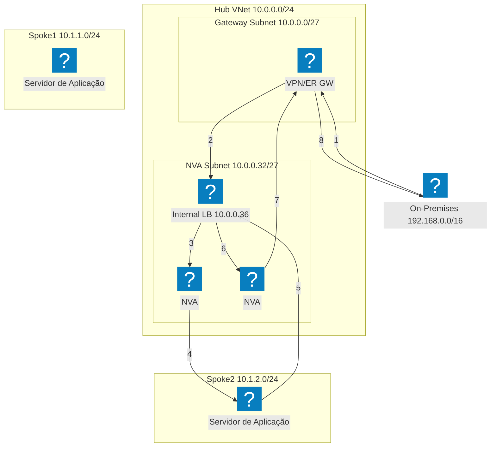
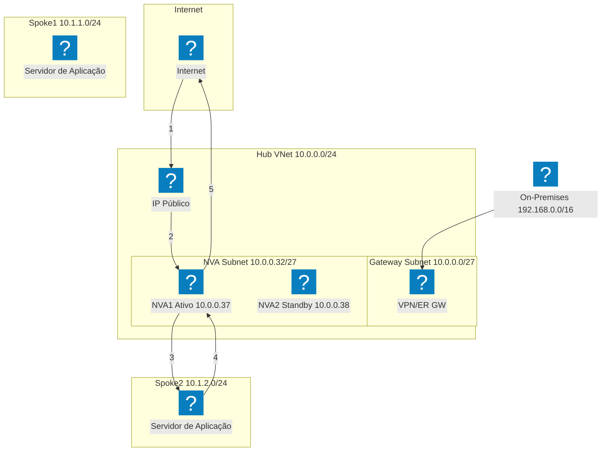
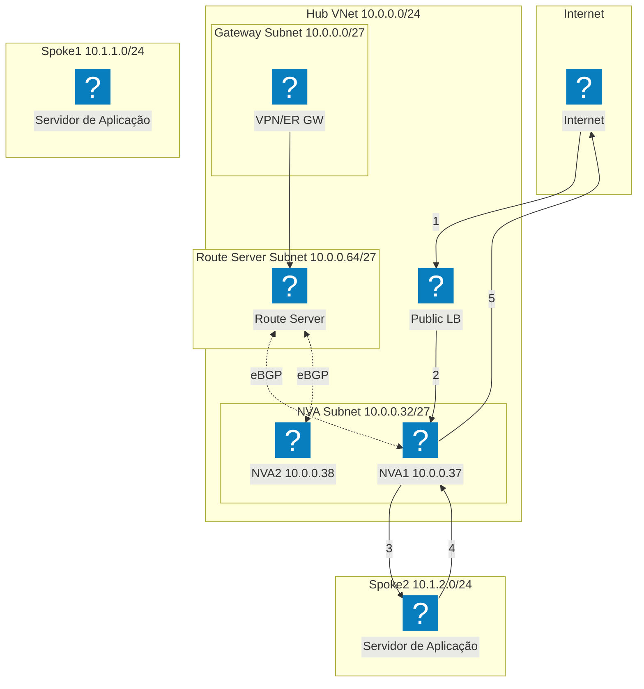
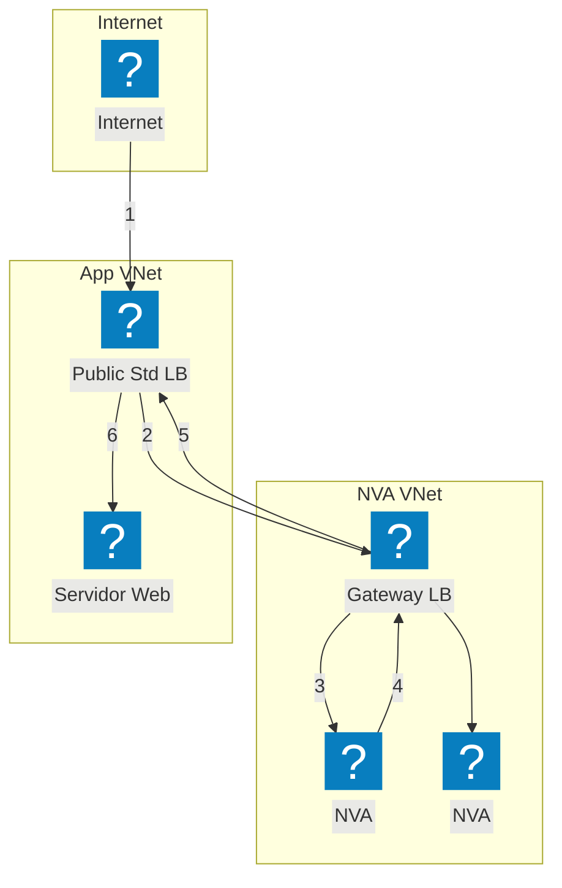

Diagramas de infraestrutura Azure utilizando os pacotes de ícones HashiCorp Flight e Carbon para redes VNet, computação e serviços gerenciados.

## VNet com App Gateway

VNet Azure com sub-redes de gateway, aplicação e dados. O Application Gateway distribui o tráfego para VM Scale Sets.

```mermaid
architecture-beta
  group vnet(carbon:virtual-private-cloud)[Azure VNet]
  group gwsub(carbon:ibm-cloud-subnets)[Gateway Subnet] in vnet
  group appsub(carbon:ibm-cloud-subnets)[App Subnet] in vnet
  group datasub(carbon:ibm-cloud-subnets)[Data Subnet] in vnet

  service appgw(carbon:gateway-security)[App Gateway] in gwsub
  service vm1(hashicorp-flight:azure-vms-color)[VM Scale Set] in appsub
  service vm2(hashicorp-flight:azure-vms-color)[VM Scale Set] in appsub
  service sqldb(carbon:data-base)[Azure SQL] in datasub

  appgw:R --> L:vm1
  appgw:B --> T:vm2
  vm1:R --> L:sqldb
  vm2:R --> L:sqldb
```

## AKS com F5 XC Multi-Cloud Connect

Azure Kubernetes Service gerenciado pelo F5 Distributed Cloud para conectividade e segurança de aplicações em múltiplas nuvens.

```mermaid
architecture-beta
  group xc(lucide:cloud)[F5 XC]
  group aks(hashicorp-flight:azure-aks-color)[AKS Cluster]

  service mcn(f5xc:multi-cloud-network-connect)[Network Connect] in xc
  service waap(f5xc:web-app-and-api-protection)[WAAP] in xc
  service ingress(carbon:gateway)[Ingress] in aks
  service app(hashicorp-flight:docker-color)[App Pods] in aks
  service cache(carbon:datastore)[Redis Cache] in aks
  service blob(hashicorp-flight:azure-blob-storage-color)[Blob Storage]

  mcn:R --> L:waap
  waap:R --> L:ingress
  ingress:R --> L:app
  app:B --> T:cache
  app:R --> L:blob
```

## Topologia de Rede Hub-Spoke

Arquitetura Hub-Spoke Azure com segurança centralizada e serviços compartilhados conectando múltiplas VNets spoke.

## Alta Disponibilidade de NVA com Load Balancer — Tráfego Internet

O tráfego de entrada da internet atinge um load balancer público, que distribui para instâncias de NVA no hub. O NVA encaminha o tráfego inspecionado para as cargas de trabalho nos spokes. O tráfego de retorno dos spokes é roteado por um load balancer interno de volta ao NVA para saída. As etapas numeradas mostram o caminho de entrada (1-3) e o caminho de retorno (4-6).

## Alta Disponibilidade de NVA com Load Balancer — Tráfego On-Premises

O tráfego on-premises entra por um gateway VPN ou ExpressRoute e é direcionado a um load balancer interno que gerencia múltiplas instâncias de NVA. O NVA inspeciona e encaminha o tráfego para as cargas de trabalho nos spokes. O tráfego de retorno percorre o mesmo load balancer interno para garantir a simetria do fluxo, evitando problemas de roteamento assimétrico.

## Alta Disponibilidade de NVA com PIP/UDR — Ativo/Standby

Par de NVA ativo/standby onde a instância ativa (NVA1) detém o endereço IP público. Em caso de falha, o NVA2 em standby aciona a API do Azure para reatribuir o IP público e atualizar as rotas definidas pelo usuário para apontarem para si mesmo. Essa abordagem dispensa load balancers, mas requer orquestração de failover no nível da API.

## Alta Disponibilidade de NVA com Azure Route Server

Alta disponibilidade baseada em BGP utilizando o Azure Route Server. O Route Server estabelece adjacências eBGP com ambas as instâncias de NVA e programa dinamicamente as rotas efetivas dos spokes. O ECMP distribui a carga entre os NVAs sem necessidade de rotas definidas pelo usuário. O Route Server injeta entradas de next-hop para ambos os IPs de NVA em todas as VNets emparelhadas.

## Alta Disponibilidade de NVA com Gateway Load Balancer

Inserção transparente de NVA utilizando o Azure Gateway Load Balancer. O tráfego destinado à aplicação é transparentemente desviado do load balancer padrão público para o Gateway LB em uma VNet de NVA separada. Os NVAs inspecionam o tráfego e o devolvem ao Gateway LB, que o encaminha de volta à aplicação. Não são necessários peering de VNet nem UDRs entre as VNets de NVA e de aplicação.

