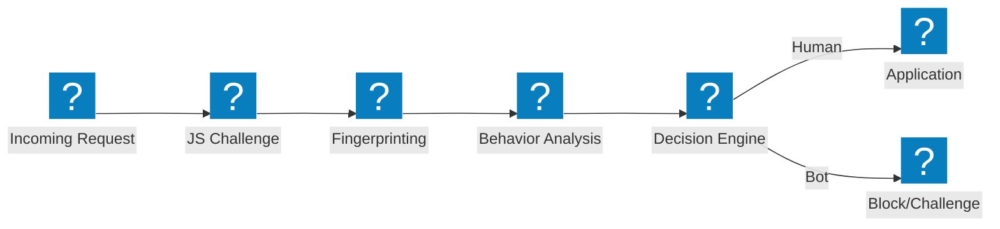
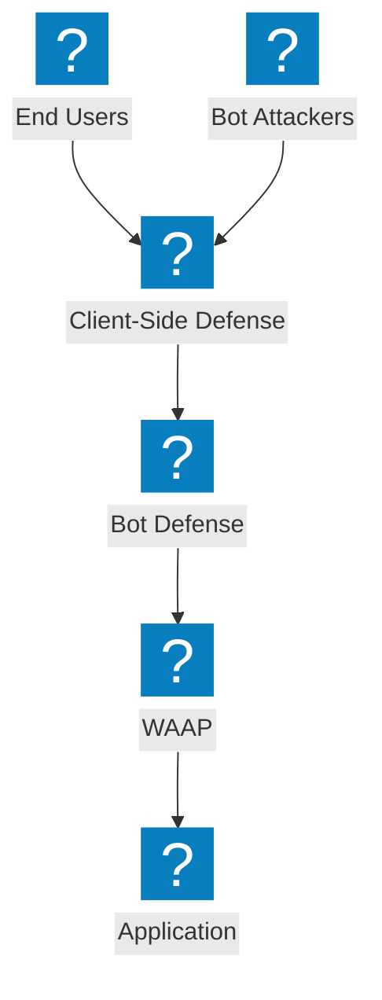

Diagramas de arquitetura de defesa contra bots cobrindo pipelines de detecção, mitigação de preenchimento de credenciais, defesa do lado do cliente e capacidades de gerenciamento de bots do F5 Distributed Cloud.

## Pipeline de Detecção de Bots

Pipeline de detecção de bots em múltiplos estágios com desafio JavaScript, análise comportamental e fingerprinting antes de permitir o acesso.

## Defesa contra Bots F5 XC e Defesa do Lado do Cliente

Defesa integrada contra bots do F5 Distributed Cloud com proteção do lado do cliente para prevenção de preenchimento de credenciais e tomada de conta.

## Arquitetura de Defesa contra Preenchimento de Credenciais

Defesa em múltiplas camadas contra ataques de preenchimento de credenciais com fingerprinting de dispositivo, inteligência de credenciais e proteção de conta.

