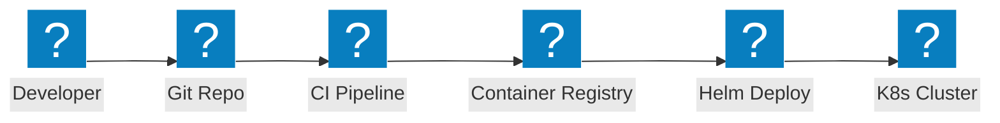

Diagramas de arquitetura Kubernetes abrangendo controladores de ingress, padrões de malha de serviços, rede de pods e segurança de contêineres com integração NGINX e F5 XC.

## Kubernetes Ingress com NGINX

Aplicação baseada em contêineres com controlador de ingress NGINX distribuindo tráfego para pods de frontend e backend.

```mermaid
architecture-beta
  group cluster(hashicorp-flight:kubernetes-color)[Kubernetes Cluster]
  group frontend(carbon:container-services)[Frontend Pods] in cluster
  group backend(carbon:container-services)[Backend Pods] in cluster

  service ingress(carbon:gateway)[Ingress Controller] in cluster
  service web(hashicorp-flight:docker-color)[Web App] in frontend
  service api(carbon:api)[API Service] in backend
  service db(carbon:data-base)[StatefulSet DB] in backend

  ingress:R --> L:web
  ingress:B --> T:api
  api:R --> L:db
```

## Malha de Serviços com F5 XC

Malha de serviços Kubernetes com F5 XC fornecendo balanceamento de carga externo, observabilidade e conectividade multi-cluster.

```mermaid
architecture-beta
  group xc(lucide:cloud)[F5 XC]
  group mesh(hashicorp-flight:kubernetes-color)[Service Mesh]

  service nginx(f5xc:nginx-one)[NGINX One] in xc
  service obs(f5xc:observability)[Observability] in xc
  service proxy1(carbon:server-proxy)[Sidecar Proxy] in mesh
  service svc1(hashicorp-flight:docker-color)[Service A] in mesh
  service proxy2(carbon:server-proxy)[Sidecar Proxy] in mesh
  service svc2(hashicorp-flight:docker-color)[Service B] in mesh

  nginx:R --> L:obs
  obs:R --> L:proxy1
  proxy1:R --> L:svc1
  svc1:B --> T:proxy2
  proxy2:R --> L:svc2
```

## Pipeline de Implantação de Contêineres

Pipeline de CI/CD para implantações Kubernetes usando Helm charts, registro de contêineres e rollouts automatizados.

