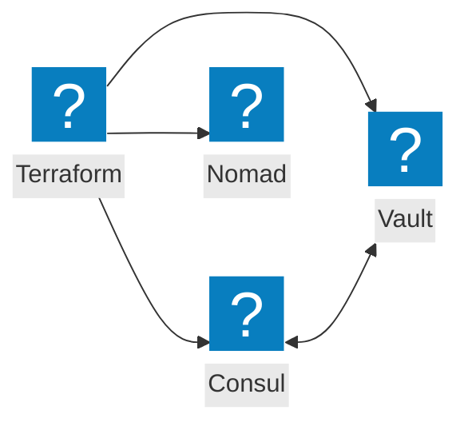
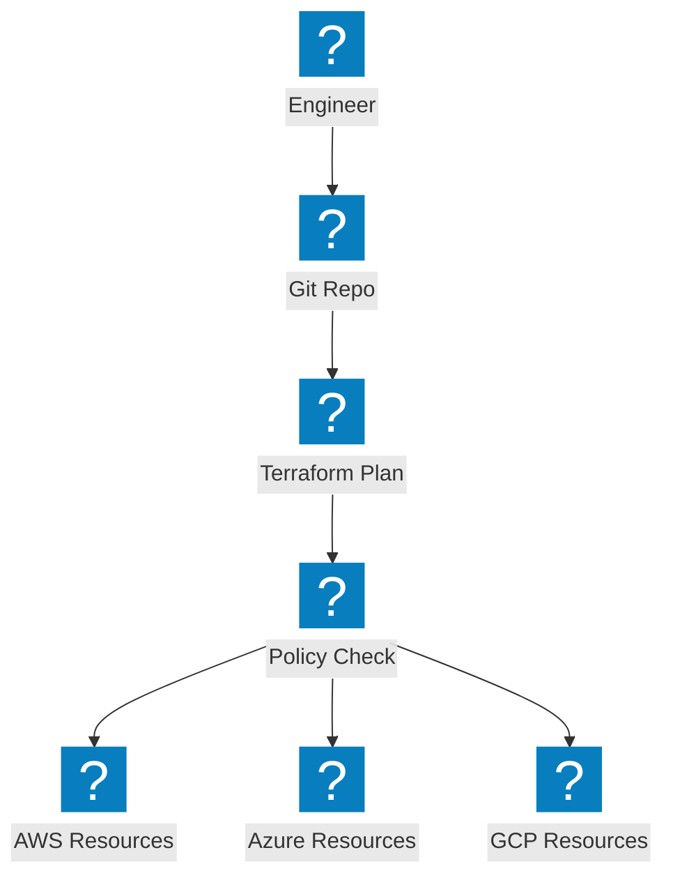

Diagramas de Infraestrutura como Código cobrindo automação com Terraform, integração com ferramentas HashiCorp e fluxos de trabalho de provisionamento multi-cloud.

## Integração com o Stack HashiCorp

O Terraform orquestrando o provisionamento de infraestrutura com o Consul para descoberta de serviços, Vault para segredos e Nomad para agendamento de cargas de trabalho.

## Pipeline IaC Multi-Cloud

O Terraform provisionando infraestrutura na AWS, Azure e GCP com gerenciamento de estado e aplicação de políticas.

## Automação de Infraestrutura F5 XC

O Terraform automatizando a configuração do F5 Distributed Cloud com balanceadores de carga, pools de origem e políticas de segurança.

```mermaid
architecture-beta
  group iac(hashicorp-flight:terraform-color)[Terraform Workspace]
  group xc(lucide:cloud)[F5 XC Tenant]

  service tfplan(hashicorp-flight:terraform-color)[Terraform] in iac
  service vault(hashicorp-flight:vault-color)[Vault Secrets] in iac
  service consul(hashicorp-flight:consul-color)[Consul Registry] in iac
  service waap(f5xc:web-app-and-api-protection)[WAAP Policy] in xc
  service lb(f5xc:multi-cloud-app-connect)[App Connect] in xc
  service dns(f5xc:dns-management)[DNS Config] in xc

  tfplan:R --> L:vault
  vault:R --> L:consul
  tfplan:B --> T:waap
  tfplan:B --> T:lb
  tfplan:B --> T:dns
```

