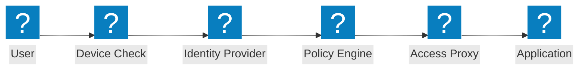
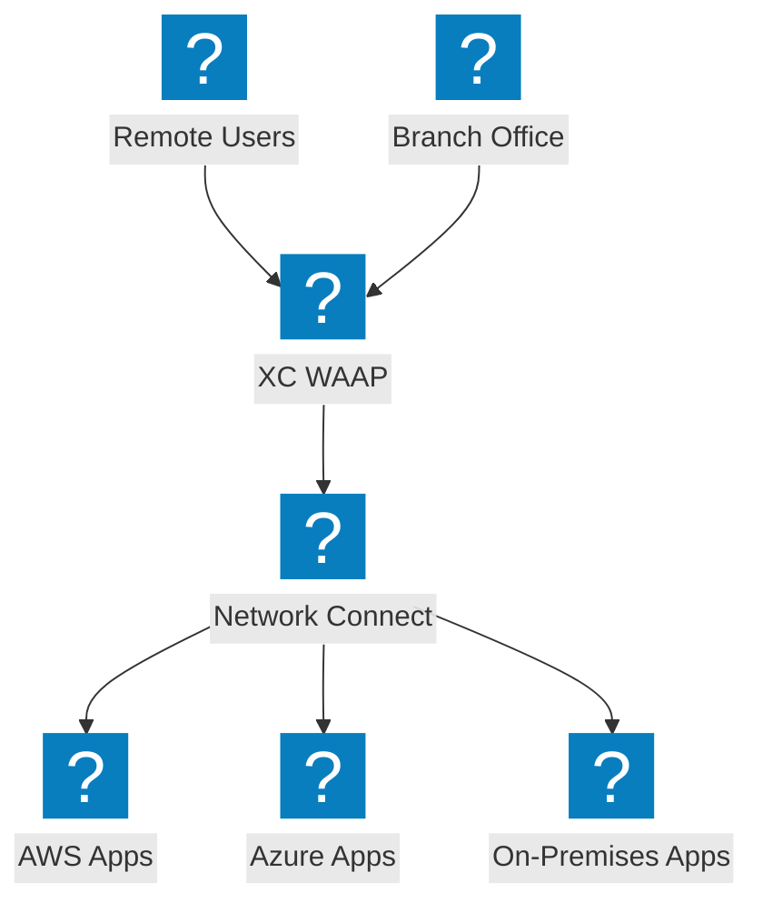

Diagramas de arquitetura de confiança zero cobrindo fluxos de acesso ZTNA, verificação de identidade, controle de acesso baseado em políticas e micro-segmentação com integração F5 XC.

## Fluxo de Acesso Zero Trust

Fluxo de acesso com confiança zero incluindo verificação de postura do dispositivo, verificação de identidade, avaliação de políticas e acesso proxiado à aplicação.

## Arquitetura Zero Trust F5 XC

F5 Distributed Cloud fornecendo acesso a aplicações com confiança zero com WAAP, proxy com reconhecimento de identidade e micro-segmentação entre nuvens.

## Arquitetura de Micro-Segmentação

Micro-segmentação de rede com políticas baseadas em identidade controlando o tráfego leste-oeste entre as camadas da aplicação.

```mermaid
architecture-beta
  group trust(lucide:shield)[Zero Trust Fabric]
  group apps(carbon:cloud-services)[Application Tiers]

  service idp(lucide:key)[Identity Provider] in trust
  service policy(carbon:gateway-security)[Policy Engine] in trust
  service seg(carbon:subnet-acl-rules)[Segmentation] in trust
  service web(carbon:application)[Web Tier] in apps
  service api(carbon:api)[API Tier] in apps
  service data(carbon:data-base)[Data Tier] in apps

  idp:R --> L:policy
  policy:R --> L:seg
  seg:R --> L:web
  web:R --> L:api
  api:R --> L:data
```

