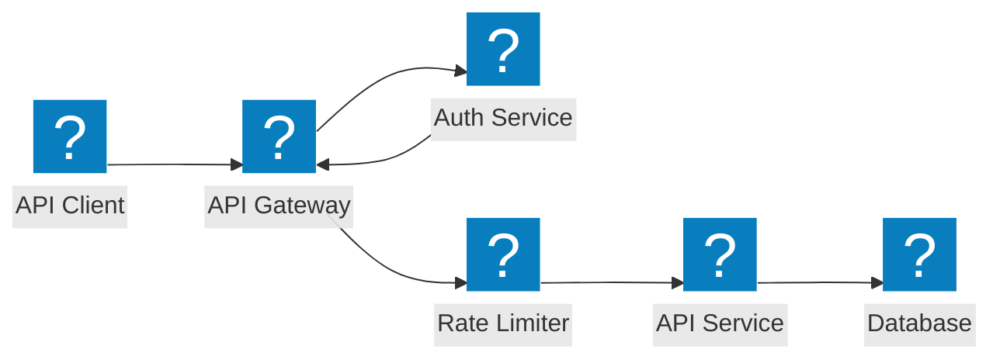
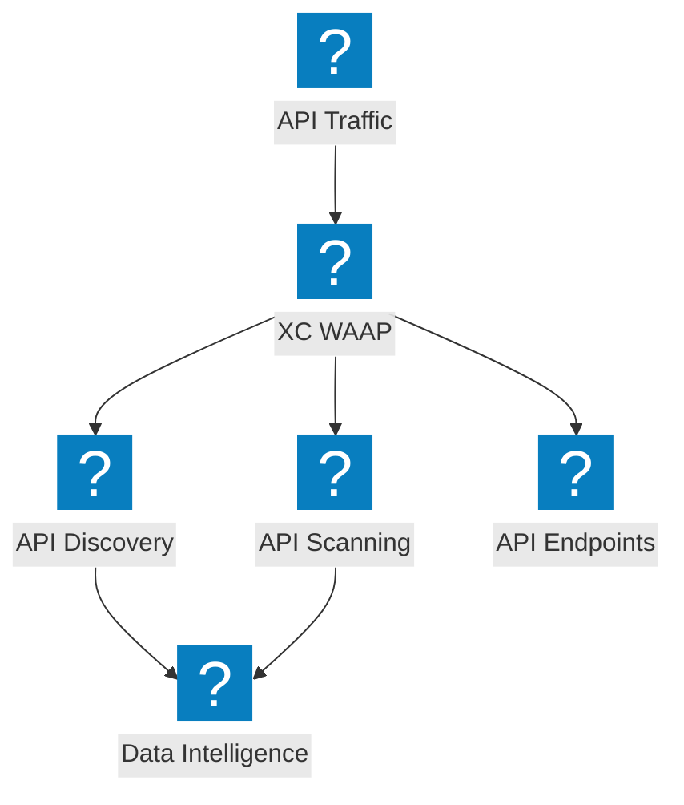

แผนภาพสถาปัตยกรรมการป้องกัน API ที่ครอบคลุมความปลอดภัยของ API gateway, การค้นพบ shadow API, การจำกัดอัตรา และการตรวจสอบ schema ด้วย F5 Distributed Cloud

## ความปลอดภัยของ API Gateway

API gateway พร้อมการยืนยันตัวตน, การอนุญาต, การจำกัดอัตรา และการตรวจสอบ schema ก่อนถึงบริการ backend

## การค้นพบและป้องกัน API ด้วย F5 XC

F5 Distributed Cloud ที่ให้บริการการค้นพบ API, การตรวจจับ shadow API และความปลอดภัย API ที่ครอบคลุมพร้อมข้อมูลเชิงลึกด้านทราฟฟิก

## ไปป์ไลน์ความปลอดภัย API

ไปป์ไลน์การตรวจสอบคำขอ API แบบหลายขั้นตอนพร้อม TLS, การตรวจสอบ JWT, การจำกัดอัตรา และการตรวจสอบ payload

```mermaid
architecture-beta
  group security(lucide:shield)[API Security Layer]
  group backend(carbon:cloud-services)[Backend Services]

  service tls(lucide:lock)[TLS Termination] in security
  service jwt(lucide:key)[JWT Validation] in security
  service rate(carbon:load-balancer-vpc)[Rate Limiter] in security
  service schema(carbon:gateway-security)[Schema Validation] in security
  service api1(carbon:api)[Users API] in backend
  service api2(carbon:api)[Orders API] in backend

  tls:R --> L:jwt
  jwt:R --> L:rate
  rate:R --> L:schema
  schema:R --> L:api1
  schema:B --> T:api2
```

