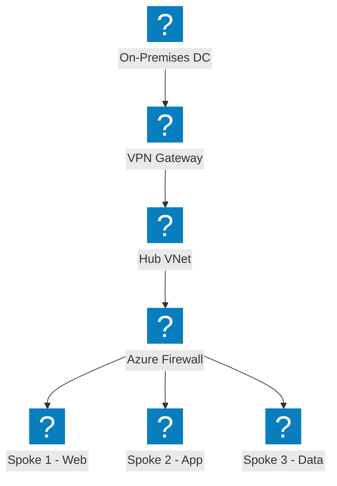
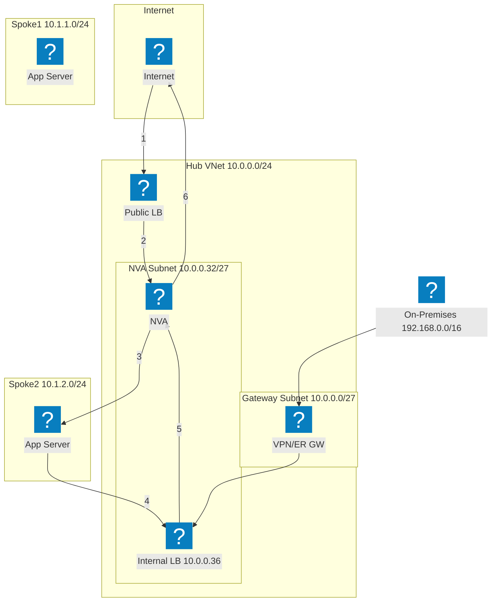
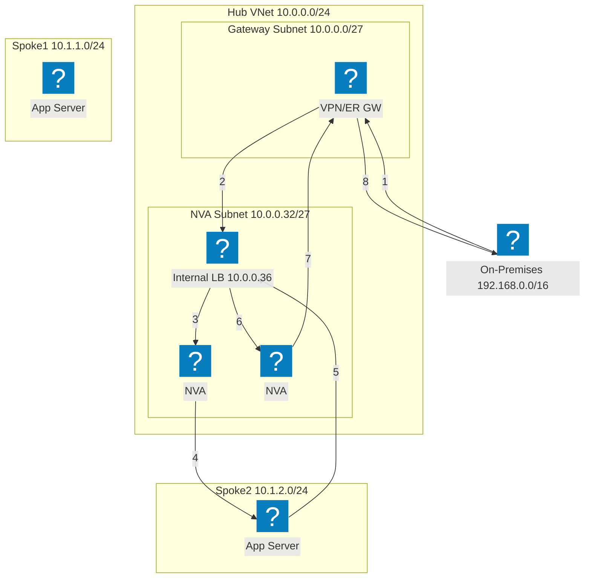
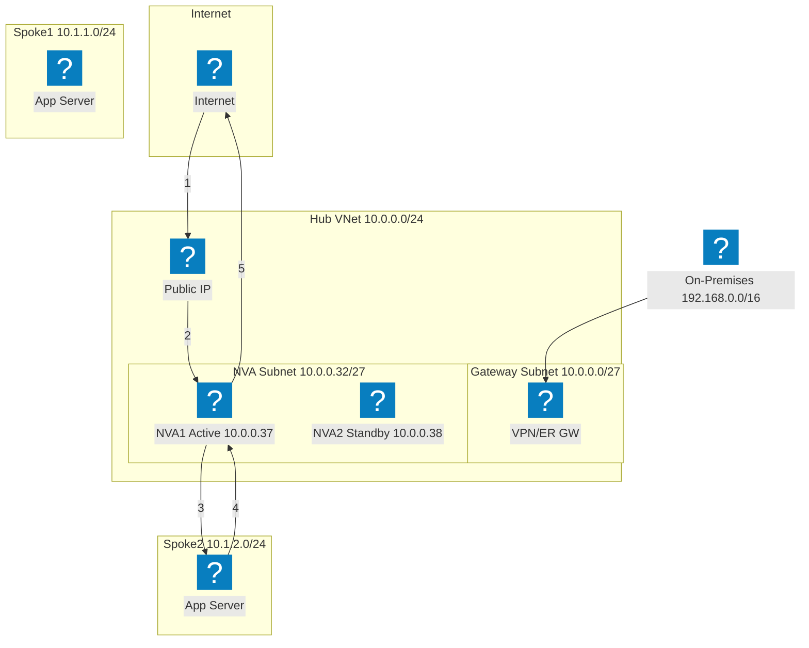
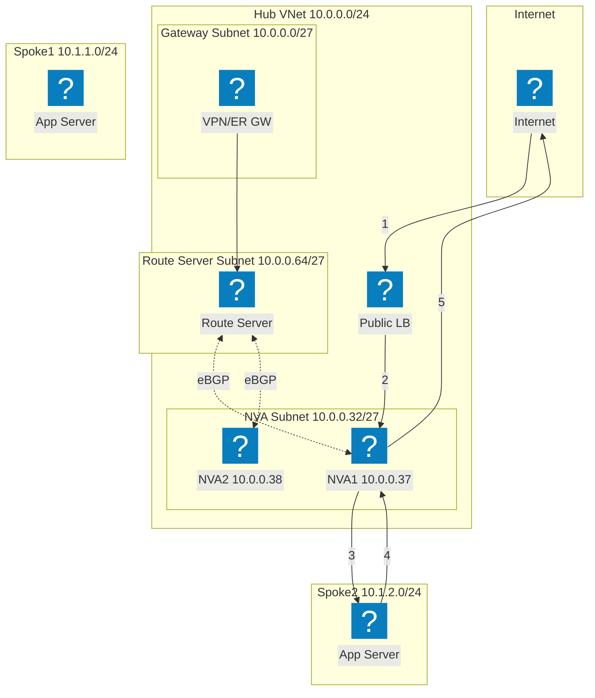
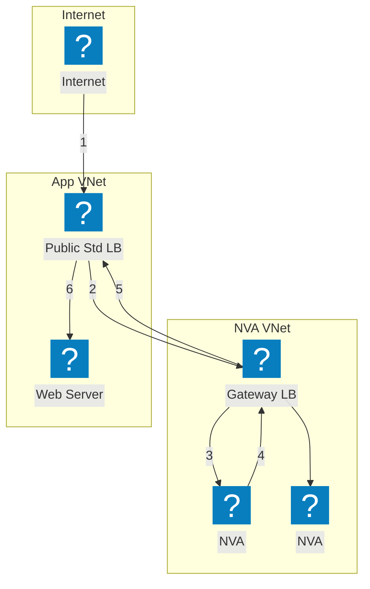

แผนภาพโครงสร้างพื้นฐาน Azure โดยใช้แพ็กเกจไอคอน HashiCorp Flight และ Carbon สำหรับเครือข่าย VNet ระบบประมวลผล และบริการที่จัดการ

## VNet พร้อม App Gateway

Azure VNet พร้อมซับเน็ตสำหรับเกตเวย์ แอปพลิเคชัน และข้อมูล Application Gateway กระจายทราฟฟิกไปยัง VM Scale Sets

```mermaid
architecture-beta
  group vnet(carbon:virtual-private-cloud)[Azure VNet]
  group gwsub(carbon:ibm-cloud-subnets)[Gateway Subnet] in vnet
  group appsub(carbon:ibm-cloud-subnets)[App Subnet] in vnet
  group datasub(carbon:ibm-cloud-subnets)[Data Subnet] in vnet

  service appgw(carbon:gateway-security)[App Gateway] in gwsub
  service vm1(hashicorp-flight:azure-vms-color)[VM Scale Set] in appsub
  service vm2(hashicorp-flight:azure-vms-color)[VM Scale Set] in appsub
  service sqldb(carbon:data-base)[Azure SQL] in datasub

  appgw:R --> L:vm1
  appgw:B --> T:vm2
  vm1:R --> L:sqldb
  vm2:R --> L:sqldb
```

## AKS พร้อม F5 XC เครือข่ายมัลติคลาวด์

Azure Kubernetes Service ที่มี F5 Distributed Cloud เป็นส่วนหน้า สำหรับการเชื่อมต่อแอปพลิเคชันมัลติคลาวด์และความปลอดภัย

```mermaid
architecture-beta
  group xc(lucide:cloud)[F5 XC]
  group aks(hashicorp-flight:azure-aks-color)[AKS Cluster]

  service mcn(f5xc:multi-cloud-network-connect)[Network Connect] in xc
  service waap(f5xc:web-app-and-api-protection)[WAAP] in xc
  service ingress(carbon:gateway)[Ingress] in aks
  service app(hashicorp-flight:docker-color)[App Pods] in aks
  service cache(carbon:datastore)[Redis Cache] in aks
  service blob(hashicorp-flight:azure-blob-storage-color)[Blob Storage]

  mcn:R --> L:waap
  waap:R --> L:ingress
  ingress:R --> L:app
  app:B --> T:cache
  app:R --> L:blob
```

## โทโพโลยีเครือข่าย Hub-Spoke

สถาปัตยกรรม Hub-Spoke ของ Azure พร้อมความปลอดภัยแบบรวมศูนย์และบริการร่วมที่เชื่อมต่อ VNet แบบ spoke หลายรายการ

## NVA HA พร้อม Load Balancer — ทราฟฟิกอินเทอร์เน็ต

ทราฟฟิกอินเทอร์เน็ตขาเข้าจะผ่าน public load balancer ซึ่งกระจายทราฟฟิกไปยังอินสแตนซ์ NVA ใน hub จากนั้น NVA จะส่งทราฟฟิกที่ตรวจสอบแล้วไปยังเวิร์กโหลดใน spoke ทราฟฟิกขาออกจาก spoke จะถูกส่งผ่าน internal load balancer กลับไปยัง NVA เพื่อออกไปยังอินเทอร์เน็ต ขั้นตอนที่มีหมายเลขแสดงเส้นทางขาเข้า (1-3) และเส้นทางขาออก (4-6)

## NVA HA พร้อม Load Balancer — ทราฟฟิกจากสถานที่ทำงาน

ทราฟฟิกจากสถานที่ทำงาน (on-premises) จะเข้ามาผ่านเกตเวย์ VPN หรือ ExpressRoute และถูกส่งไปยัง internal load balancer ที่อยู่หน้าอินสแตนซ์ NVA หลายรายการ NVA จะตรวจสอบและส่งทราฟฟิกไปยังเวิร์กโหลดใน spoke ทราฟฟิกขาออกจะผ่าน internal load balancer เดิมเพื่อให้มั่นใจในความสมมาตรของการไหล และป้องกันปัญหาการเลือกเส้นทางแบบไม่สมมาตร

## NVA HA พร้อม PIP/UDR — Active/Standby

คู่ NVA แบบ active/standby ซึ่ง NVA ที่ทำงานอยู่ (NVA1) จะถือครอง public IP address เมื่อเกิดความล้มเหลว NVA2 แบบ standby จะเรียก Azure API เพื่อกำหนด public IP ใหม่และอัปเดต user-defined routes ให้ชี้มาที่ตัวเอง วิธีนี้หลีกเลี่ยงการใช้ load balancer แต่ต้องการการประสานงาน failover ในระดับ API

## NVA HA พร้อม Azure Route Server

ความพร้อมใช้งานสูงแบบ BGP โดยใช้ Azure Route Server โดย Route Server จะสร้างความสัมพันธ์ eBGP กับอินสแตนซ์ NVA ทั้งสองและกำหนดโปรแกรมเส้นทางที่มีผลกับ spoke แบบไดนามิก ECMP กระจายโหลดระหว่าง NVA โดยไม่ต้องใช้ user-defined routes Route Server จะแทรกรายการ next-hop สำหรับ IP ของ NVA ทั้งสองเข้าไปใน VNet ทั้งหมดที่เชื่อมต่อกัน

## NVA HA พร้อม Gateway Load Balancer

การแทรก NVA แบบโปร่งใสโดยใช้ Azure Gateway Load Balancer ทราฟฟิกที่มุ่งหน้าไปยังแอปพลิเคชันจะถูกเบี่ยงเบนอย่างโปร่งใสจาก public standard load balancer ไปยัง Gateway LB ใน VNet ของ NVA แยกต่างหาก NVA จะตรวจสอบทราฟฟิกและส่งกลับไปยัง Gateway LB ซึ่งจะส่งต่อกลับไปยังแอปพลิเคชัน โดยไม่จำเป็นต้องมี VNet peering หรือ UDR ระหว่าง VNet ของ NVA และแอปพลิเคชัน

