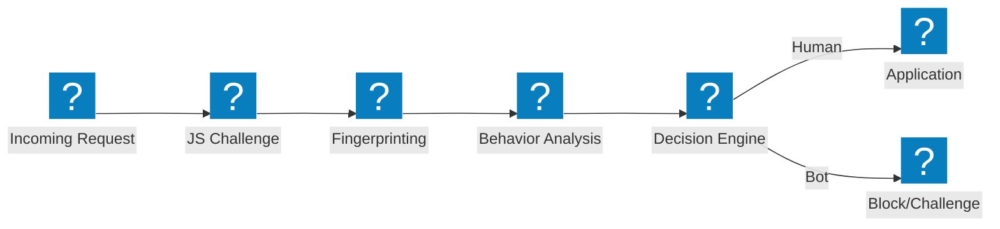
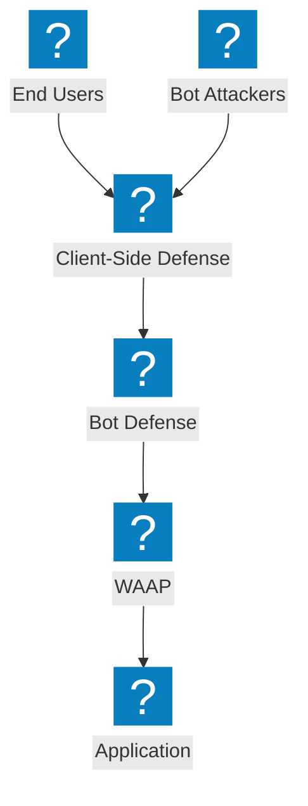

ไดอะแกรมสถาปัตยกรรมการป้องกัน Bot ครอบคลุมท่อตรวจจับ การลด Credential Stuffing การป้องกันฝั่งไคลเอนต์ และความสามารถในการจัดการ Bot ของ F5 Distributed Cloud

## ท่อตรวจจับ Bot

ท่อตรวจจับ Bot แบบหลายขั้นตอน พร้อม JavaScript Challenge การวิเคราะห์พฤติกรรม และการพิมพ์ลายนิ้วมือก่อนอนุญาตการเข้าถึง

## F5 XC การป้องกัน Bot และการป้องกันฝั่งไคลเอนต์

F5 Distributed Cloud การป้องกัน Bot แบบบูรณาการพร้อมการป้องกันฝั่งไคลเอนต์สำหรับ Credential Stuffing และการป้องกันการยึดครองบัญชี

## สถาปัตยกรรมการป้องกัน Credential Stuffing

การป้องกันแบบหลายชั้นต่อการโจมตี Credential Stuffing ด้วยการพิมพ์ลายนิ้วมืออุปกรณ์ ข้อมูลข่าวกรอง Credential และการป้องกันบัญชี

