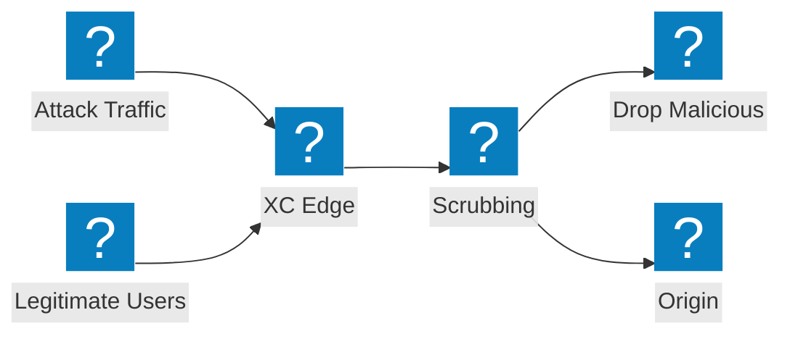

แผนภาพสถาปัตยกรรมการลดผลกระทบ DDoS ที่ครอบคลุมการออกแบบศูนย์กรองทราฟฟิก การผสานรวมบริการทรานสิต และการป้องกันการโจมตีแบบ volumetric ด้วย F5 Distributed Cloud

## สถาปัตยกรรมการลดผลกระทบ DDoS

การลดผลกระทบ DDoS แบบหลายชั้น ด้วยการกรองที่ระดับเครือข่าย การตรวจสอบที่ระดับแอปพลิเคชัน และการส่งทราฟฟิกที่สะอาดไปยังเซิร์ฟเวอร์ต้นทาง

```mermaid
architecture-beta
  group scrub(lucide:shield)[Scrubbing Center]
  group origin(carbon:cloud-services)[Origin DC]

  service edge(carbon:edge-node)[Edge Router] in scrub
  service filter(carbon:firewall)[Traffic Filter] in scrub
  service clean(carbon:load-balancer-global)[Clean Pipe] in scrub
  service lb(carbon:load-balancer-application)[Load Balancer] in origin
  service app(carbon:application)[Application] in origin
  service db(carbon:data-base)[Database] in origin

  edge:R --> L:filter
  filter:R --> L:clean
  clean:R --> L:lb
  lb:R --> L:app
  app:B --> T:db
```

## การป้องกัน DDoS และบริการทรานสิตของ F5 XC

F5 Distributed Cloud ให้การป้องกัน DDoS และบริการทรานสิต พร้อมด้วย CDN และความปลอดภัยของแอปพลิเคชันแบบผสานรวม

```mermaid
architecture-beta
  group xc(lucide:cloud)[F5 Distributed Cloud]
  group cloud(carbon:cloud-services)[Cloud Infrastructure]

  service ddos(f5xc:ddos-and-transit-services)[DDoS Protection] in xc
  service cdn(f5xc:content-delivery-network)[CDN] in xc
  service waap(f5xc:web-app-and-api-protection)[WAAP] in xc
  service lb(carbon:load-balancer-application)[Load Balancer] in cloud
  service app(carbon:application)[App Cluster] in cloud
  service db(carbon:data-base)[Database] in cloud

  ddos:R --> L:cdn
  cdn:R --> L:waap
  waap:R --> L:lb
  lb:R --> L:app
  app:B --> T:db
```

## การไหลของการโจมตีแบบ Volumetric

การไหลของทราฟฟิกการโจมตีที่แสดงให้เห็นว่าการโจมตี DDoS แบบ volumetric ถูกดูดซับและลดผลกระทบที่ขอบเครือข่าย F5 XC อย่างไร ก่อนที่จะเข้าถึงโครงสร้างพื้นฐานของเซิร์ฟเวอร์ต้นทาง

