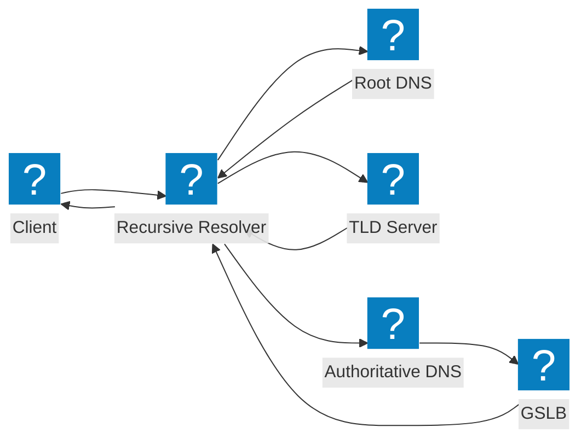
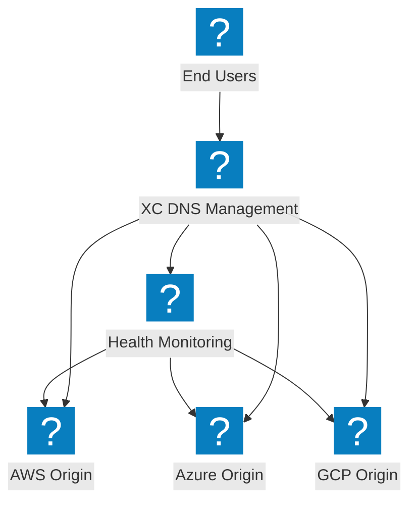

ไดอะแกรมสถาปัตยกรรม DNS ที่ครอบคลุมกระบวนการแก้ไขแบบเรียกซ้ำ, การกระจายโหลดเซิร์ฟเวอร์ระดับโลก และการจัดการ DNS ของ F5 Distributed Cloud

## กระบวนการแก้ไข DNS

การแก้ไขคำค้นหา DNS มาตรฐานจากไคลเอนต์ผ่าน Recursive Resolver ไปยัง Authoritative Nameserver พร้อมการผสานรวม GSLB

## การจัดการ DNS ของ F5 XC

การจัดการ DNS ของ F5 Distributed Cloud ที่ให้บริการ DNS Load Balancing อย่างชาญฉลาดข้าม Origin แบบมัลติคลาวด์

## สถาปัตยกรรม DNS Load Balancing

DNS Load Balancing แบบหลายระดับพร้อมการกำหนดเส้นทางตามภูมิศาสตร์, การตรวจสอบสุขภาพ และการ Failover ระหว่างภูมิภาคคลาวด์

```mermaid
architecture-beta
  group dns(carbon:dns-services)[DNS Infrastructure]
  group region1(hashicorp-flight:aws-color)[US East]
  group region2(hashicorp-flight:azure-color)[EU West]

  service gslb(carbon:load-balancer-global)[GSLB] in dns
  service health(carbon:application)[Health Check] in dns
  service lb1(carbon:load-balancer-application)[Regional LB] in region1
  service app1(carbon:virtual-machine)[App Servers] in region1
  service lb2(carbon:load-balancer-application)[Regional LB] in region2
  service app2(carbon:virtual-machine)[App Servers] in region2

  gslb:R --> L:health
  gslb:B --> T:lb1
  lb1:R --> L:app1
  gslb:B --> T:lb2
  lb2:R --> L:app2
```

