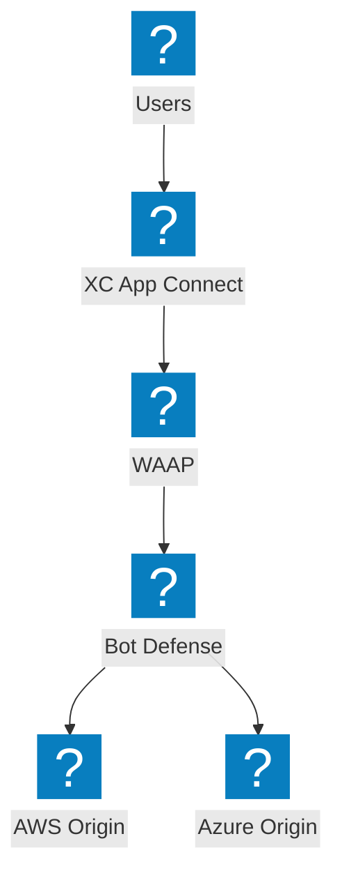
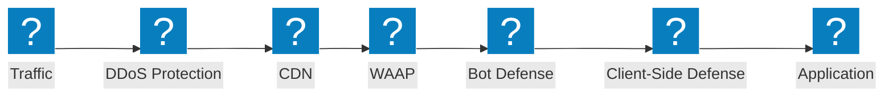

แผนภาพแสดงไอคอนผลิตภัณฑ์ F5 ที่สาธิตพอร์ตโฟลิโอบริการ F5 XC, ผลิตภัณฑ์ NGINX และความสามารถของ BIG-IP โดยใช้แพ็กเกจไอคอน `f5xc` และ `f5-brand`

## พอร์ตโฟลิโอบริการ F5 XC

ภาพรวมของบริการ F5 Distributed Cloud ที่ครอบคลุมด้านความปลอดภัย เครือข่าย และการส่งมอบแอปพลิเคชัน

## สแตกความปลอดภัย F5 XC

สแตกความปลอดภัย F5 XC ที่ครบครันพร้อม WAAP, การป้องกัน Bot, การป้องกันฝั่งไคลเอนต์, การป้องกัน DDoS และการค้นพบ API

## บริการเครือข่าย F5 XC

บริการเครือข่าย F5 Distributed Cloud พร้อมการเชื่อมต่อมัลติคลาวด์, การจัดการ DNS และแอปพลิเคชันแบบกระจาย

```mermaid
architecture-beta
  group xc(lucide:cloud)[F5 Distributed Cloud]
  group infra(carbon:cloud-services)[Infrastructure]

  service mcn(f5xc:multi-cloud-network-connect)[Network Connect] in xc
  service mca(f5xc:multi-cloud-app-connect)[App Connect] in xc
  service dns(f5xc:dns-management)[DNS Management] in xc
  service dapp(f5xc:distributed-apps)[Distributed Apps] in xc
  service k8s(hashicorp-flight:kubernetes-color)[K8s Clusters] in infra
  service vm(carbon:virtual-machine)[VM Workloads] in infra

  mcn:R --> L:mca
  mca:R --> L:dns
  dns:R --> L:dapp
  mcn:B --> T:k8s
  mca:B --> T:vm
```

## การสังเกตการณ์และข่าวกรอง F5 XC

การสังเกตการณ์, การวิเคราะห์ทราฟฟิก และข่าวกรองข้อมูลของ F5 Distributed Cloud สำหรับการมองเห็นแอปพลิเคชันอย่างครอบคลุม

```mermaid
architecture-beta
  group apps(carbon:cloud-services)[Application Layer]
  group intel(lucide:cloud)[F5 XC Intelligence]

  service app1(carbon:application)[Web App] in apps
  service app2(carbon:api)[API Service] in apps
  service app3(f5xc:distributed-apps)[Distributed App] in apps
  service obs(f5xc:observability)[Observability] in intel
  service ati(f5xc:application-traffic-insight)[Traffic Insight] in intel
  service di(f5xc:data-intelligence)[Data Intelligence] in intel

  app1:B --> T:obs
  app2:B --> T:ati
  app3:B --> T:di
  obs:R --> L:ati
  ati:R --> L:di
```

