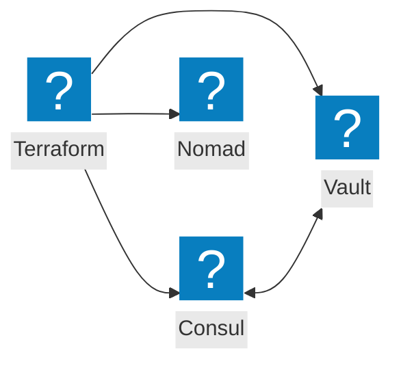
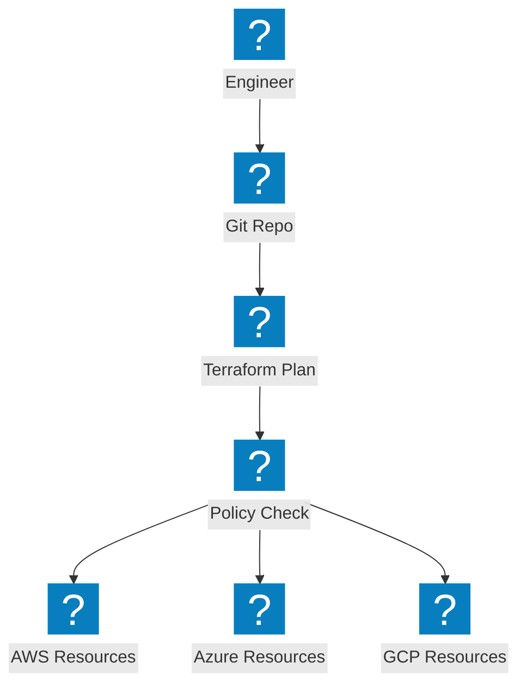

แผนภาพ Infrastructure as Code ครอบคลุมการทำงานอัตโนมัติของ Terraform, การผสานรวมเครื่องมือ HashiCorp และกระบวนการทำงานการจัดเตรียมโครงสร้างพื้นฐานแบบมัลติคลาวด์

## การผสานรวม HashiCorp Stack

Terraform จัดการการจัดเตรียมโครงสร้างพื้นฐานร่วมกับ Consul สำหรับการค้นหาบริการ, Vault สำหรับจัดการความลับ และ Nomad สำหรับการจัดตารางงาน

## ไปป์ไลน์ IaC แบบมัลติคลาวด์

Terraform จัดเตรียมโครงสร้างพื้นฐานข้ามแพลตฟอร์ม AWS, Azure และ GCP พร้อมการจัดการสถานะและการบังคับใช้นโยบาย

## การทำงานอัตโนมัติโครงสร้างพื้นฐาน F5 XC

Terraform ทำให้การกำหนดค่า F5 Distributed Cloud เป็นอัตโนมัติ พร้อมการตั้งค่า load balancer, origin pool และนโยบายความปลอดภัย

```mermaid
architecture-beta
  group iac(hashicorp-flight:terraform-color)[Terraform Workspace]
  group xc(lucide:cloud)[F5 XC Tenant]

  service tfplan(hashicorp-flight:terraform-color)[Terraform] in iac
  service vault(hashicorp-flight:vault-color)[Vault Secrets] in iac
  service consul(hashicorp-flight:consul-color)[Consul Registry] in iac
  service waap(f5xc:web-app-and-api-protection)[WAAP Policy] in xc
  service lb(f5xc:multi-cloud-app-connect)[App Connect] in xc
  service dns(f5xc:dns-management)[DNS Config] in xc

  tfplan:R --> L:vault
  vault:R --> L:consul
  tfplan:B --> T:waap
  tfplan:B --> T:lb
  tfplan:B --> T:dns
```

