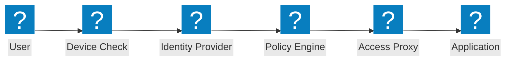
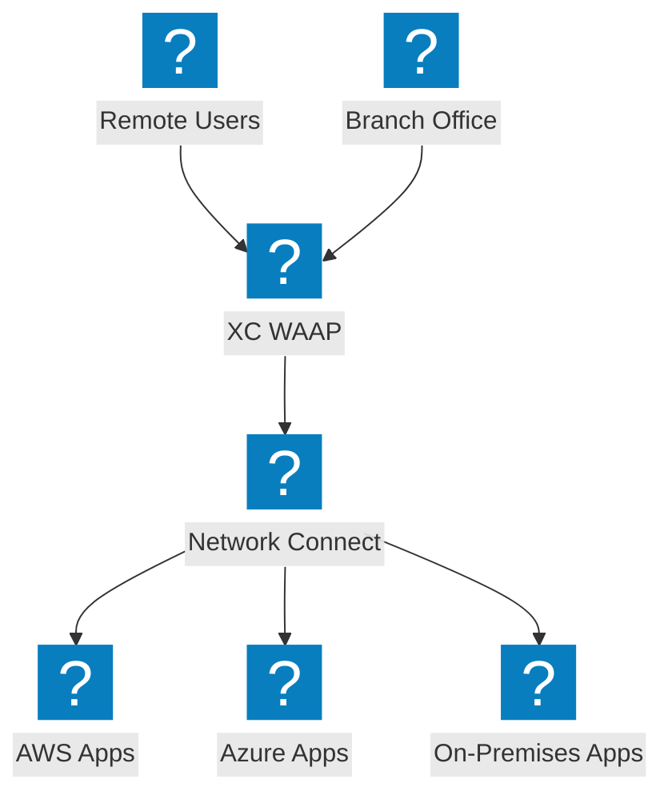

ไดอะแกรมสถาปัตยกรรม Zero Trust ครอบคลุมขั้นตอนการเข้าถึง ZTNA การตรวจสอบตัวตน การควบคุมการเข้าถึงตามนโยบาย และ Micro-Segmentation พร้อมการผสานรวม F5 XC

## ขั้นตอนการเข้าถึงแบบ Zero Trust

ขั้นตอนการเข้าถึงแบบ Zero Trust พร้อมการตรวจสอบสถานะอุปกรณ์ การตรวจสอบตัวตน การประเมินนโยบาย และการเข้าถึงแอปพลิเคชันผ่าน Proxy

## สถาปัตยกรรม F5 XC Zero Trust

F5 Distributed Cloud ให้การเข้าถึงแอปพลิเคชันแบบ Zero Trust พร้อม WAAP, Identity-Aware Proxy และ Micro-Segmentation ข้ามคลาวด์

## สถาปัตยกรรม Micro-Segmentation

การแบ่งส่วนเครือข่ายแบบ Micro-Segmentation พร้อมนโยบายที่อิงตัวตนสำหรับควบคุมการรับส่งข้อมูลแบบ East-West ระหว่างชั้นของแอปพลิเคชัน

```mermaid
architecture-beta
  group trust(lucide:shield)[Zero Trust Fabric]
  group apps(carbon:cloud-services)[Application Tiers]

  service idp(lucide:key)[Identity Provider] in trust
  service policy(carbon:gateway-security)[Policy Engine] in trust
  service seg(carbon:subnet-acl-rules)[Segmentation] in trust
  service web(carbon:application)[Web Tier] in apps
  service api(carbon:api)[API Tier] in apps
  service data(carbon:data-base)[Data Tier] in apps

  idp:R --> L:policy
  policy:R --> L:seg
  seg:R --> L:web
  web:R --> L:api
  api:R --> L:data
```

