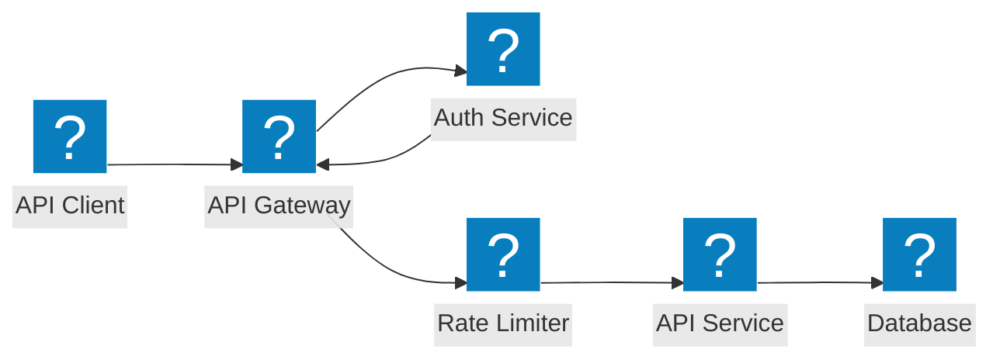
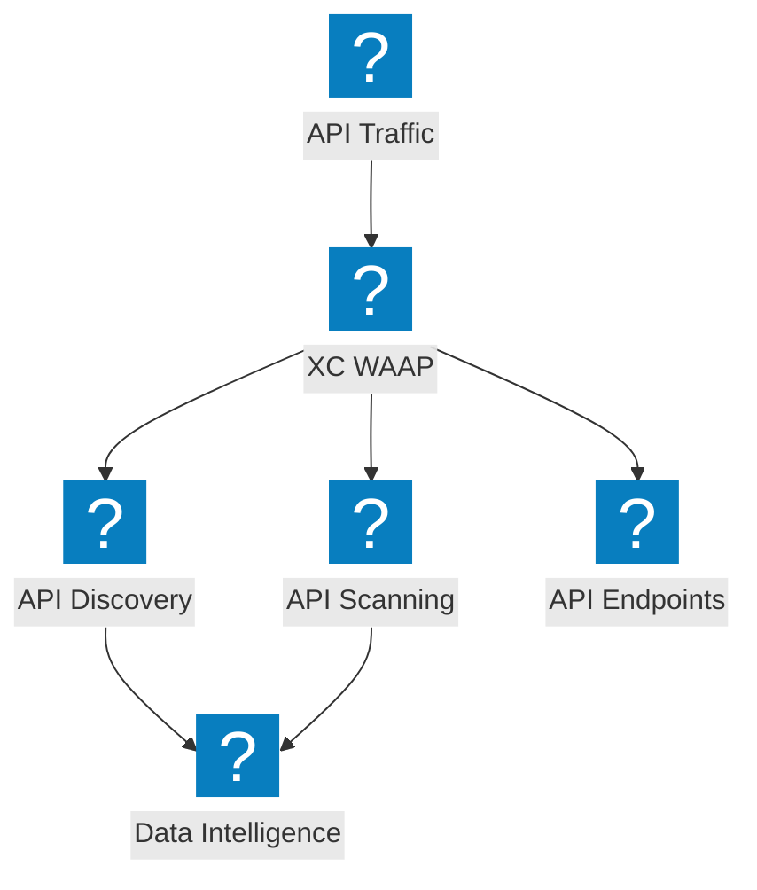

API 防护架构图，涵盖 API 网关安全、影子 API 发现、速率限制以及基于 F5 Distributed Cloud 的模式验证。

## API 网关安全

API 网关在到达后端服务之前进行身份验证、授权、速率限制和模式验证。

## F5 XC API 发现与防护

F5 Distributed Cloud 提供 API 发现、影子 API 检测以及基于流量洞察的全面 API 安全防护。

## API 安全流水线

多阶段 API 请求验证流水线，包含 TLS、JWT 验证、速率限制和载荷检测。

```mermaid
architecture-beta
  group security(lucide:shield)[API Security Layer]
  group backend(carbon:cloud-services)[Backend Services]

  service tls(lucide:lock)[TLS Termination] in security
  service jwt(lucide:key)[JWT Validation] in security
  service rate(carbon:load-balancer-vpc)[Rate Limiter] in security
  service schema(carbon:gateway-security)[Schema Validation] in security
  service api1(carbon:api)[Users API] in backend
  service api2(carbon:api)[Orders API] in backend

  tls:R --> L:jwt
  jwt:R --> L:rate
  rate:R --> L:schema
  schema:R --> L:api1
  schema:B --> T:api2
```

