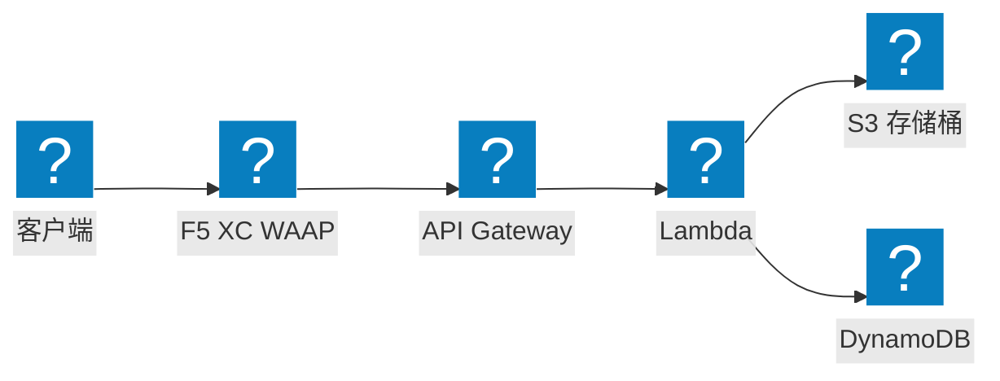

使用 HashiCorp Flight 和 Carbon 图标包绘制的 AWS 基础设施图，涵盖 VPC 网络、计算及无服务器架构。

## 带 ALB 和 EC2 的 VPC

公有子网和私有子网，应用负载均衡器将流量分发至由 RDS 支撑的 EC2 实例。

```mermaid
architecture-beta
  group vpc(carbon:virtual-private-cloud)[AWS VPC]
  group pubsub(carbon:ibm-cloud-subnets)[Public Subnet] in vpc
  group privsub(carbon:ibm-cloud-subnets)[Private Subnet] in vpc

  service igw(carbon:gateway)[Internet GW] in vpc
  service alb(carbon:load-balancer-application)[ALB] in pubsub
  service ec2a(hashicorp-flight:aws-ec2-color)[EC2] in privsub
  service ec2b(hashicorp-flight:aws-ec2-color)[EC2] in privsub
  service rds(carbon:data-base)[RDS] in privsub

  igw:R --> L:alb
  alb:R --> L:ec2a
  alb:B --> T:ec2b
  ec2a:R --> L:rds
  ec2b:R --> L:rds
```

## 带 F5 XC WAAP 的 EKS 集群

Amazon EKS 集群与 F5 分布式云协同工作，在边缘提供 Web 应用及 API 防护。

## 无服务器事件处理管道

AWS Lambda 处理来自 S3 的事件，前端通过 API Gateway 暴露，并由 F5 XC 提供防护。

