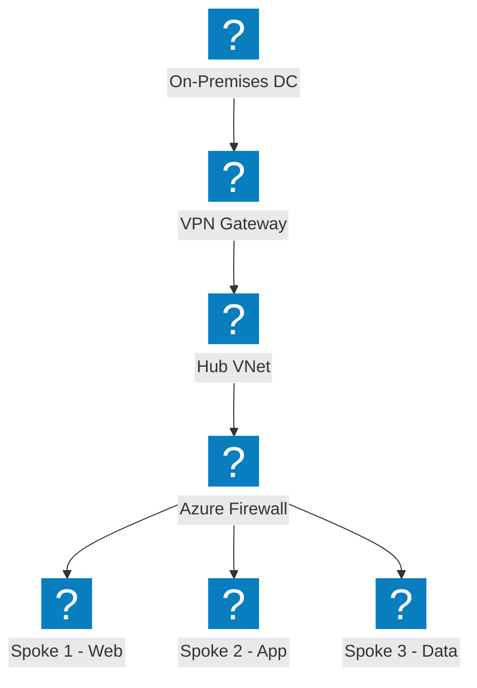
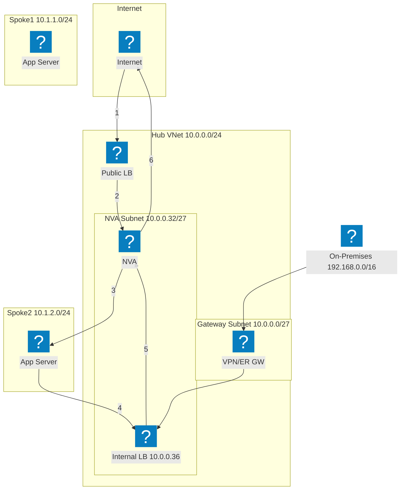
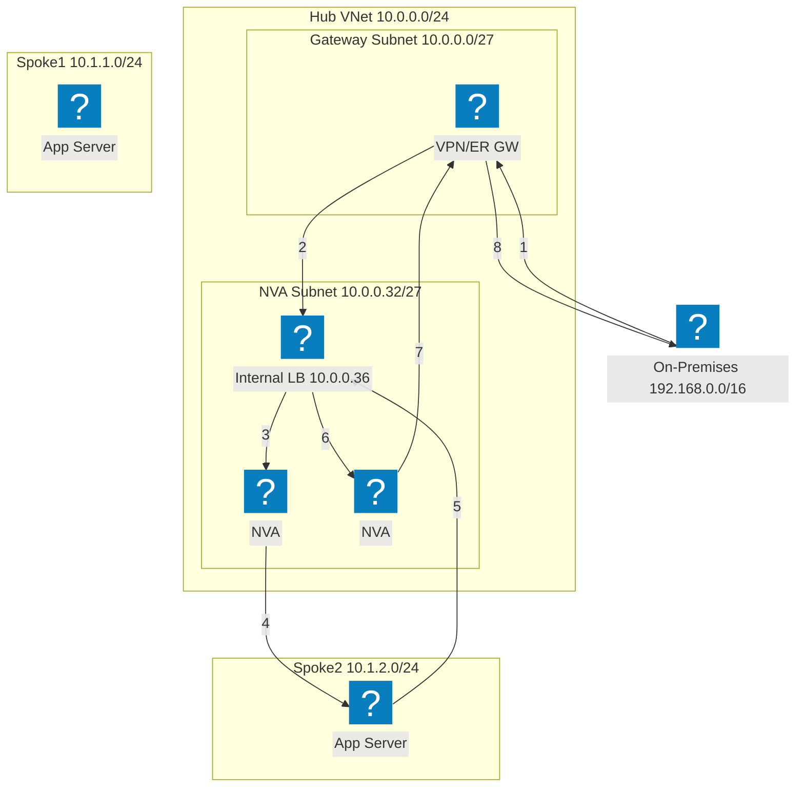
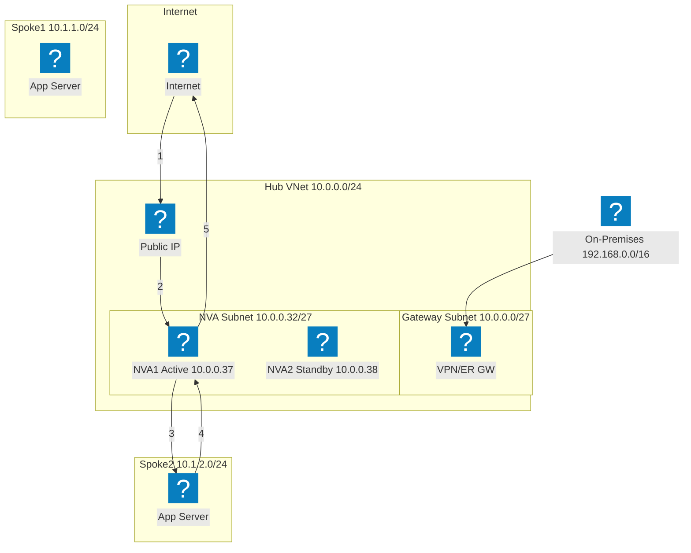
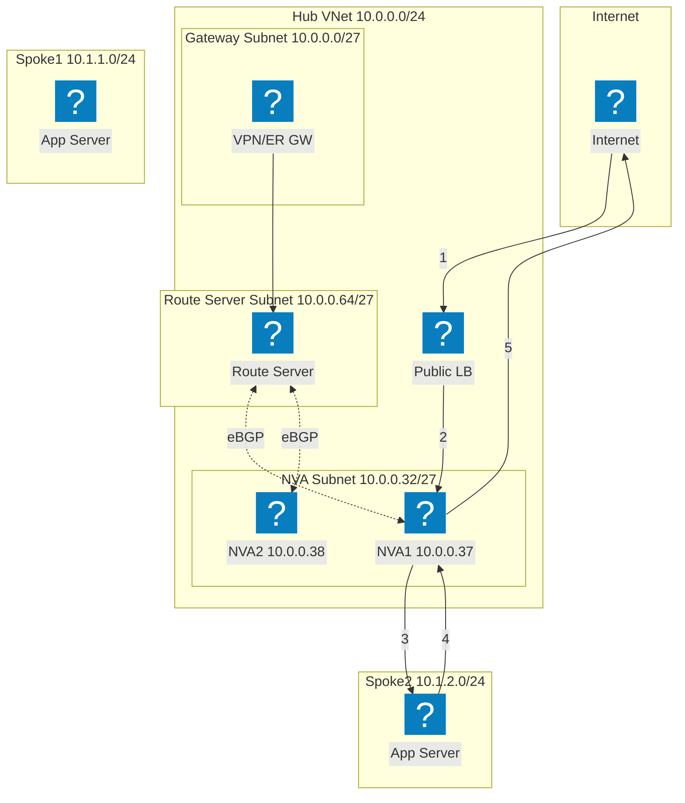
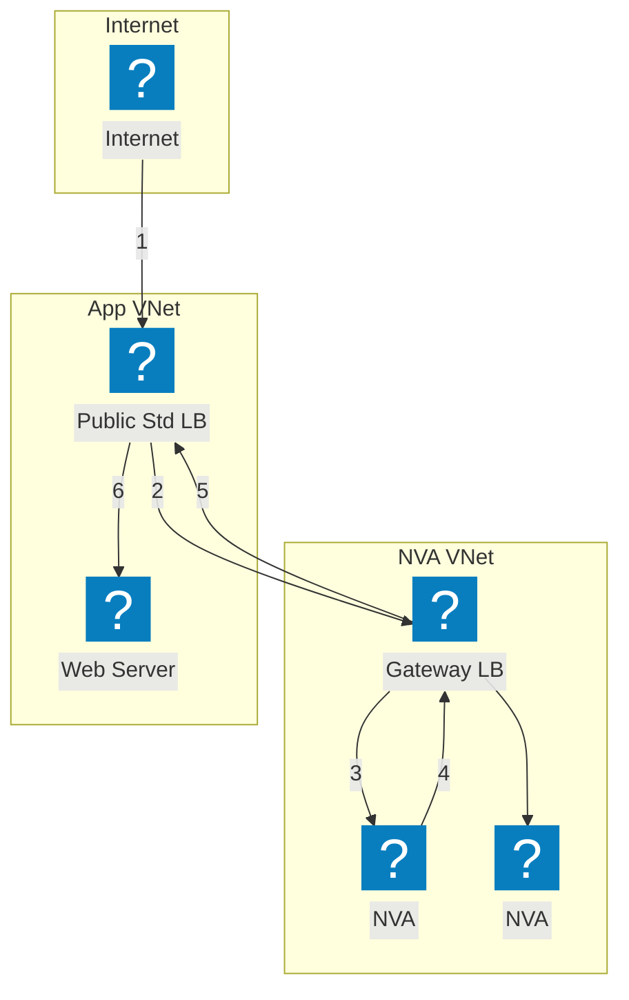

使用 HashiCorp Flight 和 Carbon 图标包构建的 Azure 基础设施图，涵盖 VNet 网络、计算和托管服务。

## VNet 与应用网关

Azure VNet 包含网关子网、应用子网和数据子网。应用网关将流量分发至 VM 规模集。

```mermaid
architecture-beta
  group vnet(carbon:virtual-private-cloud)[Azure VNet]
  group gwsub(carbon:ibm-cloud-subnets)[Gateway Subnet] in vnet
  group appsub(carbon:ibm-cloud-subnets)[App Subnet] in vnet
  group datasub(carbon:ibm-cloud-subnets)[Data Subnet] in vnet

  service appgw(carbon:gateway-security)[App Gateway] in gwsub
  service vm1(hashicorp-flight:azure-vms-color)[VM Scale Set] in appsub
  service vm2(hashicorp-flight:azure-vms-color)[VM Scale Set] in appsub
  service sqldb(carbon:data-base)[Azure SQL] in datasub

  appgw:R --> L:vm1
  appgw:B --> T:vm2
  vm1:R --> L:sqldb
  vm2:R --> L:sqldb
```

## AKS 与 F5 XC 多云连接

Azure Kubernetes Service 由 F5 分布式云前置，实现多云应用连接与安全防护。

```mermaid
architecture-beta
  group xc(lucide:cloud)[F5 XC]
  group aks(hashicorp-flight:azure-aks-color)[AKS Cluster]

  service mcn(f5xc:multi-cloud-network-connect)[Network Connect] in xc
  service waap(f5xc:web-app-and-api-protection)[WAAP] in xc
  service ingress(carbon:gateway)[Ingress] in aks
  service app(hashicorp-flight:docker-color)[App Pods] in aks
  service cache(carbon:datastore)[Redis Cache] in aks
  service blob(hashicorp-flight:azure-blob-storage-color)[Blob Storage]

  mcn:R --> L:waap
  waap:R --> L:ingress
  ingress:R --> L:app
  app:B --> T:cache
  app:R --> L:blob
```

## 中心辐射型网络拓扑

Azure 中心辐射型架构，通过集中式安全和共享服务连接多个辐射型 VNet。

## NVA 高可用与负载均衡器 — 互联网流量

入站互联网流量到达公共负载均衡器，由其分发至中心 Hub 中的 NVA 实例。NVA 对流量进行检测后转发至辐射型工作负载。来自辐射型的返回流量通过内部负载均衡器路由回 NVA 进行出站处理。编号步骤展示了入站路径（1-3）和返回路径（4-6）。

## NVA 高可用与负载均衡器 — 本地流量

本地流量通过 VPN 或 ExpressRoute 网关进入，并被引导至前置于多个 NVA 实例的内部负载均衡器。NVA 对流量进行检测并转发至辐射型工作负载。返回流量经由同一内部负载均衡器传输，以确保流量对称性，避免非对称路由问题。

## NVA 高可用与公网 IP/UDR — 主备模式

主备 NVA 对中，主实例（NVA1）持有公网 IP 地址。发生故障时，备用 NVA2 调用 Azure API 重新分配公网 IP，并更新用户自定义路由以指向自身。此方式无需负载均衡器，但需要通过 API 层面进行故障切换编排。

## NVA 高可用与 Azure 路由服务器

基于 BGP 的高可用性方案，使用 Azure 路由服务器。路由服务器与两个 NVA 实例建立 eBGP 邻接关系，并动态编程辐射型有效路由。ECMP 在各 NVA 之间实现负载均衡，无需用户自定义路由。路由服务器将两个 NVA IP 的下一跳条目注入所有对等 VNet。

## NVA 高可用与网关负载均衡器

使用 Azure 网关负载均衡器实现透明 NVA 插入。发往应用程序的流量从公共标准负载均衡器透明地转移至独立 NVA VNet 中的网关负载均衡器。NVA 对流量进行检测后将其返回给网关负载均衡器，再由其转发回应用程序。NVA 与应用程序 VNet 之间无需 VNet 对等互连或用户自定义路由。

