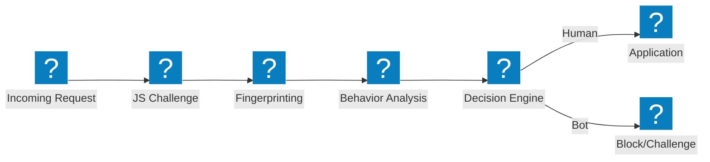
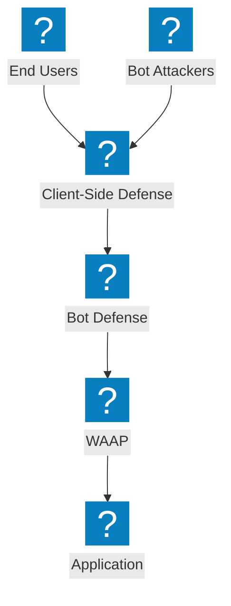

机器人防御架构图，涵盖检测流水线、凭证填充缓解、客户端防御以及 F5 分布式云机器人管理能力。

## 机器人检测流水线

多阶段机器人检测流水线，包含 JavaScript 挑战、行为分析和指纹识别，通过后方可访问。

## F5 XC 机器人防御与客户端防御

F5 分布式云集成机器人防御与客户端保护，用于防范凭证填充和账户接管攻击。

## 凭证填充防御架构

针对凭证填充攻击的多层防御，涵盖设备指纹识别、凭证情报和账户保护。

