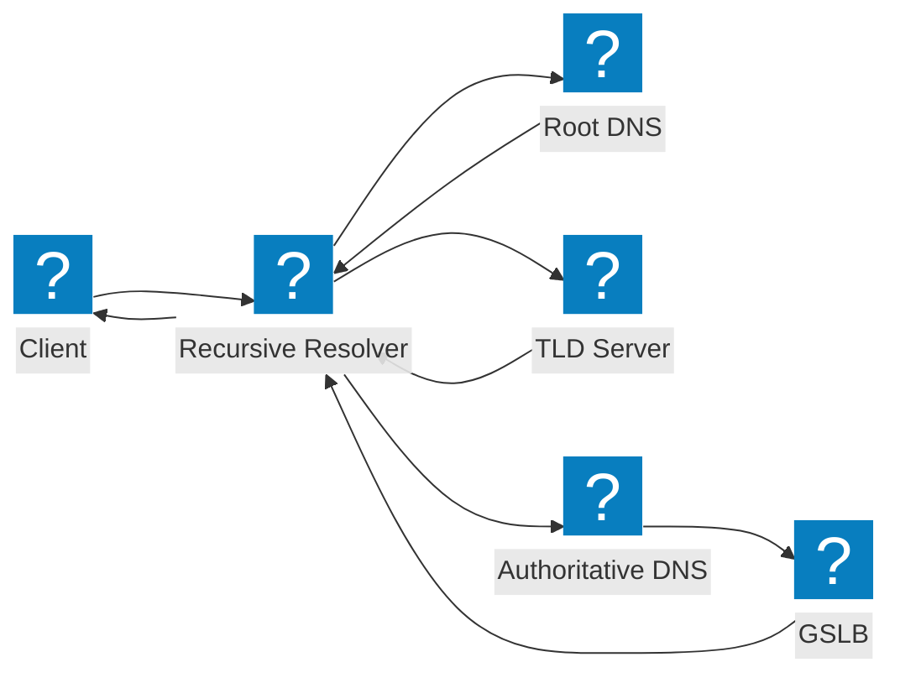
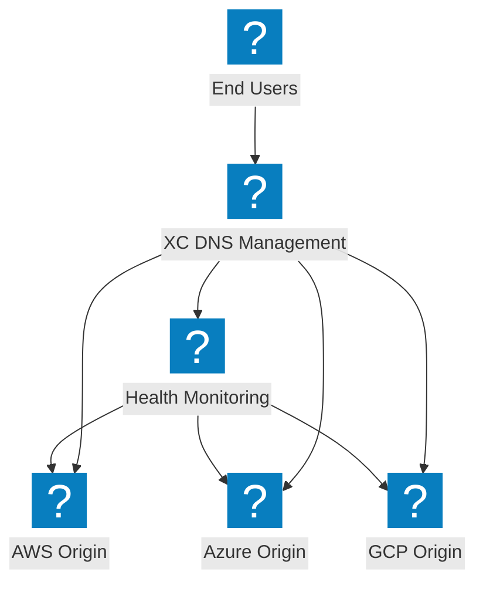

DNS 架构图，涵盖递归解析流程、全局服务器负载均衡以及 F5 分布式云 DNS 管理。

## DNS 解析流程

标准 DNS 查询解析流程，从客户端经递归解析器到权威名称服务器，并集成 GSLB。

## F5 XC DNS 管理

F5 分布式云 DNS 管理，在多云源点之间提供智能 DNS 负载均衡。

## DNS 负载均衡架构

多层 DNS 负载均衡，具备地理路由、健康检查以及云区域间故障转移能力。

```mermaid
architecture-beta
  group dns(carbon:dns-services)[DNS Infrastructure]
  group region1(hashicorp-flight:aws-color)[US East]
  group region2(hashicorp-flight:azure-color)[EU West]

  service gslb(carbon:load-balancer-global)[GSLB] in dns
  service health(carbon:application)[Health Check] in dns
  service lb1(carbon:load-balancer-application)[Regional LB] in region1
  service app1(carbon:virtual-machine)[App Servers] in region1
  service lb2(carbon:load-balancer-application)[Regional LB] in region2
  service app2(carbon:virtual-machine)[App Servers] in region2

  gslb:R --> L:health
  gslb:B --> T:lb1
  lb1:R --> L:app1
  gslb:B --> T:lb2
  lb2:R --> L:app2
```

