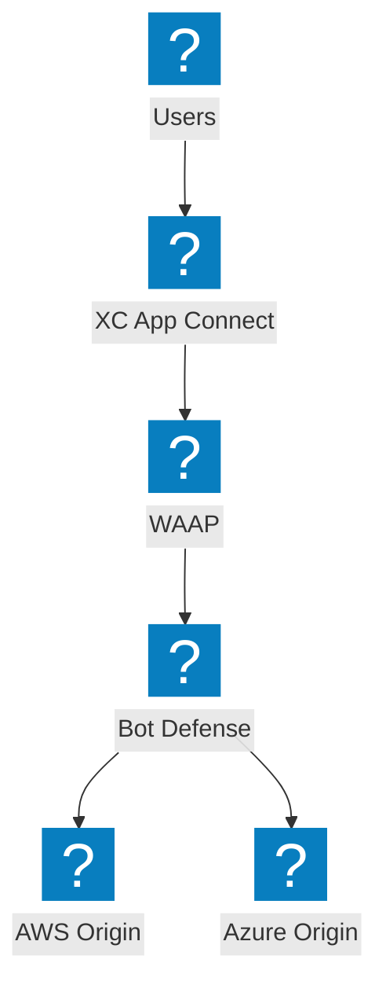
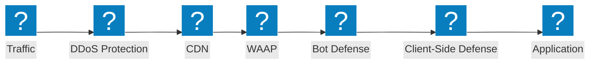

F5 产品图标展示图，使用 `f5xc` 和 `f5-brand` 图标包，演示 F5 XC 服务组合、NGINX 产品线及 BIG-IP 功能。

## F5 XC 服务组合

F5 分布式云服务概览，涵盖安全、网络及应用交付。

## F5 XC 安全堆栈

完整的 F5 XC 安全堆栈，包含 WAAP、机器人防御、客户端防御、DDoS 防护及 API 发现。

## F5 XC 网络服务

F5 分布式云网络服务，包含多云连接、DNS 管理及分布式应用。

```mermaid
architecture-beta
  group xc(lucide:cloud)[F5 Distributed Cloud]
  group infra(carbon:cloud-services)[Infrastructure]

  service mcn(f5xc:multi-cloud-network-connect)[Network Connect] in xc
  service mca(f5xc:multi-cloud-app-connect)[App Connect] in xc
  service dns(f5xc:dns-management)[DNS Management] in xc
  service dapp(f5xc:distributed-apps)[Distributed Apps] in xc
  service k8s(hashicorp-flight:kubernetes-color)[K8s Clusters] in infra
  service vm(carbon:virtual-machine)[VM Workloads] in infra

  mcn:R --> L:mca
  mca:R --> L:dns
  dns:R --> L:dapp
  mcn:B --> T:k8s
  mca:B --> T:vm
```

## F5 XC 可观测性与智能分析

F5 分布式云可观测性、流量洞察及数据智能，实现全面的应用可见性。

```mermaid
architecture-beta
  group apps(carbon:cloud-services)[Application Layer]
  group intel(lucide:cloud)[F5 XC Intelligence]

  service app1(carbon:application)[Web App] in apps
  service app2(carbon:api)[API Service] in apps
  service app3(f5xc:distributed-apps)[Distributed App] in apps
  service obs(f5xc:observability)[Observability] in intel
  service ati(f5xc:application-traffic-insight)[Traffic Insight] in intel
  service di(f5xc:data-intelligence)[Data Intelligence] in intel

  app1:B --> T:obs
  app2:B --> T:ati
  app3:B --> T:di
  obs:R --> L:ati
  ati:R --> L:di
```

